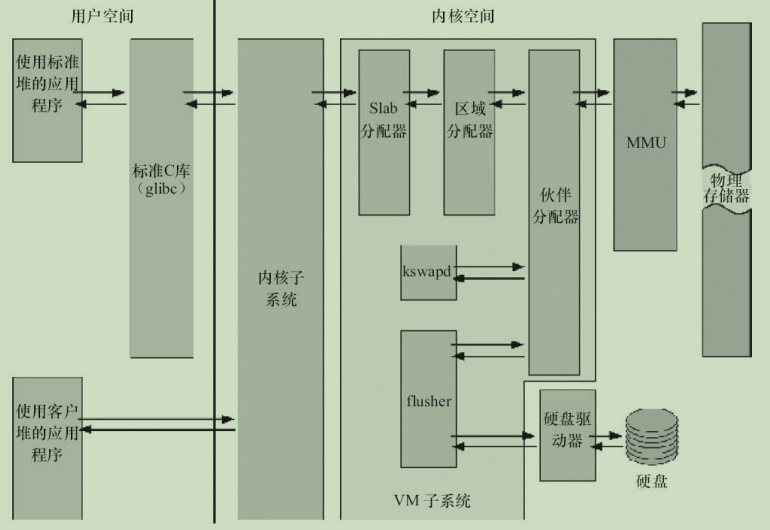
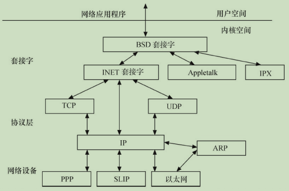

## 3.1 Linux内核的组成

### 3.1.1 Linux内核源代码的目录结构

 

内核一般要做到drivers与arch的软件架构分离，驱动中不包含板级信息，让驱动跨平台。同时内核的通用部分（如kernel、fs、ipc、net等）则与具体的硬件（arch和drivers）剥离。

### 3.1.2 Linux内核的组成部分

 

如上图所示，Linux内核主要由`进程调度（SCHED）`、`内存管理（MM）`、`虚拟文件系统（VFS）`、`网络接口（NET）`和`进程间通信（IPC）`5个子系统组成。

#### 3.1.2.1 进程调度

进程调度控制系统中的多个进程对CPU的访问，使得多个进程能在CPU中“`微观串行，宏观并行`”地执行。进程调度处于系统的中心位置，内核中其他的子系统都依赖它，因为每个子系统都需要挂起或恢复进程。

Linux进程状态转换如下：

 

在设备驱动编程中，当请求的资源不能得到满足时，驱动一般会调度其他进程执行，并使本进程进入睡眠状态，直到它请求的资源被释放，才会被唤醒而进入就绪状态。睡眠分成可中断的睡眠和不可中断的睡眠，两者的区别在于可中断的睡眠在收到信号的时候会醒。

完全处于TASK_UNINTERRUPTIBLE状态的进程甚至都无法被“杀死” ，所以Linux 2.6.26之后的内核也存在一种TASK_KILLABLE的状态，它等于“TASK_WAKEKILL|TASK_UNINTERRUPTIBLE” ，可以响应致命信号。

在Linux内核中，使用 `task_struct` 结构体来描述进程，该结构体中包含描述该进程内存资源、文件系统资源、文件资源、tty资源、信号处理等的指针。

> Linux的线程采用轻量级进程模型来实现，在用户空间通过 `pthread_create()` API创建线程的时候，本质上内核只是创建了一个新的task_struct，并将新task_struct的所有资源指针都指向创建它的那个task_struct的资源指针。

绝大多数进程（以及进程中的多个线程）是由用户空间的应用创建的，当它们存在底层资源和硬件访问的需求时，会通过系统调用进入内核空间。有时候，在内核编程中，如果需要几个并发执行的任务，可以启动内核线程，这些线程没有用户空间。启动内核线程的函数为：

>`pid_t kernel_thread(int (*fn)(void *), void *arg, unsigned long flags);`

#### 3.1.2.2 内存管理

内存管理的主要作用是控制多个进程安全地共享主内存区域。当CPU提供内存管理单元（MMU）时，Linux内存管理对于每个进程完成从虚拟内存到物理内存的转换。

> Linux 2.6引入了对无MMU CPU的支持。

 

如上图所示，一般而言，32位处理器的Linux的每个进程享有4GB的内存空间，`0~3GB`属于用户空间，`3~4GB`属于内核空间，内核空间对常规内存、I/O设备内存以及高端内存有不同的处理方式。

> 当然，内核空间和用户空间的具体界限是可以调整的，在内核配置选项`Kernel Features --> Memory split`下，可以设置界限为2GB或者3GB。

 

如上图所示，Linux内核的内存管理总体比较庞大，包含底层的Buddy算法，它用于`管理每个页的占用情况`，`内核空间的slab`以及`用户空间的C库的二次管理`。

> 另外，内核也提供了页缓存的支持，用内存来缓存磁盘，per-BDIflusher线程用于刷回脏的页缓存到磁盘。
>
> Kswapd（交换进程）则是Linux中用于页面回收（包括file-backed的页和匿名页）的内核线程，它采用最近最少使用（LRU）算法进行内存回收。

#### 3.1.2.3 虚拟文件系统

 

Linux虚拟文件系统隐藏了各种硬件的具体细节，为所有设备提供了统一的接口。而且，它独立于各个具体的文件系统，是对各种文件系统的一个抽象。它为上层的应用程序提供了统一的vfs_read（）、vfs_write（）等接口，并调用具体底层文件系统或者设备驱动中实现的file_operations结构体的成员函数。

#### 3.1.2.4 网络接口

网络接口提供了对各种网络标准的存取和各种网络硬件的支持。

 

在Linux中网络接口可分为：

- `网络协议部分`负责实现每一种可能的网络传输协议;

  > Linux内核支持的协议栈种类较多, 上层的应用程序统一使用 `BSD套接字` 接口。

- `网络设备驱动程序`负责与硬件设备通信，

  > 每一种可能的硬件设备都有相应的设备驱动程序。

#### 3.1.2.5 进程间通信

Linux提供多种通信机制来支持进程间通信，包含：`信号量`、`共享内存`、`消息队列`、`管道`、`UNIX域套接字`等，这些机制可协助多个进程、多资源的互斥访问、进程间的同步和消息传递。

在实际的Linux应用中，人们更多地趋向于使用UNIX域套接字，而不是System V IPC中的消息队列等机制。

> Android内核则新增了`Binder`进程间通信方式。

`总结`：

Linux内核5个组成部分之间的依赖关系如下。

- `进程调度与内存管理之间的关系`：这两个子系统互相依赖。在多程序环境下，程序要运行，则必须为之创建进程，而创建进程的第一件事情，就是将程序和数据装入内存。
- `进程间通信与内存管理的关系`：进程间通信子系统要依赖内存管理支持共享内存通信机制，这种机制允许两个进程除了拥有自己的私有空间之外，还可以存取共同的内存区域。
- `虚拟文件系统与网络接口之间的关系`：虚拟文件系统利用网络接口支持网络文件系统（NFS），也利用内存管理支持RAMDISK设备。
- `内存管理与虚拟文件系统之间的关系`：内存管理利用虚拟文件系统支持交换，交换进程定期由调度程序调度，这也是内存管理依赖于进程调度的原因。当一个进程存取的内存映射被换出时，内存管理向虚拟文件系统发出请求，同时，挂起当前正在运行的进程。

除了这些依赖关系外，内核中的所有子系统还要依赖于一些共同的资源。这些资源包括所有子系统都用到的API，如分配和释放内存空间的函数、输出警告或错误消息的函数及系统提供的调试接口等。

### 3.1.3 Linux 内核空间与用户空间

现代CPU内部往往实现了不同操作模式（级别），不同模式有不同功能，高层程序往往不能访问低级功能，而必须以某种方式切换到低级模式。

例如，ARM处理器分为7种工作模式。

> - `用户模式（usr）`：大多数应用程序运行在此模式下,当处理器运行在此模式下时,某些被保护的系统资源是不能访问的。
> - `快速中断模式（fiq）`：用于高速数据传输或通道处理。
> - `外部中断模式（irq）`：用于通用的中断处理。
> - `管理模式（svc）`：操作系统使用的保护模式。
> - `数据访问中止模式（abt）`：当数据或指令预取中止时进入该模式，可用于虚拟存储及存储保护。
> - `系统模式（sys）`:  运行具有特权的操作系统任务。
> - `未定义指令中止模式（und）`:  当未定义的指令执行时进入该模式，可用于支持硬件协处理器的软件仿真。

ARM Linux的系统调用实现原理是: `采用swi软中断从用户（usr）模式陷入管理模式（svc）`。

又如，x86处理器包含4个不同的特权级，称为`Ring0 ~ Ring3`。

> 在`Ring0`下，可以执行特权级指令，对任何I/O设备都有访问权等，而`Ring3`则被限制很多操作。

Linux系统可充分利用CPU的这一硬件特性(`不同操作模式`)，但它只使用了`两级`。

在Linux系统中，内核可进行任何操作，而应用程序则被禁止对硬件的直接访问和对内存的未授权访问。

例如，若使用x86处理器，则用户代码运行在特权级3，而系统内核代码则运行在特权级0。

内核空间和用户空间这两个名词用来区分程序执行的两种不同状态，它们使用不同的地址空间。

> Linux只能通过`系统调用`和`硬件中断`完成从用户空间到内核空间的控制转移。

## 3.2 Linux 内核的编译及加载

### 3.2.1 Linux内核的编译

Linux驱动开发者需要牢固地掌握Linux内核的编译方法以为嵌入式系统构建可运行的Linux操作系统映像。

在编译内核时，需要配置内核，可以使用下面命令中的一个：

```bash
make config     #基于文本的最为传统的配置界面，不推荐使用
make menuconfig #基于文本菜单的配置界面(推荐使用)
make xconfig    #要求QT被安装
make gconfig    #要求GTK+被安装
```

### 3.2.2 Linux内核的引导

引导Linux系统的过程包括很多阶段，这里将以引导ARM Linux为例来进行讲解(见下图)：

 

一般的SoC内嵌入了bootrom，上电时bootrom运行。对于CPU0而言，bootrom会去引导bootloader，而其他CPU则判断自己是不是CPU0，进入WFI的状态等待CPU0来唤醒它。CPU0引导bootloader，bootloader引导Linux内核，在内核启动阶段，CPU0会发中断唤醒CPU1，之后CPU0和CPU1都投入运行。CPU0会引起用户空间的init程序被调用，init程序再派生其他进程，派生出来的进程再派生其他进程。CPU0和CPU1共担这些负载，进行负载均衡。

bootrom是各个SoC厂家根据自身情况编写的，目前的SoC一般都具有从SD、eMMC、NAND、USB等介质启动的能力，这证明这些bootrom内部的代码具备读SD、NAND等能力。

嵌入式Linux领域最著名的bootloader是`U-Boot`。

## 3.3 Linux下C编程特点

### 3.3.1 `GNU C` 与 `ANSI C`

Linux上可用的C编译器是GNU C编译器，GNU C对标准C进行一系列扩展，以增强标准C的功能。

- `零长度和变量长度数组`

  GNU C允许使用零长度数组，在定义变长对象的头结构时，这个特性非常有用。例如：

  > ```c
  > struct var_data {
  >   int len;
  >   char data[0];
  > };
  > ```
  >
  > char data[0]仅仅意味着程序中通过var_data结构体实例的data[index]成员可以访问len之后的第index个地址，它并没有为data[]数组分配内存，因此 `sizeof（struct var_data）=sizeof（int）`。

  GNU C中也可以使用1个变量定义数组，例如如下代码中定义的“double x[n]”：

  ```c
  int main (int argc, char *argv[])
  {
    int i, n = argc;
    double x[n];
    for (i = 0; i < n; i++)
      x[i] = i;

    return 0;
  }
  ```

- `case范围`

  GNU C支持case x…y这样的语法，区间[x，y]中的数都会满足这个case的条件.

  ```c
  switch (ch) {
  case '0'... '9': c -= '0';
    break;
  case 'a'... 'f': c -= 'a' - 10;
    break;
  case 'A'... 'F': c -= 'A' - 10;
    break;
  }
  ```

- `语句表达式`

  GNU C把包含在括号中的复合语句看成是一个表达式，称为语句表达式，它可以出现在任何允许表达式的地方。我们可以在语句表达式中使用原本只能在复合语句中使用的循环、局部变量等，例如：

  ```c
  #define min_t(type,x,y) \
    (｛type _ _x =(x);type _ _y = (y); _ _x<_ _y _ _x: _ _y; })

  int ia, ib, mini;
  float fa, fb, minf;
  mini = min_t(int, ia, ib);
  minf = min_t(float, fa, fb);
  ```

  因为重新定义了__xx和__y这两个局部变量，所以用上述方式定义的宏将不会有副作用。

- `typeof关键字`

  typeof（x）语句可以获得x的类型，因此，可以借助typeof重新定义min这个宏：

  ```c
  #define min(x,y) ({       \
    const typeof(x) _x=(x); \
    const typeof(y) _y=(y); \
    (void)(&_x == &_y);     \  //作用是检查_x和_y的类型是否一致
    _x < _y ? _x : _y; })
  ```

- `可变参数宏`

  在GNU C中，宏也可以接受可变数目的参数，例如：

  `#define pr_debug(fmt,arg...)  printk(fmt,##arg)`

  这里arg表示其余的参数，可以有零个或多个参数，这些参数以及参数之间的逗号构成arg的值，在宏扩展时替换arg

  >使用 `##` 是为了处理arg不代表任何参数的情况，这时候，前面的逗号就变得多余了。使用“##”之后，GNU C预处理器会丢弃前面的逗号

- `标号元素`

  在GNU C中，通过指定索引或结构体成员名，允许初始化值以任意顺序出现。

  指定数组索引的方法是在初始化值前添加“[INDEX]=” ，当然也可以用“[FIRST...LAST]=”的形式指定一个范围。例如

  ```c
  unsigned char data[MAX] = { [0 ... MAX-1] = 0 }; //定义了一个数组，并把其中的所有元素赋值为0：
  ```

  下面的代码借助结构体成员名初始化结构体：

  ```c
  struct file_operations ext2_file_operations = {
  .llseek = generic_file_llseek,
      .read = generic_file_read,
      .write = generic_file_write,
      .aio_read = generic_file_aio_read,
      .aio_write = generic_file_aio_write,
      .ioct = ext2_ioctl,
      .mmap = generic_file_mmap,
      .open = generic_file_open,
      .release = ext2_release_file,
      .fsync = ext2_sync_file,
      .readv = generic_file_readv,
      .writev = generic_file_writev,
      .sendfile = generic_file_sendfile,
  };
  ```

- `当前函数名`

  请尽量使用 `C99`标准里支持的宏 `__func__`

- `特殊属性声明`

  GNU C允许声明函数、变量和类型的特殊属性，以便手动优化代码和定制代码检查的方法。

  要指定一个声明的属性，只需要在声明后添加`__attribute__((ATTRIBUTE))`。

  > GNU C支持`noreturn`、`format`、`section`、`aligned`、`packed`等十多个属性。

  `noreturn` 属性作用于函数，表示该函数从不返回。这会让编译器优化代码，并消除不必要的警告信息。例如：

  ```c
  # define ATTRIB_NORET __attribute__((noreturn)) //....
  asmlinkage NORET_TYPE void do_exit(long error_code) ATTRIB_NORET;
  ```

  `format` 属性也用于函数，表示该函数使用printf、scanf或strftime风格的参数，指定format属性可以让编译器根据格式串检查参数类型。例如：

  ```c
  asmlinkage int printk(const char * fmt, ...) __attribute__ ((format (printf, 1, 2)));
  //上述代码中的第1个参数是格式串，从第2个参数开始都会根据 printf() 函数的格式串规则检查参数。
  ```

  `unused`属性作用于函数和变量，表示该函数或变量可能不会用到，这个属性可以避免编译器产生警告信息。

  `aligned` 属性用于变量、结构体或联合体，指定变量、结构体或联合体的对齐方式，以字节为单位，例如：

  ```c
  struct example_struct {
    char a;
    int b;
    long c;
  } __attribute__((aligned(4)));
  //表示该结构类型的变量以4字节对齐。
  ```
  
  `packed` 属性作用于变量和类型，用于变量或结构体成员时表示使用最小可能的对齐，用于枚举、结构体或联合体类型时表示该类型使用最小的内存。例如：
  
  ```c
  struct example_struct {
  char a;
  int b;
  long c __attribute__((packed));
  };
  ```
  
- `内建函数`

  GNU C提供了大量内建函数，其中大部分是标准C库函数的GNU C编译器内建版本。

  不属于库函数的其他内建函数的命名通常以__builtin开始，如下所示。

  - 内建函数 `__builtin_return_address（LEVEL）` 返回当前函数或其调用者的返回地址

    > 参数LEVEL指定调用栈的级数，如0表示当前函数的返回地址，1表示当前函数的调用者的返回地址。

  - 内建函数 `__builtin_constant_p（EXP）`用于判断一个值是否为编译时常数

    > 如果参数EXP的值是常数，函数返回1，否则返回0。

  - 内建函数 `__builtin_expect（EXP，C）`用于为编译器提供分支预测信息
  
    > 其返回值是整数表达式EXP的值，C的值必须是编译时常数。
  
    Linux内核编程时常用的likely（）和unlikely（）底层调用的likely_notrace（）、unlikely_notrace（）就是基于__builtin_expect（EXP，C）实现的。
  
    ```c
    #define likely_notrace(x) __builtin_expect(!!(x), 1)
    #define unlikely_notrace(x) __builtin_expect(!!(x), 0)
    ```
  
    若代码中出现分支，则即可能中断流水线，我们可以通过likely（）和unlikely（）暗示分支容易成立还是不容易成立，例如：
  
    ```c
    if (likely(!IN_DEV_ROUTE_LOCALNET(in_dev)))
      if (ipv4_is_loopback(saddr))
        goto e_inval;
    ```

  - **在使用gcc编译C程序的时候，请尽可能的避免使用 `-ansi–pedantic`编译选项**
  
### 3.3.2 `do {} while (0)` 语句

  其实 `do{}while(0)` 的用法主要用于宏定义中。

  它使用完全是为了保证宏定义的使用者能无编译错误地使用宏，它不对其使用者做任何假设。

### 3.3.3 `goto`语句

Linux内核源代码中对goto的应用非常广泛，但是一般只限于错误处理中，其结构如：

```c
if(register_a()!=0)
goto err;
if(register_b()!=0)
goto err1;
if(register_c()!=0)
goto err2;
if(register_d()!=0)
goto err3;
...
err3:
unregister_c();
err2:
unregister_b();
err1:
unregister_a();
err:
return ret;
```

这种将goto用于错误处理的用法实在是简单而高效，只需保证在错误处理时注销、资源释放等，与正常的注册、资源申请顺序相反。
