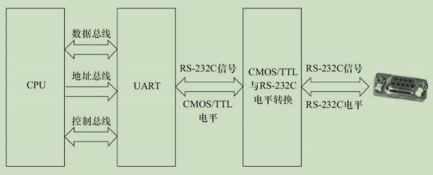

## 2.1 处理器(Processor)

### 2.1.1 通用处理器(GPP `--` General Purpose Processor)

一般而言，在嵌入式微控制器（MCU）和微处理器（MPU）中会包含一个通用处理器核。

> - `MPU` 通常代表一个 CPU（中央处理器）;
> - 而 `MCU` 则强调把中央处理器、存储器和外围电路集成在一个芯片中。

一个典型的集成了外围电路的 MCU的结构图示如下:

 

目前主流的通用处理器（GPP）多采用`SoC（片上系统,在一个芯片上设计了整个系统）`的芯片设计方法，集成了各种功能模块，每一种功能都是由硬件描述语言设计程序，然后在SoC内由电路实现的。在SoC中，每一个模块不是一个已经设计成熟的ASIC器件，而是利用芯片的一部分资源去实现某种传统的功能，将各种组件采用类似搭积木的方法组合在一起。

ARM内核的设计技术被授权给数百家半导体厂商，做成不同的SoC芯片。很多ARM主控芯片的集成度非常高，除了集成多核ARM以外，还可能集成图形处理器、视频编解码器、浮点协处理器、GPS、WiFi、蓝牙、基带、Camera等一系列功能。

中央处理器的体系结构可以分为两类:

- 一类为冯·诺依曼(或**普林斯顿**)结构 `--`  将程序指令存储器和数据存储器合并在一起的存储器
- 一类为哈佛结构 `--` 将程序指令和数据分开存储，指令和数据可以有不同的数据宽度。

 

${ARM9^+}$ 系列的处理器已经是 切换到 改进后的 `哈佛结构` 了。

 

从指令集的角度来讲，中央处理器也可以分为两类：

- RISC（精简指令集计算机）`--`强调尽量减少指令集、指令单周期执行，但是目标代码会更大。

- CISC（复杂指令集计算机）`--` 强调增强指令的能力、减少目标代码的数量，但是指令复杂，指令周期长

> ARM、MIPS、PowerPC等CPU内核都采用了RISC指令集。目前，RISC和CSIC两者的融合非常明显。

### 2.1.2 数字信号处理器(`DSP -- Digital Signal Processor`)

数字信号处理器`(DSP)`针对通信、图像、语音和视频处理等领域的算法而设计。它包含独立的硬件乘法器。DSP的乘法指令一般在单周期内完成，且优化了卷积、数字滤波、FFT（快速傅里叶变换）、相关矩阵运算等算法中的大量重复乘法。

DSP分为两类：

- 定点DSP `--`  用定点运算模拟浮点运算。
- 浮点DSP `--` 浮点运算用硬件来实现，可以在单周期内完成

常见的术语：

| 术语名 | 解释                                      |
| ------ | ----------------------------------------- |
| `ASIC` | 专用集成电路                              |
| `ASP`  | 专用处理器                                |
| `LUT`  | 查找表(`LookUp Table`)                    |
| `DSC`  | 数字信号控制器                            |
| `GPU`  | 图形处理单元（`Graphic Processing Unit`） |
| `ISP`  | 图像信号处理器(`Image Signal Processor`)  |

### 2.1.3 处理器分类总结

 

## 2.2 存储器

存储器主要可分类为`只读储存器（ROM）`、`闪存（Flash）`、`随机存取存储器（RAM）`、`光/磁介质储存器`。

Flash 闪存分为 NOR(或非) Flash 和 NAND(与非) Flash

一个NAND Flash的接口主要包含如下信号:

 

Flash的编程原理都是**只能将1写为0，而不能将0写为1**。因此在Flash编程之前，必须将对应的块擦除，而擦除的过程就是把所有位都写为1的过程，块内的所有字节变为0xFF。

`IDE（Integrated Drive Electronics）`接口可连接硬盘控制器或光驱，IDE接口的信号与SRAM类似。人们通常也把IDE接口称为ATA（Advanced Technology Attachment）接口.

很多SoC集成了一个eFuse电编程熔丝作为`OTP（One-Time Programmable，一次性可编程）`存储器。

以上所述的各种ROM、Flash和磁介质存储器都属于`非易失性存储器（NVM）`的范畴，掉电时信息不会丢失，而RAM则与此相反。

RAM也可再分为:

- 静态RAM（SRAM）`--` 是静态的， 只要供电它就会保持一个值，SRAM没有刷新周期。

  > SRAM每个SRAM存储单元由6个晶体管组成

- 动态RAM（DRAM）`--` 以电荷形式进行存储，数据存储在电容器中。由于电容器会因漏电而出现电荷丢失，所以DRAM器件需要定期刷新。

  > - 而DRAM存储单元由1个晶体管和1个电容器组成。
  > - 通常所说的SDRAM、DDR SDRAM皆属于DRAM的范畴，它们采用与CPU外存控制器同步的时钟工作.
  > - 与SDRAM相比，DDR SDRAM同时利用了时钟脉冲的上升沿和下降沿传输数据，因此在时钟频率不变的情况下，数据传输频率加倍。

### 2.2.1 特定类型的RAM

- `DPRAM：双端口RAM`  可以通过两个端口同时访问，具有两套完全独立的数据总线、地址总线和读写控制线，通常用于两个处理器之间交互数据，如图2.6所示。

 

- `CAM: 内容寻址RAM`  一种特殊的存储阵列RAM，它的主要工作机制就是同时将一个输入数据项与存储在CAM中的所有数据项自动进行比较，判别该输入数据项与CAM中存储的数据项是否相匹配，并输出该数据项对应的匹配信息。

 

- `FIFO -- 先进先出队列`  是先进先出，进出有序，FIFO多用于数据缓冲。

### 2.2.2 存储器分类总结

 

## 2.3 接口与总线

- 串口

  `RS-232C`是嵌入式系统中应用最广泛的串行接口，它为连接DTE（数据终端设备）与DCE（数据通信设备）而制定。

  RS-232C标准接口常用的9根信号为:

  

  组成一个RS-232C串口的硬件原理如下图：

  

  依次为CPU、UART（通用异步接收器发送器，作用是完成并/串转换）、CMOS/TTL电平与RS-232C电平转换、DB9/DB25或自定义连接器。

- SPI  `--` (Serial Peripheral Interface) 串行外设接口

  SPI总线系统是一种同步串行外设接口，它可以使CPU与各种外围设备以串行方式进行通信以交换信息。
  
  > 一般主控SoC作为SPI的“主” ，而外设作为SPI的“从” 。
  
  SPI接口一般使用4条线：串行时钟线（SCLK）、主机输入/从机输出数据线MISO、主机输出/从机输
入数据线MOSI和低电平有效的从机选择线SS。

- USB `--` 通用串行总线(`Universal Serial Bus`)

  它具有数据传输率高、易扩展、支持即插即用和热插拔的优点，目前已得到广泛应用。

  > - USB 1.1 : `低速模式(1.5Mbit/s)` 和 `全速模式(12Mbit/s)`
  > - USB 2.0 : 新增 `高速模式(480Mbit/s;半双工)`
  > - USB 3.0 (Super Speed USB) `5.0 Gbit/s;全双工`

- 以太网接口 `--` 由 `MAC (以太网接入控制器)` 和 `PHY(物理接口收发器)` 组成。

  MAC由 `IEEE 802.3 以太网标准` 定义，实现了数据链路层。

  > 常用的MAC支持10Mbit/s或100Mbit/s 和 1000 Mbit/s 三种速率。

  MAC和PHY之间采用MII（媒体独立接口）连接，它是IEEE-802.3定义的以太网行业标准，包括1个数据接口与MAC和PHY之间的1个管理接口。数据接口包括分别用于发送和接收的两条独立信道，每条信道都有自己的数据、时钟和控制信号，MII数据接口总共需要16个信号。MII管理接口包含两个信号，一个是时钟信号，另一个是数据信号。通过管理接口，上层能监视和控制PHY。
  一个以太网接口的硬件电路原理如下图：(依次为`CPU、MAC、PHY、以太网隔离变压器、RJ45插座`)
  
   

- PCI 和 PCI-E  `--` 外围部件互连

  PCI-E 每个设备都有自己的专用连接，采用串行方式传输数据

- `SD(Secure Digital)` 和 `SDIO(Secure Digital Input and Output Card，安全数字输入输出卡)`  

  一种关于Flash存储卡的标准，在设计上与MMC（`Multi-Media Card`）保持了兼容。

  SDIO在SD标准的基础上，定义了除存储卡以外的外设接口。
  
  一般情况下，芯片内部集成的SD控制器同时支持MMC、SD卡，又支持SDIO卡。
  
  SD/SDIO的传输模式有：
  
  - SPI模式
  - 1位模式
  - 4位模式
  
  下表显示了SDIO接口的引脚定义:
  
  
  
  其中:
  
  - CLK为时钟引脚，每个时钟周期传输一个命令或数据位
  - CMD是命令引脚，命令在CMD线上串行传输，是双向半双工的（命令从主机到从卡，而命令的响应是从卡发送到主机）
  - DAT[0]~DAT[3]为数据线引脚
  
  `eMMC（Embedded Multi Media Card）`是当前移动设备本地存储的主流解决方案，目的在于简化手机存储器的设计。eMMC就是NAND Flash、闪存控制芯片和标准接口封装的集合，它把NAND和控制芯片直接封装在一起成为一个多芯片封装（Multi-Chip Package，MCP）芯片。eMMC支持DAT[0]~DAT[7]8位的数据线。上电或者复位后，默认处于1位模式，只使用DAT[0]，后续可以配置为4位或者8位模式。
  
- CPLD（复杂可编程逻辑器件） 和 FPGA(现场可编程门阵列)

## 2.4 原理图分析

原理图分析的含义是指通过阅读电路板的原理图获得各种存储器、外设所使用的硬件资源、接口和引脚连接关系。若要整体理解整个电路板的硬件组成，原理图的分析方法是以主CPU为中心向存储器和外设辐射，步骤如下。

1. 阅读CPU部分，获知CPU的哪些片选、中断和集成的外设控制器在使用，列出这些元素a、b、c、…。
2. 对第1步中列出的元素，从原理图中对应的外设和存储器电路中分析出实际的使用情况。

硬件原理图中包含如下元素:

- `符号（symbol）`。符号描述芯片的外围引脚以及引脚的信号，对于复杂的芯片，可能会被分割为几个符号。

  > 在符号中，一般把属于同一个信号群的引脚排列在一起。

- `网络（net）`。描述芯片、接插件和分离元器件引脚之间的互连关系，每个网络需要根据信号的定义赋予一个合适的名字

  > 如果没有给网络取名字，EDA软件会自动添加一个默认的网络名。

- `描述(description)` 原理图中会添加一些文字来辅助描述原理图（类似源代码中的注释），如每页页脚会有该页的功能描述，对重要的信号，在原理图的相应符号和网络中也会附带文字说明。

## 2.5 硬件时序图

对驱动工程师或硬件工程师而言，时序分析的意思是让芯片之间的访问满足芯片数据手册中时序图信号有效的先后顺序、采样建立时间（Setup Time）和保持时间（Hold Time）的要求，在电路板工作不正常的时候，准确地定位时序方面的问题。

`建立时间`是指在触发器的时钟信号边沿到来以前，数据已经保持稳定不变的时间

> 如果建立时间不够，数据将不能在这个时钟边沿被打入触发器；

`保持时间`是指在触发器的时钟信号边沿到来以后，数据还需稳定不变的时间

> 如果保持时间不够，数据同样不能被打入触发器。

### 2.5.1 典型的硬件时序

最典型的硬件时序是SRAM的读写时序，在读/写过程中涉及的信号包括地址、数据、片选、读/写、字节使能和就绪/忙。

> 对于一个16位、32位（甚至64位）的SRAM，字节使能表明哪些字节被读写。

 

上图给出了SRAM的读时序，写时序与此相似。

`首先`，地址总线上输出要读（写）的地址，`然后`发出SRAM片选信号，`接着`输出读（写）信号，`之后`读（写）信号要经历数个等待周期。

当SRAM读（写）速度比较慢时，等待周期可以由MCU的相应寄存器设置，也可以通过设备就绪/忙向CPU报告，这样，读写过程中会自动添加等待周期。

## 2.6 仪器仪表使用

### 2.6.1 万用表

主要使用万用表两个功能：

- 测量电平
- 使用二极管档 测量电路板上网络的连通性(`连通的网络会发声`)

### 2.6.2 示波器

示波器是利用电子示波管的特性，将人眼无法直接观测的交变电信号转换成图像，显示在荧光屏上以便测量的电子仪器。它是观察数字电路实验现象、分析实验中的问题、测量实验结果必不可少的重要仪器。

`奈奎斯特定理（即为采样定理）`，指当采样频率fsmax大于信号中最高频率fmax的两倍时，即fsmax≥2fmax时，采样之后的数字信号可完整地保留原始信息。

> 这条定理在信号处理领域中的地位相当高，大致相当于物理学领域中的牛顿定律。

### 2.6.3 逻辑分析仪

逻辑分析仪是利用时钟从测试设备上采集数字信号并进行显示的仪器，其最主要的作用是用于时序的判定。
