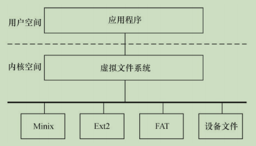
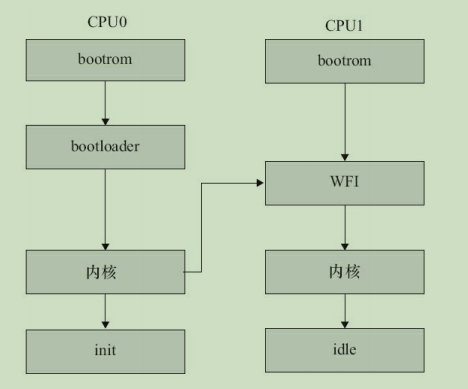
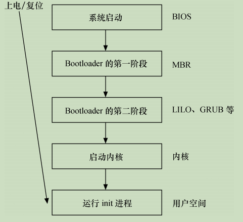

## 3.1 Linux 2.6 后的内核特点

* `新的调度器` Linux2.6 早期采用了`O(1)` 算法，之后转移到 `CFS算法(（Completely Fair Scheduler，完全公平调度)`。Linux 3.14中实现了`EDF（Earliest Deadline First，最早截止期限优先）`调度算法。

* `内核抢占` 在Linux 2.6以后版本的Linux内核中，一个内核任务可以被抢占，从而提高系统的实时性。

* `改进的线程模型` Linux 2.6以后版本中的线程采用`NPTL（Native POSIX Thread Library，本地POSIX线程库）模型`，操作速度得以极大提高。NPTL没有使用LinuxThreads模型中采用的管理线程，内核本身也增加了FUTEX（Fast Userspace Mutex，快 速用户态互斥体），从而减小多线程的通信开销。

* `虚拟内存的变化` 新内核融合了r-map（反向映射）技术，通过页结构体快速寻找到页面的映射。

* `文件系统` 增加了对日志文件系统功能的支持，增加了对扩展属性的支持，可以给指定的文件在文件系统中嵌入元数据。

* `音频` 采用高级Linux音频体系结构（Advanced Linux Sound Architecture，ALSA），ALSA支持USB音频和MIDI设备，并支持全双工重放等功能。

* `总线、设备和驱动模型` 在Linux 2.6以后的内核中，总线、设备、驱动三者之间因为一定的联系性而实现对设备的控制。总线是三者联系起来的基础，通过一种总线类型，将设备和驱动联系起来。总线类型中的match（）函数用来匹配设备和驱动，当匹配操作完成之后就会执行驱动程序中的probe（）函数。

* `电源管理` 支持高级配置和电源接口（Advanced Configuration and Power Interface，ACPI），用于调整CPU在不同的负载下工作于不同的时钟频率以降低功耗。

   > 目前，Linux内核的电源管理（PM）相对比较完善了，包括CPUFreq、CPUIdle、CPU热插拔、设备运行时PM、Linux系统挂起到内存和挂起到硬盘等全套的支持，在ARM上的支持也较完备。

* `联网和IPSec` Linux 2.6内核中加入了对IPSec的支持，加入了对新的NFSv4（网络文件系统）客户机/服务器的支持，并改进了对IPv6的支持。

* `用户界面层` Linux 2.6内核重写了帧缓冲/控制台层，人机界面层还加入了对近乎所有接口设备的支持。在内核API中增加了不

   少新功能（例如内存池）、sysfs文件系统、内核模块从.o变为.ko、驱动模块编译方式、模块使用计数、模块加载和卸载函数的定义等方面。

* `Linux 3.0后ARM架构的变更` ARM Linux的代码在时钟、DMA、pinmux、计时器刻度等诸多方面都进行了优化和调整，也删除了arch/arm/mach-xxx/include/mach头文件目录，以至于Linux 3.7以后的内核可以支持多平台，即用同一份内核镜像运行于多家SoC公司的多个芯片，实现“一个Linux可适用于所有的ARM系统” 。

## 3.2 Linux内核的组成

### 3.2.1 Linux内核源代码的目录结构


内核一般要做到drivers与arch的软件架构分离，驱动中不包含板级信息，让驱动跨平台。同时内核的通用部分（如kernel、fs、ipc、net等）则与具体的硬件（arch和drivers）剥离。

### 3.3.2 Linux内核的组成部分

 

如上图所示，Linux内核主要由`进程调度`、`内存管理`、`虚拟文件系统`、`网络接口`和`进程间通信`5个子系统组成。

#### 3.2.2.1 进程调度（`SCHED`）

进程调度控制系统中的多个进程对CPU的访问，使得多个进程能在CPU中“`微观串行，宏观并行`”地执行。

进程调度处于系统的中心位置，内核中其他的子系统都依赖它，因为每个子系统都需要挂起或恢复进程。

Linux进程在几个状态间进行切换如下：

 

在设备驱动编程中，当请求的资源不能得到满足时，驱动一般会调度其他进程执行，并使本进程进入睡眠状态，直到它请求的资源被释放，才会被唤醒而进入就绪状态。

> 睡眠分成可中断的睡眠和不可中断的睡眠，两者的区别在于可中断的睡眠在收到信号的时候会醒。
> 完全处于TASK_UNINTERRUPTIBLE 状态的进程甚至都无法被“杀死” ，所以Linux 2.6.26之后的内核也存在一种TASK_KILLABLE的状态，它等于“TASK_WAKEKILL|TASK_UNINTERRUPTIBLE” ，可以响应致命信号。

在Linux内核中，使用 `task_struct` 结构体来描述进程，该结构体中包含描述该进程内存资源、文件系统资源、文件资源、tty资源、信号处理等的指针。Linux的线程采用轻量级进程模型来实现，在用户空间通过 `pthread_create()` API创建线程的时候，本质上内核只是创建了一个新的task_struct，并将新task_struct的所有资源指针都指向创建它的那个task_struct的资源指针。

绝大多数进程（以及进程中的多个线程）是由用户空间的应用创建的，当它们存在底层资源和硬件访问的需求时，会通过系统调用进入内核空间。有时候，在内核编程中，如果需要几个并发执行的任务，可以启动内核线程，这些线程没有用户空间。启动内核线程的函数为：

>`pid_t kernel_thread(int (*fn)(void *), void *arg, unsigned long flags);`

#### 3.2.2.2 内存管理(`MM`)

内存管理的主要作用是控制多个进程安全地共享主内存区域。当CPU提供内存管理单元（MMU）时，Linux内存管理对于每个进程完成从虚拟内存到物理内存的转换。`Linux 2.6引入了对无MMU CPU的支持`。

 

如上图所示，一般而言，32位处理器的Linux的每个进程享有4GB的内存空间，`0~3GB`属于用户空间，`3~4GB`属于内核空间，内核空间对常规内存、I/O设备内存以及高端内存有不同的处理方式。

> 当然，内核空间和用户空间的具体界限是可以调整的，在内核配置选项`Kernel Features --> Memory split`下，可以设置界限为2GB或者3GB。

 

如上图所示，Linux内核的内存管理总体比较庞大，包含底层的Buddy算法，它用于`管理每个页的占用情况`，`内核空间的slab`以及`用户空间的C库的二次管理`。另外，内核也提供了页缓存的支持，用内存来缓存磁盘，per-BDIflusher线程用于刷回脏的页缓存到磁盘。Kswapd（交换进程）则是Linux中用于页面回收（包括file-backed的页和匿名页）的内核线程，它采用`最近最少使用（LRU）算法`进行内存回收。

#### 3.2.2.3 虚拟文件系统(`VFS`)

 

Linux虚拟文件系统隐藏了各种硬件的具体细节，为所有设备提供了统一的接口。而且，它独立于各个具体的文件系统，是对各种文件系统的一个抽象。它为上层的应用程序提供了统一的vfs_read（）、vfs_write（）等接口，并调用具体底层文件系统或者设备驱动中实现的file_operations结构体的成员函数。

#### 3.2.2.4 网络接口(`NET`)

 

网络接口提供了对各种网络标准的存取和各种网络硬件的支持。如上图所示，在Linux中网络接口可分为：

* `网络协议部分`负责实现每一种可能的网络传输协议
* `网络设备驱动程序`负责与硬件设备通信，`每一种可能的硬件设备都有相应的设备驱动程序`。

Linux内核支持的协议栈种类较多, 上层的应用程序统一使用 `BSD套接字` 接口。

#### 3.2.2.5 进程间通信(`IPC`)

Linux提供了多种通信机制来支持进程间通信，包含：`信号量`、`共享内存`、`消息队列`、`管道`、`UNIX域套接字`等，这些机制可协助多个进程、多资源的互斥访问、进程间的同步和消息传递。

> 在实际的Linux应用中，人们更多地趋向于使用UNIX域套接字，而不是System V IPC中的消息队列等机制。Android内核则新增了`Binder`进程间通信方式。

Linux内核5个组成部分之间的依赖关系如下。

* `SCHED`与`MM`：这两个子系统互相依赖。在多程序环境下，程序要运行，则必须为之创建进程，而创建进程的第一件事情，就是将程序和数据装入内存。
* `IPC`与`MM`：进程间通信子系统要依赖内存管理支持共享内存通信机制，这种机制允许两个进程除了拥有自己的私有空间之外，还可以存取共同的内存区域。
* `VFS`与`NET`：虚拟文件系统利用网络接口支持网络文件系统（NFS），也利用内存管理支持RAMDISK设备。
* `MM`与`VFS`：内存管理利用虚拟文件系统支持交换，交换进程定期由调度程序调度，这也是内存管理依赖于进程调度的原因。当一个进程存取的内存映射被换出时，内存管理向虚拟文件系统发出请求，同时，挂起当前正在运行的进程。

除了这些依赖关系外，内核中的所有子系统还要依赖于一些共同的资源。这些资源包括所有子系统都用到的API，如分配和释放内存空间的函数、输出警告或错误消息的函数及系统提供的调试接口等。

### 3.2.3 Linux 内核空间与用户空间

现代CPU内部往往实现了不同操作模式(级别)，不同模式有不同功能，高层程序往往不能访问低级功能，而必须以某种方式切换到低级模式。例如，ARM处理器分为7种工作模式。

* `用户模式(usr)`：大多数应用程序运行在此模式下,当处理器运行在此模式下时,某些被保护的系统资源是不能访问的。
* `快速中断模式(fiq)`：用于高速数据传输或通道处理。
* `外部中断模式(irq)`：用于通用的中断处理。
* `管理模式(svc)`：操作系统使用的保护模式。
* `数据访问中止模式(abt)`：当数据或指令预取中止时进入该模式，可用于虚拟存储及存储保护。
* `系统模式(sys)`:  运行具有特权的操作系统任务。
* `未定义指令中止模式(und)`:  当未定义的指令执行时进入该模式，可用于支持硬件协处理器的软件仿真。

ARM Linux的系统调用实现原理是: **采用swi软中断从用户(usr)模式陷入管理模式(svc)**。

又如，x86处理器包含4个不同的特权级，称为`Ring0 ~ Ring3`。

> 在`Ring0`下，可以执行特权级指令，对任何`I/O设备`都有访问权等，而`Ring3`则被限制很多操作。

Linux系统可充分利用CPU的这一硬件特性(`不同操作模式`)，但它只使用了`两级`。在Linux系统中，内核可进行任何操作，而应用程序则被禁止对硬件的直接访问和对内存的未授权访问。

例如，若使用x86处理器，则用户代码运行在特权级3，而系统内核代码则运行在特权级0。

内核空间和用户空间这两个名词用来区分程序执行的两种不同状态，它们使用不同的地址空间。Linux只能通过`系统调用`和`硬件中断`完成从用户空间到内核空间的控制转移。

## 3.3 Linux 内核的编译及加载

### 3.3.1 Linux内核的编译

Linux驱动开发者需要牢固地掌握Linux内核的编译方法以为嵌入式系统构建可运行的Linux操作系统映像。

```bash
### 配置内核
make config     #基于文本的最为传统的配置界面，不推荐使用
make menuconfig #基于文本菜单的配置界面(推荐使用)
make xconfig    #要求QT被安装
make gconfig    #要求GTK+被安装

### 编译内核和模块
make zImage
make modules
```

### 3.3.2 Linux内核的引导

引导Linux系统的过程包括很多阶段，这里将以引导ARM Linux为例来进行讲解(见下图)：

 

一般的SoC内嵌入了bootrom，上电时bootrom运行。对于CPU0而言，bootrom会去引导bootloader，而其他CPU则判断自己是不是CPU0，进入WFI的状态等待CPU0来唤醒它。CPU0引导bootloader，bootloader引导Linux内核，在内核启动阶段，CPU0会发中断唤醒CPU1，之后CPU0和CPU1都投入运行。CPU0会引起用户空间的init程序被调用，init程序再派生其他进程，派生出来的进程再派生其他进程。CPU0和CPU1共担这些负载，进行负载均衡。

bootrom是各个SoC厂家根据自身情况编写的，目前的SoC一般都具有从SD、eMMC、NAND、USB等介质启动的能力，这证明这些`bootrom内部的代码具备读SD、NAND等能力`。嵌入式Linux领域最著名的bootloader是`U-Boot`。在ARM Linux支持设备树（Device Tree）后，bootloader则需要把dtb的地址放入r2寄存器中。当然，ARM Linux也支持直接把dtb和zImage绑定在一起的模式（内核ARM_APPENDED_DTB选项“Use appended device tree blob to zImage”），这样r2寄存器就不再需要填充dtb地址了。

类似zImage的内核镜像实际上是由没有压缩的解压算法和被压缩的内核组成，所以在bootloader跳入zImage以后，它自身的解压缩逻辑就把内核的镜像解压缩出来了。

用户空间的init程序常用的有busybox init、SysVinit、systemd等，它们的职责类似，把整个系统启动，最后形成一个进程树。

### 3.3.3 Linux内核在`x86` 平台引导

在 X86 PC 上有一个从 `BIOS(基本输入/输出系统)`转移到 Bootloader 的过程，而嵌入式系统往往复位后就直接运行 Bootloader。

 

上图为 X86 PC 上从上电/复位到运行 Linux 用户空间初始进程的流程。在进入与 Linux相关代码之间，会经历如下阶段。

`(1)` **当系统上电或复位时，CPU 会将 PC 指针赋值为一个特定的地址 0xFFFF0 并执行该地址处的指令**。在 PC 机中，该地址位于 BIOS 中，它保存在主板上的 ROM 或 Flash 中。

`(2)`  **BIOS 运行时按照 CMOS 的设置定义的启动设备顺序来搜索处于活动状态并且可以引导的设备**。若从硬盘启动，BIOS 会将硬盘 MBR（主引导记录）中的内容加载到 RAM。当 MBR 被加载到 RAM中之后，BIOS 就会将控制权交给 MBR。

`(3)` **主引导加载程序查找并加载次引导加载程序**。它在分区表中查找活动分区，当找到一个活动分区时，扫描分区表中的其他分区，以确保它们都不是活动的。当这个过程验证完成之后，就将活动分区的引导记录从这个设备中读入 RAM 中并执行它。

`(4)` **次引导加载程序加载 Linux 内核和可选的初始 RAM 磁盘，将控制权交给 Linux 内核源代码**。

`(5)` **运行被加载的内核，并启动用户空间应用程序**。

不论具体以怎样的方式实现，只要具备如下特征就可以称其为 `Bootloader`。

1. `可以在系统上电或复位的时候以某种方式执行`，这些方式包括

   > `被BIOS引导执行`、`直接在NOR Flash中执行`、`NAND Flash中的代码被MCU自动拷入内部或外部 RAM执行`等

2. 能将 U 盘、磁盘、光盘、NOR/NAND Flash、ROM、SD 卡等存储介质，甚或网口、串口中的操作系统加载到 RAM 并把控制权交给操作系统源代码执行。

完成上述功能的 Bootloader 的实现方式非常多样化，甚至本身也可以是一个简化版的操作系统。著名的 Linux Bootloader 包括应用于 PC 的 LILO 和 GRUB，应用于嵌入式系统的 U-Boot、RedBoot 等。

我们有必要对上述流程的第 5 个阶段进行更详细的分析，它完成`启动内核并运行用户空间的init 进程`。

当内核映像被加载到 RAM 之后，Bootloader 的控制权被释放，内核阶段就开始了。内核映像并不是完全可直接执行的目标代码，而是一个压缩过的 zImage（小内核）或 bzImage（大内核，bzImage 中的 b 是“big”的意思）。

实际上，映像中包含未被压缩的部分，这部分中包含解压缩程序，解压缩程序会解压映像中被压缩的部分。zImage 和 bzImage 都是用 gzip 压缩的，它们不仅是一个压缩文件，而且在这两个文件的开头部分内嵌有 gzip 解压缩代码。

 

当 bzImage（用于 i386 映像）被调用时，它从/arch/i386/boot/head.S 的 start 汇编例程开始执行。

这个程序执行一些基本的硬件设置，并调用/arch/i386/boot/compressed/head.S 中的startup_32 例程。

startup_32 程序设置一些基本的运行环境（如堆栈）后，清除 BSS 段，调用/arch/i386/boot/compressed/misc.c 中的 decompress_kernel() C 函数解压内核。

内核被解压到内存中之后，会再调用/arch/i386/kernel/head.S 文件中的 startup_32 例程，这个新的 startup_32 例程（称为清除程序或进程 0）会初始化页表，并启用内存分页机制，接着为任何可选的浮点单元（FPU）检测CPU 的类型，并将其存储起来供以后使用。这些都做完之后，/init/main.c 中的 start_kernel()函数被调用，进入与体系结构无关的 Linux 内核部分。start_kernel()会调用一系列初始化函数来设置中断，执行进一步的内存配置。之后，/arch/i386/kernel/process.c 中 kernel_thread()被调用以启动第一个核心线程，该线程执行 init()函数，而原执行序列会调用 cpu_idle()等待调度。

作为核心线程的 init()函数完成外设及其驱动程序的加载和初始化，挂接根文件系统。init()打开/dev/console 设备，重定向 stdin、stdout 和 stderr 到控制台。之后，它搜索文件系统中的 init程序（也可以由“init=”命令行参数指定 init 程序），并使用 execve()系统调用执行 init 程序。搜索 init 程序的顺序为：/sbin/init、/etc/init、/bin/init 和/bin/sh。在嵌入式系统中，多数情况下，可以给内核传入一个简单的 shell 脚本来启动必需的嵌入式应用程序。

至此，漫长的 Linux 内核引导和启动过程就此结束，而 init()对应的这个由 start_kernel()创建的第一个线程也进入用户模式。

## 3.4 Linux下C编程特点

### 3.4.1 `GNU C` 与 `ANSI C`

Linux上可用的C编译器是GNU C编译器，GNU C对标准C进行一系列扩展，以增强标准C的功能。

* `零长度和变量长度数组`

  GNU C允许使用零长度数组，在定义变长对象的头结构时，这个特性非常有用。例如：

  > ```c
  > struct var_data {
  >   int len;
  >   char data[0];
  > };
  > ```
  >
  > char data[0]仅仅意味着程序中通过var_data结构体实例的data[index]成员可以访问len之后的第index个地址，它并没有为data[]数组分配内存，因此 `sizeof（struct var_data）=sizeof（int）`。

  GNU C中也可以使用1个变量定义数组，例如如下代码中定义的“double x[n]”：

  ```c
  int main (int argc, char *argv[])
  {
    int i, n = argc;
    double x[n];
    for (i = 0; i < n; i++)
      x[i] = i;

    return 0;
  }
  ```

* `case范围`

  GNU C支持case x…y这样的语法，区间[x，y]中的数都会满足这个case的条件.

  ```c
  switch (ch) {
  case '0'... '9': c -= '0';
    break;
  case 'a'... 'f': c -= 'a' - 10;
    break;
  case 'A'... 'F': c -= 'A' - 10;
    break;
  }
  ```

* `语句表达式`

  GNU C把包含在括号中的复合语句看成是一个表达式，称为语句表达式，它可以出现在任何允许表达式的地方。我们可以在语句表达式中使用原本只能在复合语句中使用的循环、局部变量等，例如：

  ```c
  #define min_t(type,x,y) \
    (｛type _ _x =(x);type _ _y = (y); _ _x<_ _y _ _x: _ _y; })

  int ia, ib, mini;
  float fa, fb, minf;
  mini = min_t(int, ia, ib);
  minf = min_t(float, fa, fb);
  ```

  因为重新定义了__xx和__y这两个局部变量，所以用上述方式定义的宏将不会有副作用。

* `typeof关键字`

  typeof（x）语句可以获得x的类型，因此，可以借助typeof重新定义min这个宏：

  ```c
  #define min(x,y) ({       \
    const typeof(x) _x=(x); \
    const typeof(y) _y=(y); \
    (void)(&_x == &_y);     \  //作用是检查_x和_y的类型是否一致
    _x < _y ? _x : _y; })
  ```

* `可变参数宏`

  在GNU C中，宏也可以接受可变数目的参数，例如：

  `#define pr_debug(fmt,arg...)  printk(fmt,##arg)`

  这里arg表示其余的参数，可以有零个或多个参数，这些参数以及参数之间的逗号构成arg的值，在宏扩展时替换arg

  >使用 `##` 是为了处理arg不代表任何参数的情况，这时候，前面的逗号就变得多余了。使用“##”之后，GNU C预处理器会丢弃前面的逗号

* `标号元素`

  在GNU C中，通过指定索引或结构体成员名，允许初始化值以任意顺序出现。

  指定数组索引的方法是在初始化值前添加“[INDEX]=” ，当然也可以用“[FIRST...LAST]=”的形式指定一个范围。例如

  ```c
  unsigned char data[MAX] = { [0 ... MAX-1] = 0 }; //定义了一个数组，并把其中的所有元素赋值为0：
  ```

  下面的代码借助结构体成员名初始化结构体：

  ```c
  struct file_operations ext2_file_operations = {
  .llseek = generic_file_llseek,
      .read = generic_file_read,
      .write = generic_file_write,
      .aio_read = generic_file_aio_read,
      .aio_write = generic_file_aio_write,
      .ioct = ext2_ioctl,
      .mmap = generic_file_mmap,
      .open = generic_file_open,
      .release = ext2_release_file,
      .fsync = ext2_sync_file,
      .readv = generic_file_readv,
      .writev = generic_file_writev,
      .sendfile = generic_file_sendfile,
  };
  ```

* `当前函数名`

  请尽量使用 `C99`标准里支持的宏 `__func__`

* `特殊属性声明`

  GNU C允许声明函数、变量和类型的特殊属性，以便手动优化代码和定制代码检查的方法。

  要指定一个声明的属性，只需要在声明后添加`__attribute__((ATTRIBUTE))`。

  > GNU C支持`noreturn`、`format`、`section`、`aligned`、`packed`等十多个属性。

  `noreturn` 属性作用于函数，表示该函数从不返回。这会让编译器优化代码，并消除不必要的警告信息。例如：

  ```c
  # define ATTRIB_NORET __attribute__((noreturn)) //....
  asmlinkage NORET_TYPE void do_exit(long error_code) ATTRIB_NORET;
  ```

  `format` 属性也用于函数，表示该函数使用printf、scanf或strftime风格的参数，指定format属性可以让编译器根据格式串检查参数类型。例如：

  ```c
  asmlinkage int printk(const char * fmt, ...) __attribute__ ((format (printf, 1, 2)));
  //上述代码中的第1个参数是格式串，从第2个参数开始都会根据 printf() 函数的格式串规则检查参数。
  ```

  `unused`属性作用于函数和变量，表示该函数或变量可能不会用到，这个属性可以避免编译器产生警告信息。

  `aligned` 属性用于变量、结构体或联合体，指定变量、结构体或联合体的对齐方式，以字节为单位，例如：

  ```c
  struct example_struct {
    char a;
    int b;
    long c;
  } __attribute__((aligned(4)));
  //表示该结构类型的变量以4字节对齐。
  ```
  
  `packed` 属性作用于变量和类型，用于变量或结构体成员时表示使用最小可能的对齐，用于枚举、结构体或联合体类型时表示该类型使用最小的内存。例如：
  
  ```c
  struct example_struct {
  char a;
  int b;
  long c __attribute__((packed));
  };
  ```
  
* `内建函数`

  GNU C提供了大量内建函数，其中大部分是标准C库函数的GNU C编译器内建版本。

  不属于库函数的其他内建函数的命名通常以__builtin开始，如下所示。

  * 内建函数 `__builtin_return_address（LEVEL）` 返回当前函数或其调用者的返回地址

    > 参数LEVEL指定调用栈的级数，如0表示当前函数的返回地址，1表示当前函数的调用者的返回地址。

  * 内建函数 `__builtin_constant_p（EXP）`用于判断一个值是否为编译时常数

    > 如果参数EXP的值是常数，函数返回1，否则返回0。

  * 内建函数 `__builtin_expect（EXP，C）`用于为编译器提供分支预测信息
  
    > 其返回值是整数表达式EXP的值，C的值必须是编译时常数。
  
    Linux内核编程时常用的likely（）和unlikely（）底层调用的likely_notrace（）、unlikely_notrace（）就是基于__builtin_expect（EXP，C）实现的。
  
    ```c
    #define likely_notrace(x) __builtin_expect(!!(x), 1)
    #define unlikely_notrace(x) __builtin_expect(!!(x), 0)
    ```
  
    若代码中出现分支，则即可能中断流水线，我们可以通过likely（）和unlikely（）暗示分支容易成立还是不容易成立，例如：
  
    ```c
    if (likely(!IN_DEV_ROUTE_LOCALNET(in_dev)))
      if (ipv4_is_loopback(saddr))
        goto e_inval;
    ```

  * **在使用gcc编译C程序的时候，请尽可能的避免使用 `-ansi–pedantic`编译选项**
  
### 3.3.2 `do {} while (0)` 语句

  其实 `do{}while(0)` 的用法主要用于宏定义中。

  它使用完全是为了保证宏定义的使用者能无编译错误地使用宏，它不对其使用者做任何假设。

### 3.3.3 `goto`语句

Linux内核源代码中对goto的应用非常广泛，但是一般只限于错误处理中，其结构如：

```c
if(register_a()!=0)
goto err;
if(register_b()!=0)
goto err1;
if(register_c()!=0)
goto err2;
if(register_d()!=0)
goto err3;
...
err3:
unregister_c();
err2:
unregister_b();
err1:
unregister_a();
err:
return ret;
```

这种将goto用于错误处理的用法实在是简单而高效，只需保证在错误处理时注销、资源释放等，与正常的注册、资源申请顺序相反。
