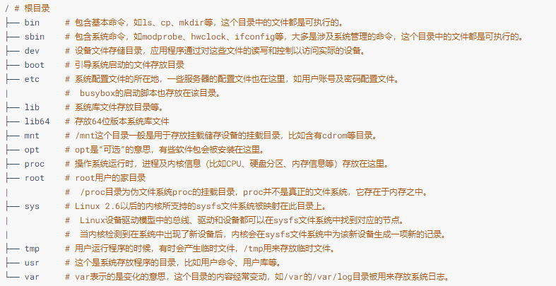

## 5.1 Linux文件操作

### 5.1.1 文件操作系统调用

Linux的文件操作 `系统调用` 涉及创建、打开、读写和关闭文件。

1. `创建`

   ```c
   int creat(const char* filename, mode_t mode);
   ```

   参数 `mode` 指定新建文件的存取权限。它同umask一起决定文件的最终权限（mode&umask），其中，`umask` 代表了文件在创建时需要去掉的一些存取权限。

   umask可通过系统调用umask（）来改变：

   ```c
   int umask(int newmask);
   ```

   该调用将umask设置为newmask，然后返回旧的umask，它只影响读、写和执行权限。

2. `打开`

   ```c
   int open(const char* pathname, int flags);
   int open(const char* pathname, int flags, mode_t mode);
   ```

   open（）函数有两个形式，其中pathname是我们要打开的文件名（包含路径名称，缺省是认为在当前路径下面），flags可以是表5.1中的一个值或者是几个值的组合。

    

   > - O_RDONLY、O_WRONLY、O_RDWR三个标志只能使用任意的一个。
   > - 如果使用了O_CREATE标志，则使用的函数是int open（const char*pathname，int flags，mode_t mode）；这个时候我们还要指定mode标志，以表示文件的访问权限。

   mode可以是下表中所列值的组合:

    
   除了可以通过上述宏进行“或”逻辑产生标志以外，我们也可以自己用数字来表示。

   Linux用5个数字来表示文件的各种权限：

   - 第一位表示设置用户ID；
   - 第二位表示设置组ID；
   - 第三位表示用户自己的权限位；
   - 第四位表示组的权限；
   - 最后一位表示其他人的权限。

   每个数字可以取1（执行权限）、2（写权限）、 4（读权限）、0（无）或者是这些值的和。

   如果文件打开成功，open函数会返回一个文件描述符，以后对该文件的所有操作就可以通过对这个文件描述符进行操作来实现。

3. `读写`

   在文件打开以后，我们才可对文件进行读写，Linux中提供文件读写的系统调用是read、write函数：

   ```c
   int read(int fd, const void *buf, size_t length);
   int write(int fd, const void *buf, size_t length);
   ```

   - 参数buf为指向缓冲区的指针，length为缓冲区的大小（以字节为单位）。
   - `read` 实现从文件描述符fd所指定的文件中读取length个字节到buf所指向的缓冲区中，返回值为实际读取的字节数。
   - `write`实现把length个字节从buf指向的缓冲区中写到文件描述符fd所指向的文件中，返回值为实际写入的字节数。

4. `定位`

   对于随机文件，我们可以随机指定位置进行读写，使用如下函数进行定位：

   ```c
   int lseek(int fd, offset_t offset, int whence);
   ```

   lseek（）将文件读写指针相对whence移动offset个字节。`操作成功时，返回文件指针相对于文件头的位置`。

   参数whence可使用下述值：

   - `SEEK_SET`: 相对文件开头
   - `SEEK_CUR`: 相对文件读写指针的当前位置
   - `SEEK_END`: 相对文件末尾

   offset可取负值，例如下述调用可将文件指针相对当前位置向前移动5个字节： `lseek(fd, -5, SEEK_CUR);`

   下列调用的返回值就是文件的长度：`lseek(fd,0,SEEK_END);`

5. `关闭`

   当我们操作完成以后，要关闭文件，此时，只要调用close就可以了，其中fd是我们要关闭的文件描述符：

   ```c
   int close(int fd);
   ```

### 5.1.2 C库文件操作

C库函数的文件操作实际上独立于具体的操作系统平台。

1. `创建与打开`

   ```c
   FILE* fopen(const char* path, const char* mode);
   ```

   fopen用于打开指定文件filename，其中的mode为打开模式，C库函数中支持的打开模式如下：

    

   其中，b用于区分二进制文件和文本文件，`但Linux不区分二进制文件和文本文件`

2. `读写`

   C库函数支持以字符、字符串等为单位，支持按照某种格式进行文件的读写，这一组函数为：

   ```c
   int fgetc(FILE* stream);
   int fputc(int c, FILE* stream);
   char* fgets(char* s, int n, FILE* stream);
   int fputs(const char* s, FILE* stream);
   int fprintf(FILE* stream, const char* format, ...);
   int fscanf (FILE* stream, const char* format, ...);
   size_t fread(void* ptr, size_t size, size_t n, FILE* stream);
   size_t fwrite (const void* ptr, size_t size, size_t n, FILE* stream);
   ```

   `fread` 实现从流（stream）中读取n个字段，每个字段为size字节，并将读取的字段放入ptr所指的字符数组中，返回实际已读取的字段数。

   > 当读取的字段数小于num时，可能是在函数调用时出现了错误，也可能是读到了文件的结尾。因此要通过调用 `feof` 和`ferror` 来判断。

   `fwrite` 实现从缓冲区ptr所指的数组中把n个字段写到流中，每个字段长为size个字节，返回实际写入的字段数。

   另外，C库函数还提供了读写过程中的定位能力，这些函数包括：

   ```c
   int fgetpos(FILE* stream, fpos_t* pos);
   int fsetpos(FILE *stream, const fpos_t* pos);
   int fseek(FILE *stream, long offset, int whence);
   ```

3. `关闭`

   利用C库函数关闭文件依然是很简单的操作：`int fclose(FILE* stream);`

## 5.2 Linux文件系统

### 5.2.1 Linux 文件系统目录结构

 

### 5.2.2 Linux文件系统与设备驱动

下所示为Linux中虚拟文件系统、磁盘/Flash文件系统及一般的设备文件与设备驱动程序之间的关系。 

 

应用程序和VFS之间的接口是系统调用，而VFS与文件系统以及设备文件之间的接口是file_operations结构体成员函数，

这个结构体包含对文件进行打开、关闭、读写、控制的一系列成员函数，其关系如下图:

 

- 由于字符设备的上层没有类似于磁盘的ext2等文件系统，所以字符设备的file_operations成员函数就直接由设备驱动提供了。

- 块设备有两种访问方法:

  - 一种方法是不通过文件系统直接访问裸设备. 在Linux内核实现了统一的def_blk_fops这一file_operations，它的源代码位于fs/block_dev.c。

    > 所以当我们运行类似于“`dd if=/dev/sdb1 of=sdb1.img`”的命令把整个`/dev/sdb1` 裸分区复制到sdb1.img的时候，内核走的是`def_blk_fops`这个file_operations。

  - 另外一种方法是通过文件系统来访问块设备，file_operations的实现则位于文件系统内，文件系统会把针对文件的读写转换为针对块设备原始扇区的读写。

    > 文件系统中会实现针对VFS的file_operations成员函数，设备驱动层此时将看不到file_operations的存在。

在设备驱动程序的设计中，一般而言，会关心file和inode这两个结构体。

## 5.3 `devfs`

## 5.4 udev用户空间设备管理
