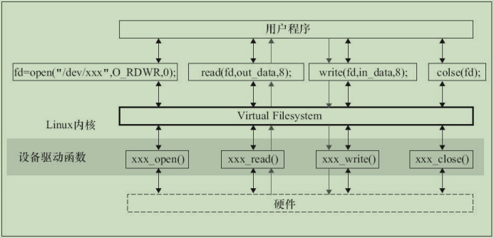

## 5.1 Linux文件操作

### 5.1.1 文件操作系统调用

Linux的文件操作 `系统调用` 涉及创建、打开、读写和关闭文件。

1. `创建`

   ```c
   int creat(const char* filename, mode_t mode);
   ```

   参数 `mode` 指定新建文件的存取权限。它同umask一起决定文件的最终权限（mode&umask），其中，`umask` 代表了文件在创建时需要去掉的一些存取权限。

   umask可通过系统调用umask（）来改变：

   ```c
   int umask(int newmask);
   ```

   该调用将umask设置为newmask，然后返回旧的umask，它只影响读、写和执行权限。

2. `打开`

   ```c
   int open(const char* pathname, int flags);
   int open(const char* pathname, int flags, mode_t mode);
   ```

   open（）函数有两个形式，其中pathname是我们要打开的文件名（包含路径名称，缺省是认为在当前路径下面），flags可以是表5.1中的一个值或者是几个值的组合。

    

   * O_RDONLY、O_WRONLY、O_RDWR三个标志只能使用任意的一个。
   * 如果使用了O_CREATE标志，则使用的函数是int open（const char*pathname，int flags，mode_t mode）；这个时候我们还要指定mode标志，以表示文件的访问权限。

   mode可以是下表中所列值的组合:

    
   除了可以通过上述宏进行“或”逻辑产生标志以外，我们也可以自己用数字来表示。

   Linux用5个数字来表示文件的各种权限：

   * 第一位表示设置用户ID；
   * 第二位表示设置组ID；
   * 第三位表示用户自己的权限位；
   * 第四位表示组的权限；
   * 最后一位表示其他人的权限。

   每个数字可以取1（执行权限）、2（写权限）、 4（读权限）、0（无）或者是这些值的和。

   如果文件打开成功，open函数会返回一个文件描述符，以后对该文件的所有操作就可以通过对这个文件描述符进行操作来实现。

3. `读写`

   在文件打开以后，我们才可对文件进行读写，Linux中提供文件读写的系统调用是read、write函数：

   ```c
   int read(int fd, const void *buf, size_t length);
   int write(int fd, const void *buf, size_t length);
   ```

   * 参数buf为指向缓冲区的指针，length为缓冲区的大小（以字节为单位）。
   * `read` 实现从文件描述符fd所指定的文件中读取length个字节到buf所指向的缓冲区中，返回值为实际读取的字节数。
   * `write`实现把length个字节从buf指向的缓冲区中写到文件描述符fd所指向的文件中，返回值为实际写入的字节数。

4. `定位`

   对于随机文件，我们可以随机指定位置进行读写，使用如下函数进行定位：

   ```c
   int lseek(int fd, offset_t offset, int whence);
   ```

   lseek（）将文件读写指针相对whence移动offset个字节。`操作成功时，返回文件指针相对于文件头的位置`。

   参数whence可使用下述值：

   * `SEEK_SET`: 相对文件开头
   * `SEEK_CUR`: 相对文件读写指针的当前位置
   * `SEEK_END`: 相对文件末尾

   offset可取负值，例如下述调用可将文件指针相对当前位置向前移动5个字节： `lseek(fd, -5, SEEK_CUR);`

   下列调用的返回值就是文件的长度：`lseek(fd,0,SEEK_END);`

5. `关闭`

   当我们操作完成以后，要关闭文件，此时，只要调用close就可以了，其中fd是我们要关闭的文件描述符：

   ```c
   int close(int fd);
   ```

### 5.1.2 C库文件操作

C库函数的文件操作实际上独立于具体的操作系统平台。

1. `创建与打开`

   ```c
   FILE* fopen(const char* path, const char* mode);
   ```

   fopen用于打开指定文件filename，其中的mode为打开模式，C库函数中支持的打开模式如下：

    

   > 其中，b用于区分二进制文件和文本文件，`但Linux不区分二进制文件和文本文件`

2. `读写`

   C库函数支持以字符、字符串等为单位，支持按照某种格式进行文件的读写，这一组函数为：

   ```c
   int fgetc(FILE* stream);
   int fputc(int c, FILE* stream);
   char* fgets(char* s, int n, FILE* stream);
   int fputs(const char* s, FILE* stream);
   int fprintf(FILE* stream, const char* format, ...);
   int fscanf (FILE* stream, const char* format, ...);
   size_t fread(void* ptr, size_t size, size_t n, FILE* stream);
   size_t fwrite (const void* ptr, size_t size, size_t n, FILE* stream);
   ```

   `fread` 实现从流（stream）中读取n个字段，每个字段为size字节，并将读取的字段放入ptr所指的字符数组中，返回实际已读取的字段数。

   > 当读取的字段数小于n时，可能是在函数调用时出现了错误，也可能是读到了文件的结尾。因此要通过调用 `feof` 和`ferror` 来判断。

   `fwrite` 实现从缓冲区ptr所指的数组中把n个字段写到流中，每个字段长为size个字节，返回实际写入的字段数。

   另外，C库函数还提供了读写过程中的定位能力，这些函数包括：

   ```c
   int fgetpos(FILE* stream, fpos_t* pos);
   int fsetpos(FILE *stream, const fpos_t* pos);
   int fseek(FILE *stream, long offset, int whence);
   ```

3. `关闭`

   利用C库函数关闭文件依然是很简单的操作：`int fclose(FILE* stream);`

## 5.2 Linux文件系统

### 5.2.1 Linux 文件系统目录结构

 

 

### 5.2.2 Linux文件系统与设备驱动

为 Linux 中虚拟文件系统、磁盘文件（存放于 Ramdisk、Flash、ROM、SD 卡、U盘等文件系统中的文件也属于此列）及一般的设备文件与设备驱动程序之间的关系如下图所示:

 

应用程序和VFS之间的接口是`系统调用`，而VFS与磁盘文件系统以及普通设备文件之间的接口是`file_operations结构体成员函数`，这个结构体包含对文件进行打开、关闭、读写、控制的一系列成员函数，其关系如下图:

 

由于字符设备的上层没有类似于磁盘的ext2等文件系统，所以字符设备的file_operations成员函数就直接由设备驱动提供了。

块设备有两种访问方法:

* 一种方法是`直接访问裸设备`。

  在Linux内核实现了统一的def_blk_fops这一file_operations，它的源代码位于fs/block_dev.c。所以当我们运行类似于`dd if=/dev/sdb1 of=sdb1.img` 的命令把整个`/dev/sdb1` 裸分区复制到sdb1.img的时候，内核走的是`def_blk_fops`这个file_operations。

* 另外一种方法是`通过文件系统来访问块设备`。

  file_operations的实现则位于文件系统内，文件系统会把针对文件的读写转换为针对块设备原始扇区的读写。文件系统中会实现针对VFS的file_operations成员函数，设备驱动层此时将看不到file_operations的存在。

在设备驱动程序的设计中，一般而言，会关心 file 和 inode 这两个结构体。

file 结构体代表一个打开的文件（设备对应于设备文件），系统中每个打开的文件在内核空间都有一个关联的 file结构体。它由内核在打开文件时创建，并传递给在文件上进行操作的任何函数。在文件的所有实例都关闭后，内核释放这个数据结构。在内核和驱动源代码中，struct file 的指针通常被命名为 file 或 filp（即 file pointer）。

```CPP
struct file {
union {
    struct llist_node fu_llist;
    struct rcu_head fu_rcuhead;
} f_u;
struct path f_path;
#define f_dentry f_path.dentry
struct inode *f_inode;                /* cached value */
const struct file_operations*f_op;    /* 和文件关联的操作*/

/* Protects f_ep_links, f_flags. Must not be taken from IRQ context.*/
spinlock_t f_lock;
atomic_long_t f_count;
unsigned int f_flags;               /*文件标志，如O_RDONLY、O_NONBLOCK、O_SYNC*/
fmode_t f_mode;                     /*文件读、写模式，FMODE_READ和FMODE_WRITE*/
struct mutex f_pos_lock;
loff_t f_pos;                       /* 当前读写位置 */
struct fown_struct f_owner;
const struct cred *f_cred;
struct file_ra_statef_ra;

u64 f_version;
#ifdef CONfiG_SECURITY
void *f_security;
#endif
/* needed for tty driver, and maybe others */
void *private_data;           /*文件私有数据*/

/* used by fs/eventpoll.c to link all the hooks to this file */
#ifdef CONfiG_EPOLL
struct list_head f_ep_links;
struct list_head f_tfile_llink;
#endif /* #ifdef CONfiG_EPOLL */

struct address_space*f_mapping;
} __attribute__((aligned(4)));  /* lest something weird decides that 2 is OK */
```

文件读/写模式 f_mode、标志 f_flags 都是设备驱动关心的内容，而私有数据指针 private_data 在设备驱动中被广泛应用，大多被指向设备驱动自定义用于描述设备的结构体。

```CPP
/*驱动程序中经常会使用如下类似的代码来检测用户打开文件的读写方式：*/

/* 用户要求可写 */
if (file->f_mode & FMODE_WRITE) {
    //...
}

/* 用户要求可读 */
if (file->f_mode & FMODE_READ) {
    //...
}

/*下面的代码可用于判断以阻塞还是非阻塞方式打开设备文件：*/
if (file->f_flags & O_NONBLOCK) /* 非阻塞 */
 pr_debug("open: non-blocking\n");
else /* 阻塞 */
 pr_debug("open: blocking\n");
```

`VFS inode` 包含文件访问权限、属主、组、大小、生成时间、访问时间、最后修改时间等信息。它是 Linux 管理文件系统的最基本单位，也是文件系统连接任何子目录、文件的桥梁，inode结构体的定义如下：

```CPP
struct inode {
//...
umode_t i_mode; /* inode 的权限 */
uid_t i_uid;    /* inode 拥有者的 id */
gid_t i_gid;    /* inode 所属的群组 id */
dev_t i_rdev;   /* 若是设备文件，此字段将记录设备的设备号 */
loff_t i_size;  /* inode 所代表的文件大小 */

struct timespec i_atime; /* inode 最近一次的存取时间 */
struct timespec i_mtime; /* inode 最近一次的修改时间 */
struct timespec i_ctime; /* inode 的产生时间 */

unsigned long i_blksize; /* inode 在做 I/O 时的区块大小 */
unsigned long i_blocks;  /* inode 所使用的 block 数，一个 block 为 512 byte*/

struct block_device *i_bdev;
/*若是块设备，为其对应的 block_device 结构体指针*/
struct cdev *i_cdev; /*若是字符设备，为其对应的 cdev 结构体指针*/
//...
};
```

对于表示设备文件的 inode 结构，i_rdev 字段包含设备编号。Linux 2.6 设备编号分为主设备编号和次设备编号，前者为 dev_t 的高 12 位，后者为 dev_t 的低 20 位。下列操作用于从一个 inode 中获得主设备号和次设备号：

```c
unsigned int iminor(struct inode *inode);
unsigned int imajor(struct inode *inode);
```

查看/proc/devices文件可以获知系统中注册的设备，第1列为主设备号，第2列为设备名

查看/dev目录可以获知系统中包含的设备文件，日期之前的两列给出了对应设备的主设备号和次设备号：

`主设备号是与驱动对应的概念`，同一类设备一般使用相同的主设备号，不同类的设备一般使用不同的主设备号（但是也不排除在同一主设备号下包含有一定差异的设备）。因为同一驱动可支持多个同类设备，因此用次设备号来描述使用该驱动的设备的序号，序号一般从 0 开始。

## 5.3 devfs设备文件系统

devfs是由Linux 2.4内核引入的，它的出现使得设备驱动程序能自主地管理自己的设备文件。具体来说，devfs具有如下优点：

`1.` 可以通过程序在设备初始化时在/dev 目录下创建设备文件，卸载设备时将它删除。

`2.` 设备驱动程序可以指定设备名、所有者和权限位，用户空间程序仍可以修改所有者和权限位。

`3.` 不再需要为设备驱动程序分配主设备号以及处理次设备号，在程序中可以直接给`register_chrdev()`传递`NULL`给主设备号以获得可用的主设备号，并在`devfs_register()`中指定次设备号。

```cpp
//// 驱动程序应调用下面这些函数来进行设备文件的创建和删除工作。

/* 创建设备目录 */
devfs_handle_t devfs_mk_dir(devfs_handle_t dir, const char *name, void *info);
/* 创建设备文件 */
devfs_handle_t devfs_register(devfs_handle_t dir, const char *name, unsigned int flags,
               unsigned int major, unsigned int minor, umode_t mode, void *ops, void *info);
/* 撤销设备文件 */
void devfs_unregister(devfs_handle_t de);
```

## 5.4 udev设备文件系统

### 5.4.1 udev 与 devfs的区别

尽管devfs有这样和那样的优点，但是，在Linux 2.6内核中，devfs被认为是过时的方法，并最终被抛弃了，udev取代了它。

下面举一个通俗的例子来理解udev设计的出发点。

> 以谈恋爱为例，Greg Kroah-Hartman认为，可以让内核提供谈恋爱的机制，但是不能在内核空间中限制跟谁谈恋爱，不能把谈恋爱的策略放在内核空间。因为恋爱是自由的，用户应该可以在用户空间中实现“萝卜白菜，各有所爱”的理想，可以根据对方的外貌、籍贯、性格等自由选择。对应devfs而言，第1个相亲的女孩被命名为/dev/girl0，第2个相亲的女孩被命名为/dev/girl1，以此类推。而在用户空间实现的udev则可以使得用户实现这样的自由：不管你中意的女孩是第几个，只要它与你定义的规则符合，都命名为/dev/mygirl！

udev 完全在用户态工作，利用设备加入或移除时内核所发送的热插拔事件（hotplug event）来工作。在热插拔时，设备的详细信息会由内核输出到位于/sys 的 sysfs 文件系统。udev 的设备命名策略、权限控制和事件处理都是在用户态下完成的，它利用 sysfs 中的信息来进行创建设备文件节点等工作。热插拔时输出到 sysfs 中的设备的详细信息就是相亲对象的资料（外貌、年龄、性格、籍贯等），设备命名策略等就是择偶标准。devfs 是个蹩脚的婚姻介绍所，它直接指定了谁和谁谈恋爱，而 udev 则聪明地多，它只是把资料交给客户，让客户根据这些资料去选择和谁谈恋爱。

由于 udev 根据系统中硬件设备的状态动态更新设备文件，进行设备文件的创建和删除等，因此，在使用 udev 后，/dev 目录下就会只包含系统中真正存在的设备了。 

`devfs 与 udev 的另一个显著区别`在于：采用 devfs，当一个并不存在的/dev 节点被打开的时候，devfs 能自动加载对应的驱动，而 udev 则不这么做。这是因为 udev 的设计者认为 Linux 应该在设备被发现的时候加载驱动模块，而不是当它被访问的时候。udev 的设计者认为系统中所有的设备都应该产生热插拔事件并加载恰当的驱动，而udev能注意到这点并且为它创建对应的设备节点。

这里有一个问题，就是冷插拔的设备怎么办？冷插拔的设备在开机时就存在，在udev启动前已经被插入了。对于冷插拔的设备，Linux内核提供了sysfs下面一个uevent节点，可以往该节点写一个“add” ，导致内核重新发送netlink，之后udev就可以收到冷插拔的netlink消息了。

```bash
echo add >/sys/module/psmouse/uevent
```

### 5.4.2 sysfs 文件系统与Linux设备模型

Linux 2.6 的内核引入了 sysfs 文件系统，sysfs 被看成是与 proc、devfs 和 devpty 同类别的文件系统，该文件系统是一个虚拟的文件系统，它可以产生一个包括所有系统硬件的层级视图，与提供进程和状态信息的 proc 文件系统十分类似。

sysfs 把连接在系统上的设备和总线组织成为一个分级的文件，它们可以由用户空间存取，向用户空间导出内核数据结构以及它们的属性。sysfs 的一个目的就是展示设备驱动模型中各组件的层次关系，其顶级目录包括 block、device、bus、drivers、class、power 和 firmware等。
```bash
#block    -- 目录包含所有的块设备；
#devices  -- 目录包含系统所有的设备，并根据设备挂接的总线类型组织成层次结构；
#bus      -- 目录包含系统中所有的总线类型；
#drivers  -- 目录包括内核中所有已注册的设备驱动程序；
#class    -- 目录包含系统中的设备类型（如网卡设备、声卡设备、输入设备等）。 
```

大多数情况下，Linux 2.6 内核中的设备模型代码会作为“幕后黑手”处理好这些关系，内核中的总线级和其他内核子系统会完成与设备模型的交互，这使得驱动工程师几乎不需要关心设备模型，只需要按照每个框架的要求， “填鸭式”地填充xxx_driver里面的各种回调函数，xxx是总线的名字。 

在 Linux 内核中，分别使用 bus_type、device_driver 和 device 来描述总线、驱动和设备，这 3个结构体定义于include/linux/device.h 头文件中。

device_driver和device分别表示驱动和设备，而这两者都必须依附于一种总线，因此都包含struct bus_type指针。在Linux内核中，设备和驱动是分开注册的，注册1个设备的时候，并不需要驱动已经存在，而1个驱动被注册的时候，也不需要对应的设备已经被注册。设备和驱动各自涌向内核，而每个设备和驱动涌入内核的时候，都会去寻找自己的另一半，而正是bus_type的match（）成员函数将两者捆绑在一起。简单地说，设备和驱动就是红尘中漂浮的男女，而bus_type的match（）则是牵引红线的月老，它可以识别什么设备与什么驱动是可配对的。

> 一旦配对成功，xxx_driver的probe（）就被执行（xxx是总线名，如platform、pci、i2c、spi、usb等）。 

*注意:* 总线、驱动和设备最终都会落实为sysfs中的1个目录，因为进一步追踪代码会发现，它们实际上都可以认为是kobject的派生类，kobject可看作是所有总线、设备和驱动的抽象基类，1个kobject对应sysfs中的1个目录。总线、设备和驱动中的各个attribute则直接落实为sysfs中的1个文件，attribute会伴随着show（）和 store（）这两个函数，分别用于读写该attribute对应的sysfs文件。

**事实上，sysfs中的目录来源于bus_type、device_driver、device，而目录中的文件则来源于attribute。**

### 5.4.3 udev 的组成

