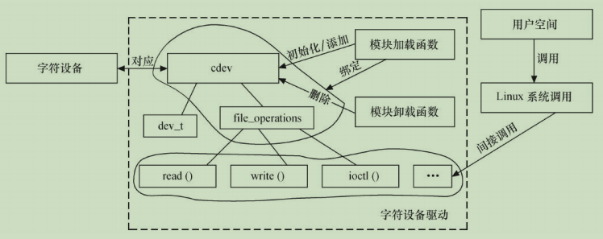

## 6.1 Linux字符设备驱动结构

### 6.1.1 cdev结构体

在Linux内核中，使用cdev结构体描述一个字符设备，cdev的定义代码如下：

```c
struct cdev {
  struct kobject kobj;
  struct module *owner;
  struct file_operations *ops;
  struct list_head list;
  dev_t dev;
  unsigned int count;
};
```

cdev结构体的dev_t成员定义了设备号，为32位，其中12位为主设备号，20位为次设备号。

```c
// 使用下列宏可以从dev_t获得主设备号和次设备号
MAJOR(dev_t dev)
MINOR(dev_t dev)

// 使用下列宏则可以通过主设备号和次设备号生成dev_t
MKDEV(int major, int minor)

// Linux内核提供了一组函数以用于操作cdev结构体

//// 用于初始化cdev的成员，并建立cdev和file_operations之间的连接
void cdev_init(struct cdev *dev, struct file_operations *ops);
struct cdev *cdev_alloc(void);
void cdev_put(struct cdev *p);
int cdev_add(struct cdev *, dev_t, unsigned);
void cdev_del(struct cdev *);
```

### 6.1.2 分配和释放设备号

调用cdev_add函数向系统注册字符设备之前，应首先调用`register_chrdev_region`或`alloc_chrdev_region`函数向系统申请设备号，这两个函数的原型为：

```c
// 用于已知起始设备的设备号的情况
int register_chrdev_region(dev_t from, unsigned count, const char *name);

// 用于设备号未知，向系统动态申请未被占用的设备号的情况(推荐使用)
///此函数调用成功之后，会把得到的设备号放入第一个参数dev中
int alloc_chrdev_region(dev_t *dev, unsigned baseminor, unsigned count, const char *name);
```

相应地，在调用cdev_del函数从系统注销字符设备之后，`unregister_chrdev_region`应该被调用以释放原先申请的设备号，这个函数的原型为：

```c
void unregister_chrdev_region(dev_t from, unsigned count);
```

### 6.1.3 file_operations 结构体

file_operations 结构体中的成员函数是字符设备驱动程序设计的主体内容，这些函数实际会在应用程序进行 Linux 的 open()、write()、read()、close()等系统调用时最终被调用。file_operations结构体如下定义：

>```c
>struct file_operations {
>struct module *owner;
>loff_t (*llseek) (struct file *, loff_t, int);
>ssize_t (*read) (struct file *, char __user *, size_t, loff_t *);
>ssize_t (*write) (struct file *, const char __user *, size_t, loff_t *);
>ssize_t (*read_iter) (struct kiocb *, struct iov_iter *);
>ssize_t (*write_iter) (struct kiocb *, struct iov_iter *);
>int (*iterate) (struct file *, struct dir_context *);
>int (*iterate_shared) (struct file *, struct dir_context *);
>unsigned int (*poll) (struct file *, struct poll_table_struct *);
>long (*unlocked_ioctl) (struct file *, unsigned int, unsigned long);
>long (*compat_ioctl) (struct file *, unsigned int, unsigned long);
>int (*mmap) (struct file *, struct vm_area_struct *);
>int (*open) (struct inode *, struct file *);
>int (*flush) (struct file *, fl_owner_t id);
>int (*release) (struct inode *, struct file *);
>int (*fsync) (struct file *, loff_t, loff_t, int datasync);
>int (*fasync) (int, struct file *, int);
>int (*lock) (struct file *, int, struct file_lock *);
>ssize_t (*sendpage) (struct file *, struct page *, int, size_t, loff_t *, int);
>unsigned long (*get_unmapped_area)(struct file *, unsigned long, unsigned long, unsigned long, unsigned long);
>int (*check_flags)(int);
>int (*flock) (struct file *, int, struct file_lock *);
>ssize_t (*splice_write)(struct pipe_inode_info *, struct file *, loff_t *, size_t, unsigned int);
>ssize_t (*splice_read)(struct file *, loff_t *, struct pipe_inode_info *, size_t, unsigned int);
>int (*setlease)(struct file *, long, struct file_lock **, void **);
>long (*fallocate)(struct file *file, int mode, loff_t offset, loff_t len);
>void (*show_fdinfo)(struct seq_file *m, struct file *f);
>#ifndef CONFIG_MMU
>unsigned (*mmap_capabilities)(struct file *);
>#endif
>ssize_t (*copy_file_range)(struct file *, loff_t, struct file *, loff_t, size_t, unsigned int);
>int (*clone_file_range)(struct file *, loff_t, struct file *, loff_t, u64);
>ssize_t (*dedupe_file_range)(struct file *, u64, u64, struct file *, u64);
>} __randomize_layout;
>```

### 6.1.4 Linux 字符设备驱动的组成

字符设备驱动由如下几个部分组成：

**1. `字符设备驱动模块加载与卸载函数`**

在字符设备驱动模块加载函数中应该实现设备号的申请和cdev的注册，而在卸载函数中应实现设备号的释放和cdev的注销。

> ```c
> /////##### 字符设备驱动模块加载与卸载函数模板 #####/////
> // 设备结构体(Linux内核的编码习惯)
> struct xxx_dev_t {
>  struct cdev cdev;
>  ...
> } xxx_dev;
> // 设备驱动模块加载函数
> static int __init xxx_init(void)
> {
>  ...
>  cdev_init(&xxx_dev.cdev, &xxx_fops); /* 初始化cdev */
>  xxx_dev.cdev.owner = THIS_MODULE;
>  /* 获取字符设备号*/
>  if (xxx_major) {
>  register_chrdev_region(xxx_dev_no, 1, DEV_NAME);
>  } else {
>  alloc_chrdev_region(&xxx_dev_no, 0, 1, DEV_NAME);
>  }
> 
>  ret = cdev_add(&xxx_dev.cdev, xxx_dev_no, 1); /* 注册设备*/
>  ...
> }
> /* 设备驱动模块卸载函数*/
> static void __exit xxx_exit(void)
> {
>  unregister_chrdev_region(xxx_dev_no, 1); /* 释放占用的设备号*/
>  cdev_del(&xxx_dev.cdev); /* 注销设备*/
>  ...
> }
> ```

**2. `字符设备驱动的file_operations结构体中的成员函数`**

file_operations结构体中的成员函数是字符设备驱动与内核虚拟文件系统的接口，是用户空间对Linux进行系统调用最终的落实者。大多数字符设备驱动会实现read（）、write（）和ioctl（）函数，常见的字符设备驱动的这3个函数的形式如下:

> ```c
> /////##### 字符设备驱动读、写、I/O控制函数模板 #####/////
> /* 读设备*/
> ssize_t xxx_read(struct file *filp, char __user *buf, size_t count, loff_t *f_pos)
> {
> ...
> copy_to_user(buf, ..., ...);
> ...
> }
> /*写设备*/
> ssize_t xxx_write(struct file *filp, const char __user *buf, size_t count, loff_t *f_pos)
> {
> ...
> copy_from_user(..., buf, ...);
> ...
> }
> /* ioctl函数 */
> long xxx_ioctl(struct file *filp, unsigned int cmd, unsigned long arg)
> {
> ...
> switch (cmd) {
> case XXX_CMD1:
> ...
> break;
> case XXX_CMD2:
> ...
> break;
> default:
> /* 不能支持的命令 */
> return - ENOTTY;
> }
> return 0;
> }
> ```

设备驱动的读、写函数中，filp是文件结构体指针，buf是用户空间内存的地址，该地址在内核空间不宜直接读写，count是要读的字节数，f_pos是读的位置相对于文件开头的偏移。

由于用户空间不能直接访问内核空间的内存，因此借助了函数`copy_from_user()`完成用户空间缓冲区到内核空间的复制，以及`copy_to_user()`完成内核空间到用户空间缓冲区的复制。两者的原型如下:

```c
unsigned long copy_from_user(void *to, const void __user *from, unsigned long count);
unsigned long copy_to_user(void __user *to, const void *from, unsigned long count);
///上述函数均返回不能被复制的字节数。如果完全复制成功，返回值为0。如果复制失败，则返回负值。

//读和写函数中的_user是一个宏，表明其后的指针指向用户空间，实际上更多地充当了代码自注释的功能。
///这个宏定义为：
#ifdef __CHECKER__
# define __user __attribute__((noderef, address_space(1)))
#else
# define __user
#endif
```

内核空间虽然可以访问用户空间的缓冲区，但是在访问之前，一般需要先检查其合法性，通过`access_ok(type,addr,size)`进行判断，以确定传入的缓冲区的确属于用户空间，例如：

> ```c
> static ssize_t read_port(struct file *file, char __user *buf, size_t count, loff_t *ppos)
> {
> 	unsigned long i = *ppos;
> 	char __user *tmp = buf;
> 	if (!access_ok(VERIFY_WRITE, buf, count))
> 		return -EFAULT;
> 	
> 	while (count-- > 0 && i < 65536) {
> 		if (__put_user(inb(i), tmp) < 0)
> 			return -EFAULT;
> 		i++;
> 		tmp++;
> 	}
> 	*ppos = i;
> 	return tmp - buf;
> }
> ```

`特别要提醒读者注意的是`：在内核空间与用户空间的界面处，内核检查用户空间缓冲区的合法性显得尤其必要，Linux内核的许多安全漏洞都是因为遗忘了这一检查造成的，非法侵入者可以伪造一片内核空间的缓冲区地址传入系统调用的接口，让内核对这个evil指针指向的内核空间填充数据。

其实copy_from_user（）、copy_to_user（）内部也进行了这样的检查：

> ```c
> static inline unsigned long __must_check copy_from_user(void *to,
>        const void __user *from, unsigned long n)
> {
>     if (access_ok(VERIFY_READ, from, n))
>     	n = __copy_from_user(to, from, n);
>     else /* security hole - plug it */
>     	memset(to, 0, n);
>     return n;
> }
> static inline unsigned long __must_check copy_to_user(void __user *to,
>        const void *from, unsigned long n)
> {
> 	if (access_ok(VERIFY_WRITE, to, n))
> 		n = __copy_to_user(to, from, n);
> 	return n;
> }
> ```

在字符设备驱动中，需要定义一个file_operations的实例，并将具体设备驱动的函数赋值给file_operations的成员，如代码所示：

> ```c
> struct file_operations xxx_fops = {
>        .owner = THIS_MODULE,
>        .read = xxx_read,
>        .write = xxx_write,
>        .unlocked_ioctl= xxx_ioctl,
>        ...
>};
> ```

下图所示即为字符设备驱动的结构、字符设备驱动与字符设备以及字符设备驱动与用户空间访问该设备的程序之间的关系:

 

