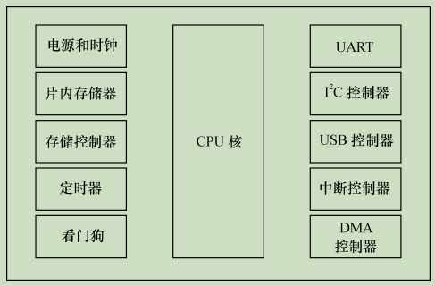
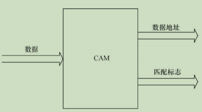
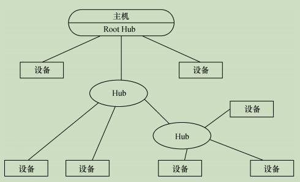
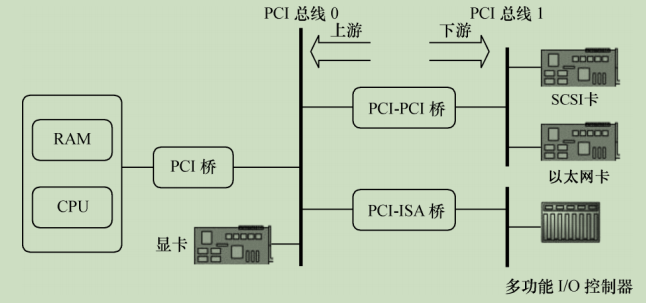
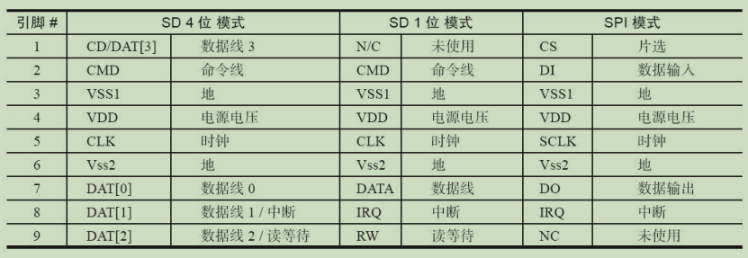
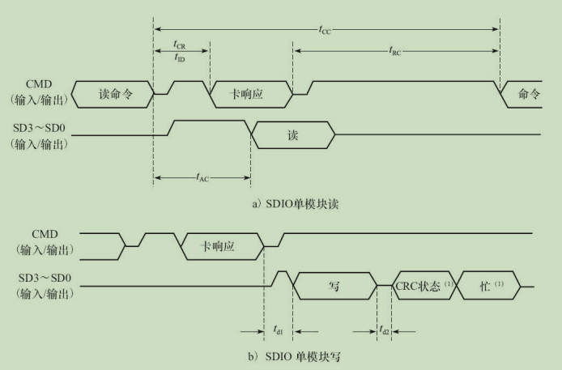

## 2.1 处理器(Processor)

### 2.1.1 通用处理器(GPP `--` General Purpose Processor)

一般而言，在嵌入式微控制器（MCU）和微处理器（MPU）中会包含一个通用处理器核。

> - `MPU` 通常代表一个 CPU（中央处理器）;
> - 而 `MCU` 则强调把中央处理器、存储器和外围电路集成在一个芯片中。

一个典型的集成了外围电路的 MCU的结构图示如下:

 

目前主流的通用处理器（GPP）多采用`SoC（片上系统,在一个芯片上设计了整个系统）`的芯片设计方法，集成了各种功能模块，每一种功能都是由硬件描述语言设计程序，然后在SoC内由电路实现的。在SoC中，每一个模块不是一个已经设计成熟的ASIC器件，而是利用芯片的一部分资源去实现某种传统的功能，将各种组件采用类似搭积木的方法组合在一起。

ARM内核的设计技术被授权给数百家半导体厂商，做成不同的SoC芯片。很多ARM主控芯片的集成度非常高，除了集成多核ARM以外，还可能集成图形处理器、视频编解码器、浮点协处理器、GPS、WiFi、蓝牙、基带、Camera等一系列功能。

中央处理器的体系结构可以分为两类:

- 一类为冯·诺依曼(或**普林斯顿**)结构 `--`  将程序指令存储器和数据存储器合并在一起的存储器
- 一类为哈佛结构 `--` 将程序指令和数据分开存储，指令和数据可以有不同的数据宽度。

 

${ARM9^+}$ 系列的处理器已经是 切换到 改进后的 `哈佛结构` 了。

 

从指令集的角度来讲，中央处理器也可以分为两类：

- RISC（精简指令集计算机）`--`强调尽量减少指令集、指令单周期执行，但是目标代码会更大。

- CISC（复杂指令集计算机）`--` 强调增强指令的能力、减少目标代码的数量，但是指令复杂，指令周期长

> ARM、MIPS、PowerPC等CPU内核都采用了RISC指令集。目前，RISC和CSIC两者的融合非常明显。

### 2.1.2 数字信号处理器(`DSP -- Digital Signal Processor`)

数字信号处理器`(DSP)`针对通信、图像、语音和视频处理等领域的算法而设计。它包含独立的硬件乘法器。DSP的乘法指令一般在单周期内完成，且优化了卷积、数字滤波、FFT（快速傅里叶变换）、相关矩阵运算等算法中的大量重复乘法。

DSP分为两类：

- 定点DSP `--`  用定点运算模拟浮点运算。
- 浮点DSP `--` 浮点运算用硬件来实现，可以在单周期内完成

网络处理器是一种可编程器件，它应用于电信领域的各种任务，如包处理、协议分析、路由查找、声音/数据的汇聚、防火墙、QoS 等。网络处理器器件内部通常由若干个微码处理器和若干硬件协处理器组成，多个微码处理器在网络处理器内部并行处理，通过预先编制的微码来控制处理流程。而对于一些复杂的标准操作（如内存操作、路由表查找算法、QoS 的拥塞控制算法、流量调度算法等）则采用硬件协处理器来进一步提高处理性能，从而实现了业务灵活性和高性能的有机结合。

对于某些应用场合，使用 ASIC（专用集成电路）往往是低成本且高性能的方案。ASIC 专门针对特定应用而设计，不具备也不需要灵活的编程能力。

常见的术语：

| 术语名 | 解释                                      |
| ------ | ----------------------------------------- |
| `ASIC` | 专用集成电路                              |
| `ASP`  | 专用处理器                                |
| `LUT`  | 查找表(`LookUp Table`)                    |
| `DSC`  | 数字信号控制器（`MCU` + `DSP`）           |
| `GPU`  | 图形处理单元（`Graphic Processing Unit`） |
| `ISP`  | 图像信号处理器(`Image Signal Processor`)  |

### 2.1.3 处理器分类总结

 

## 2.2 存储器

存储器主要可分类为`只读储存器（ROM）`、`闪存（Flash）`、`随机存取存储器（RAM）`、`光/磁介质储存器`。

目前 ROM 有被 Flash 替代的趋势，Flash闪存分为`NOR(或非) Flash` 和 `NAND(与非) Flash` 两种。

> - Intel 于 1988 年首先开发出 NOR Flash 技术
> - 1989 年，东芝公司发表了 NAND Flash 结构

NOR Flash 和 CPU 的接口属于典型的类 SRAM 接口，不需要增加额外的控制电路。

 

NOR Flash 的特点是可芯片内执行（XIP，eXecute In Place），`程序可以直接在 NOR 内运行`。而 NAND Flash 和 CPU 的接口必须由相应的控制电路进行转换，当然也可以通过地址线或 GPIO 产生 NAND Flash 接口的信号。`NAND FLASH 以块方式进行访问，不支持芯片内执行`。

一个NAND Flash的接口主要包含如下信号: 

NAND Flash 较 NOR Flash 容量大，价格低；NAND Flash 中每个块的最大擦写次数是一百万次，而 NOR 的擦写次数是十万次；NAND Flash 的擦除、编程速度远超过 NOR Flash。NAND Flash 发生位反转的几率要远大于 NOR Flash。位反转无法避免，因此，使用 NAND Flash 的同时，应采用`错误探测/错误更正（EDC/ECC）算法`。

Flash的编程原理都是**只能将1写为0，而不能将0写为1**。因此在Flash编程之前，必须将对应的块擦除，而擦除的过程就是把所有位都写为1的过程，块内的所有字节变为0xFF。

许多嵌入式系统都提供了 IDE（Integrated Drive Electronics）接口，以供连接硬盘控制器或光驱，`IDE 接口的信号与 SRAM 类似`。

以上所述的各种ROM、Flash和磁介质存储器都属于`非易失性存储器（NVM）`的范畴，掉电时信息不会丢失，而RAM则与此相反。

RAM也可再分为:

- 静态RAM（SRAM）`--` 是静态的， 只要供电它就会保持一个值，SRAM没有刷新周期。

  > SRAM每个SRAM存储单元由6个晶体管组成

- 动态RAM（DRAM）`--` 以电荷形式进行存储，数据存储在电容器中。由于电容器会因漏电而出现电荷丢失，所以DRAM器件需要定期刷新。

  > - 而DRAM存储单元由1个晶体管和1个电容器组成。

> 通常所说的SDRAM、DDR SDRAM皆属于DRAM的范畴，它们采用与`CPU外存控制器`同步的时钟工作.
>
> 与SDRAM相比，DDR SDRAM同时利用了时钟脉冲的上升沿和下降沿传输数据，因此在时钟频率不变的情况下，数据传输频率加倍。

### 2.2.1 特定类型的RAM

- `DPRAM：双端口RAM`  可以通过两个端口同时访问，具有两套完全独立的数据总线、地址总线和读写控制线，通常用于两个处理器之间交互数据，如图2.6所示。

 

- `CAM: 内容寻址RAM`  一种特殊的存储阵列RAM，它的主要工作机制就是同时将一个输入数据项与存储在CAM中的所有数据项自动进行比较，判别该输入数据项与CAM中存储的数据项是否相匹配，并输出该数据项对应的匹配信息。

 

- `FIFO -- 先进先出队列`  是先进先出，进出有序，FIFO多用于数据缓冲。

### 2.2.2 存储器分类总结

 

## 2.3 接口与总线

### 2.3.1 串口

`RS-232`、`RS-422` 与 `RS-485` 都是串行数据接口标准，最初都是由电子工业协会（EIA）制订并发布的。

1969 年发布的 RS-232 修改版`RS-232C`是嵌入式系统中应用最广泛的串行接口，它为连接DTE（数据终端设备）与DCE（数据通信设备）而制定。

RS-232C标准接口常用的9根信号为:

 

在嵌入式系统中，并不太注重 DTE 和 DCE 的概念，多使用 RS-232C 进行对等通信，如 Windows 超级终端、Linux minicom 用来连接电路板控制台等。 组成一个RS-232C串口的硬件原理如下图：

 

依次为CPU、UART（通用异步接收器发送器，作用是完成并/串转换）、CMOS/TTL电平与RS-232C电平转换、DB9/DB25或自定义连接器。

### 2.3.2  通用串行总线(`USB,Universal Serial Bus`)

USB（通用串行总线）是 Intel、Microsoft 等厂商为解决计算机外设种类的日益增加与有限的主板插槽和端口之间的矛盾而于 1995 年提出的，它具有`数据传输率高`、`易扩展`、`支持即插即用`和`热插拔`的优点，目前已得到广泛应用。

- USB 1.1 : `低速模式(1.5Mbit/s)` 和 `全速模式(12Mbit/s)`
- USB 2.0 : 新增 `高速模式(480Mbit/s;半双工)`
- USB 3.0 (Super Speed USB) `5.0 Gbit/s;全双工`

USB 的物理拓扑结构如图：

 

在嵌入式系统中，电路板若需要挂接 USB 设备（device），则需提供 USB 主机（host）控制器和连接器；若电路板需要作为 USB 设备，则需提供 USB 设备适配器和连接器。有的 MCU 集成了 USB 主机控制器和设备适配器。

USB 总线的机械连接非常简单,采用 4 芯的屏蔽线`一对差分线（D+，D-）传送信号`，`一对（VBUS，电源地）传送+5V 的直流电`。

USB 提供了 4 种传输方式以适应各种设备的需要：

- `控制（Control）传输方式` 双向传输，数据量通常较小，主要用来进行查询、配置和给 USB 设备发送通用的命令
- `同步（Synchronization）传输方式` 提供了确定的带宽和间隔时间
- `中断（Interrupt）传输方式` 单向的，对于 USB 主机而言，只有输入。主要应用在少量的、分散的、不可预测的数据传输场合，键盘、游戏杆和鼠标属于这一类型。
- `批量（Bulk）传输方式` 主要应用在没有带宽和间隔时间要求的批量数据的传送和接收，它要求保证传输质量。打印机和扫描仪属于这种类型

### 2.3.3 以太网接口

以太网接口由 `MAC (以太网接入控制器)` 和 `PHY(物理接口收发器)` 组成。以太网MAC由 `IEEE 802.3` 以太网标准定义，实现了数据链路层;PHY则实现了物理层功能。

> 目前常用的MAC支持`100Mbit/s` 和`1000 Mbit/s` 两种速率。

MAC和PHY之间采用MII（媒体独立接口）连接，包括1个数据接口与MAC和PHY之间的1个管理接口。

数据接口包括分别用于发送和接收的两条独立信道,每条信道都有自己的数据、时钟和控制信号,MII数据接口总共需要16个信号。

MII管理接口包含两个信号，一个是时钟信号，另一个是数据信号。通过管理接口，上层能监视和控制PHY。
一个以太网接口的硬件电路原理如下图：(依次为`CPU、MAC、PHY、以太网隔离变压器、RJ45插座`)

 

> 以太网隔离变压器是以太网收发芯片与连接器之间的磁性组件，在其两者之间起着信号传输、阻抗匹配、波形修复、信号杂波抑制和高电压隔离作用。

### 2.3.4  PCI 和 PCIe

PCI(外围部件互连,`Peripheral Component Interconnection`)是由 Intel 于 1991 年推出的一种局部总线，作为一种通用的总线接口标准，它在目前的计算机系统中得到了非常广泛的应用。PCI 提供了一组完整的总线接口规范，其目的是描述如何将计算机系统中的外围设备以一种结构化和可控化的方式连接在一起，给出了外围设备在连接时的电气特性和行为规约，并且详细定义了计算机系统中的各个不同部件之间应该如何正确地进行交互。PCI 总线具有如下特点：

- 数据总线 32 位，可扩充到 64 位

- 可进行突发（burst）模式传输

  > 突发方式传输是指取得总线控制权后连续进行多个数据的传输。
  >
  > 与突发方式对应的是`单周期方式`，它在1个总线周期只传送1个数据。

- 总线操作与处理器-存储器子系统操作并行

- 总线时钟频率为 33MHz 或 66MHz，最高传输率可达 528MB/s

- 采用中央集中式总线仲裁

- 支持全自动配置、资源分配，PCI 卡内有设备信息寄存器组为系统提供卡的信息，可实现即插即用

- PCI 总线规范独立于微处理器，通用性好

- PCI 设备可以完全作为主控设备控制总线

一个典型的基于 PCI 总线的计算机系统逻辑示意图如下：

 

`当 PCI 卡刚加电时，卡上只有配置空间是可被访问的`，因而 PCI 卡开始不能由驱动或用户程 序访问，这与 ISA 卡有本质的区别（CPU 可直接读取 ISA 卡在存储空间或 I/O 空间映射的地址）。PCI 配置空间保存着该卡工作所需的所有信息，如厂家、卡功能、资源要求、处理能力、功能模块数量、主控卡能力等。通过对这个空间信息的读取与编程，可完成对 PCI 卡的配置。

`PCI-E（PCI Express）`是Intel公司提出的新一代的总线接口，PCI Express采用了目前业内流行的点对点串行连接，比起PCI以及更早的计算机总线的共享并行架构，**每个设备都有自己的专用连接，采用串行方式传输数据，不需要向整个总线请求带宽，并可以把数据传输率提高到一个很高的频率**，达到PCI所不能提供的高带宽。

PCI Express在软件层面上兼容目前的PCI技术和设备，支持PCI设备和内存模组的初始化，也就是说无须推倒目前的驱动程序、操作系统，就可以支持PCI Express设备。

### 2.3.5 SD和SDIO

`SD（Secure Digital）`是一种关于Flash存储卡的标准，也就是一般常见的SD记忆卡，在设计上与`MMC（Multi-Media Card）`保持了兼容。`SDHC（SD High Capacity）`是大容量SD卡，支持的最大容量为32GB。2009年发布的`SDXC（SD eXtended Capacity）`则支持最大2TB大小的容量。

`SDIO（Secure Digital Input and Output Card，安全数字输入输出卡）`在SD标准的基础上，定义了除存储卡以外的外设接口。SDIO主要有两类应用——可移动和不可移动。不可移动设备遵循相同的电气标准，但不要求符合物理标准。现在已经有非常多的手机或者手持装置都支持SDIO的功能，以连接WiFi、蓝牙、GPS等模块。

一般情况下，芯片内部集成的SD控制器同时支持MMC、SD卡，又支持SDIO卡。

> SD和SDIO的协议还是有不一样的地方，支持的命令也会有不同。

SD/SDIO的传输模式有：`SPI模式`、 `1位模式`、 `4位模式`

下表显示了SDIO接口的引脚定义:

其中: CLK为时钟引脚，每个时钟周期传输一个命令或数据位；CMD是命令引脚，命令在CMD线上串行传输，是双向半双工的（命令从主机到从卡，而命令的响应是从卡发送到主机）；`DAT[0]~DAT[3]`为数据线引脚；；在SPI模式中，第8脚位被当成中断信号。

一个SDIO单模块读、写的典型时序如下图：

 

`eMMC（Embedded Multi Media Card）`是当前移动设备本地存储的主流解决方案，目的在于简化手机存储器的设计。

eMMC就是NAND Flash、闪存控制芯片和标准接口封装的集合，它把NAND和控制芯片直接封装在一起成为一个多芯片封装（Multi-Chip Package，MCP）芯片。

eMMC支持DAT[0]~DAT[7]8位的数据线。上电或者复位后，默认处于1位模式，只使用DAT[0]，后续可以配置为4位或者8位模式。

## 2.4 原理图分析

原理图分析的含义是指通过阅读电路板的原理图获得各种存储器、外设所使用的硬件资源，主要包括存储器和外设控制芯片所使用的片选、中断和 DMA 资源。

若要整体理解整个电路板的硬件组成，原理图的分析方法是以主CPU为中心向存储器和外设辐射，步骤如下。

1. 阅读CPU部分，获知CPU的哪些片选、中断和集成的外设控制器在使用，列出这些元素a、b、c、…。
2. 对第1步中列出的元素，从原理图中对应的外设和存储器电路中分析出实际的使用情况。

硬件原理图中包含如下元素:

- `符号（symbol）`。符号描述芯片的外围引脚以及引脚的信号，对于复杂的芯片，可能会被分割为几个符号。

  > 在符号中，一般把属于同一个信号群的引脚排列在一起。

- `网络（net）`。描述芯片、接插件和分离元器件引脚之间的互连关系，每个网络需要根据信号的定义赋予一个合适的名字

  > 如果没有给网络取名字，EDA软件会自动添加一个默认的网络名。

- `描述(description)` 原理图中会添加一些文字来辅助描述原理图（类似源代码中的注释），如每页页脚会有该页的功能描述，对重要的信号，在原理图的相应符号和网络中也会附带文字说明。

## 2.5 硬件时序图

对驱动工程师或硬件工程师而言，时序分析的意思是让芯片之间的访问满足芯片数据手册中时序图信号有效的先后顺序、采样建立时间（Setup Time）和保持时间（Hold Time）的要求，在电路板工作不正常的时候，准确地定位时序方面的问题。

`建立时间`是指在触发器的时钟信号边沿到来以前，数据已经保持稳定不变的时间

> 如果建立时间不够，数据将不能在这个时钟边沿被打入触发器；

`保持时间`是指在触发器的时钟信号边沿到来以后，数据还需稳定不变的时间

> 如果保持时间不够，数据同样不能被打入触发器。

### 2.5.1 典型的硬件时序

最典型的硬件时序是SRAM的读写时序，在读/写过程中涉及的信号包括地址、数据、片选、读/写、字节使能和就绪/忙。

> 对于一个16位、32位（甚至64位）的SRAM，字节使能表明哪些字节被读写。

 

上图给出了SRAM的读时序，写时序与此相似。

`首先`，地址总线上输出要读（写）的地址，`然后`发出SRAM片选信号，`接着`输出读（写）信号，`之后`读（写）信号要经历数个等待周期。

当SRAM读（写）速度比较慢时，等待周期可以由MCU的相应寄存器设置，也可以通过设备就绪/忙向CPU报告，这样，读写过程中会自动添加等待周期。

## 2.6 仪器仪表使用

### 2.6.1 万用表

主要使用万用表两个功能：

- 测量电平
- 使用二极管档 测量电路板上网络的连通性(`连通的网络会发声`)

### 2.6.2 示波器

示波器是利用电子示波管的特性，将人眼无法直接观测的交变电信号转换成图像，显示在荧光屏上以便测量的电子仪器。它是观察数字电路实验现象、分析实验中的问题、测量实验结果必不可少的重要仪器。

`奈奎斯特定理（即为采样定理）`，指当采样频率fsmax大于信号中最高频率fmax的两倍时，即fsmax≥2fmax时，采样之后的数字信号可完整地保留原始信息。

> 这条定理在信号处理领域中的地位相当高，大致相当于物理学领域中的牛顿定律。

### 2.6.3 逻辑分析仪

逻辑分析仪是利用时钟从测试设备上采集数字信号并进行显示的仪器，其最主要的作用是用于时序的判定。
