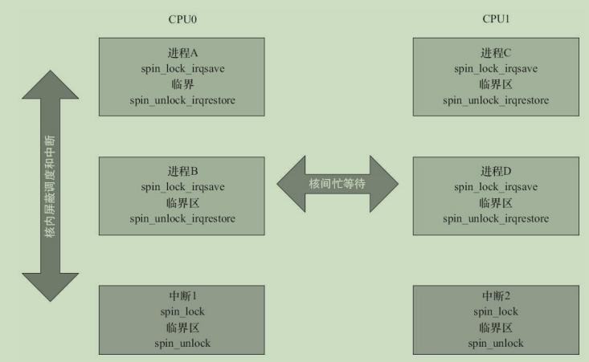
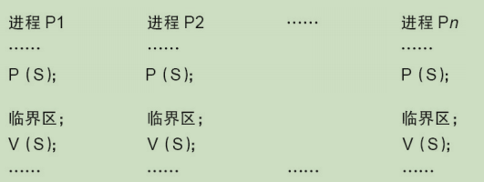
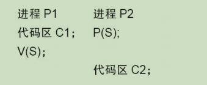
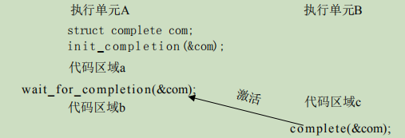

## 7.1 并发与竞态

`并发(Concurrency)`指的是多个执行单元同时、并行被执行，而并发的执行单元对共享资源(`硬件资源和软件上的全局变量、静态变量等`)的访问则很容易导致`竞态(Race Conditions)`。

并发大量存在于设备驱动中，只要并发的多个执行单元存在对共享资源的访问，竞态就可能发生。在Linux内核中，主要的竞态发生于如下几种情况：

**`1)` 对称多处理器（SMP）的多个CPU**

SMP是一种紧耦合、共享存储的系统模型，其体系结构如下图所示，它的特点是多个CPU使用共同的系统总线，因此可访问共同的外设和储存器。

 

在SMP的情况下，两个核（CPU0和CPU1）的竞态可能发生于CPU0的进程与CPU1的进程之间、CPU0的进程与CPU1的中断之间以及CPU0的中断与CPU1的中断之间，下图中任何一条线连接的两个实体都有核间并发可能性。

 

**`2)` 单CPU内进程与抢占它的进程**

Linux 2.6以后的内核支持内核抢占调度，一个进程在内核执行的时候可能耗完了自己的时间片（timeslice），也可能被另一个高优先级进程打断，进程与抢占它的进程访问共享资源的情况类似于SMP的多个CPU。

**`3)` 中断（硬中断、软中断、Tasklet、底半部）与进程之间**

中断可以打断正在执行的进程，如果中断服务程序访问进程正在访问的资源，则竞态也会发生。此外，中断也有可能被新的更高优先级的中断打断，因此，多个中断之间本身也可能引起并发而导致竞态。

> 但是Linux 2.6.35之后，就取消了中断的嵌套。

上述并发的发生除了SMP是真正的并行以外，其他的都是单核上的“宏观并行，微观串行” ，但其引发的实质问题和SMP相似。

**解决竞态问题的途径是`保证对共享资源的互斥访问`**.

> `互斥访问`是指一个执行单元在访问共享资源的时候，其他的执行单元被禁止访问。

访问共享资源的代码区域称为临界区（Critical Sections），临界区需要被以某种互斥机制加以保护。

> `中断屏蔽`、`原子操作`、`自旋锁`、`信号量`、`互斥体`等是Linux设备驱动中可采用的互斥途径。

## 7.2 编译乱序与执行乱序

理解Linux内核的锁机制，还需要理解编译器和处理器的特点。现代的高性能编译器在目标码优化上都具备对指令进行乱序优化的能力。编译器可以对访存的指令进行乱序，减少逻辑上不必要的访存，以及尽量提高Cache命中率和CPU的Load/Store单元的工作效率。因此在打开编译器优化以后，看到生成的汇编码并没有严格按照代码的逻辑顺序，这是正常的。

解决编译乱序问题，需要通过barrier（）编译屏障进行。我们可以在代码中设置barrier（）屏障，这个屏障可以阻挡编译器的优化。对于编译器来说，设置编译屏障可以保证屏障前的语句和屏障后的语句不乱“串门” 。在嵌入式Linux下面一般定义宏如下:

```c
#define barrier() __asm__ __volatile__("": : :"memory")
```

> 关于解决编译乱序的问题，C语言volatile关键字的作用较弱，它更多的只是避免内存访问行为的合并，对C编译器而言，volatile是暗示除了当前的执行线索以外，其他的执行线索也可能改变某内存，所以它的含义是“易变的” 。另外，volatile也不具备保护临界资源的作用。总之，Linux内核明显不太喜欢volatile。

编译乱序是编译器的行为，而执行乱序则是处理器运行时的行为。

对于大多数体系结构而言，尽管每个CPU都是乱序执行，但是这一乱序对于单核的程序执行是不可见的，因为单个CPU在碰到依赖点(后面的指令依赖于前面指令的执行结果)的时候会等待，所以程序员可能感觉不到这个乱序过程。但是这个依赖点等待的过程，在SMP处理器里面对于其他核是不可见的。

处理器为了解决多核间一个核的内存行为对另外一个核可见的问题,引入了一些内存屏障的指令.譬如,ARM处理器的屏障指令包括:

- `DMB（数据内存屏障）`：在DMB之后的显式内存访问执行前，保证所有在DMB指令之前的内存访问完成；
- `DSB（数据同步屏障）`：等待所有在DSB指令之前的指令完成（位于此指令前的所有显式内存访问均完成，位于此指令前的所有缓存、跳转预测和TLB维护操作全部完成）；
- `ISB（指令同步屏障）`：Flush流水线，使得所有ISB之后执行的指令都是从缓存或内存中获得的。

Linux内核的自旋锁、互斥体等互斥逻辑，需要用到上述指令:在请求获得锁时，调用屏障指令;在解锁时，也需要调用屏障指令。

```asm
/// 基于内存屏障指令的互斥逻辑
LOCKED EQU 1
UNLOCKED EQU 0
lock_mutex
 ; 互斥量是否锁定
 LDREX r1, [r0]     ; 检查是否锁定
 CMP r1, #LOCKED    ; 和"locked"比较
 WFEEQ              ; 互斥量已经锁定，进入休眠
 BEQ lock_mutex     ; 被唤醒，重新检查互斥量是否锁定

 ; 尝试锁定互斥量
 MOV r1, #LOCKED
 STREX r2, r1, [r0] ; 尝试锁定
 CMP r2, #0x0       ; 检查STR指令是否完成
 BNE lock_mutex     ; 如果失败，重试
 DMB                ; 进入被保护的资源前需要隔离，保证互斥量已经被更新
 BX lr

unlock_mutex
 DMB                ; 保证资源的访问已经结束
 MOV r1, #UNLOCKED  ; 向锁定域写"unlocked"
 STR r1, [r0]

 DSB                ; 保证在CPU唤醒前完成互斥量状态更新
 SEV                ; 像其他CPU发送事件，唤醒任何等待事件的CPU

 BX lr
```

在Linux内核中，定义了`读写屏障mb()`、`读屏障rmb()`、`写屏障wmb()`、以及作用于寄存器读写的`__iormb()`、`__iowmb()`这样的屏障API。读写寄存器的readl_relaxed()和readl()、writel_relaxed()和writel()API的区别就体现在有无屏障方面。

```c
#define readb(c)    ({ u8 __v = readb_relaxed(c); __iormb(); __v; })
#define readw(c)    ({ u16 __v = readw_relaxed(c); __iormb(); __v; })
#define readl(c)    ({ u32 __v = readl_relaxed(c); __iormb(); __v; })
#define writeb(v,c) ({ __iowmb(); writeb_relaxed(v,c); })
#define writew(v,c) ({ __iowmb(); writew_relaxed(v,c); })
#define writel(v,c) ({ __iowmb(); writel_relaxed(v,c); })
```

比如我们通过`writel_relaxed()`写完DMA的开始地址、结束地址、大小之后，我们一定要调用`writel()`来启动DMA。

```c
writel_relaxed(DMA_SRC_REG, src_addr);
writel_relaxed(DMA_DST_REG, dst_addr);
writel_relaxed(DMA_SIZE_REG, size);
writel (DMA_ENABLE, 1);
```

## 7.3 中断屏蔽

在单CPU范围内避免竞态的一种简单而有效的方法是在进入临界区之前屏蔽系统的中断，但是在驱动编程中不值得推荐，驱动通常需要考虑跨平台特点而不假定自己在单核上运行。CPU一般都具备屏蔽中断和打开中断的功能，这项功能可以保证正在执行的内核执行路径不被中断处理程序所抢占，防止某些竞态条件的发生。

具体而言，中断屏蔽将使得中断与进程之间的并发不再发生，而且，由于Linux内核的进程调度等操作都依赖中断来实现，内核抢占进程之间的并发也得以避免了。

中断屏蔽的使用方法为：

```c
local_irq_disable() /* 屏蔽中断 */
. . .
critical section /* 临界区*/
. . .
local_irq_enable() /* 开中断*/
```

其底层的实现原理是**让CPU本身不响应中断**，比如，对于ARM处理器而言，其底层的实现是屏蔽ARM CPSR的`i`位：

```c
static inline void arch_local_irq_disable(void)
{
    asm volatile(" cpsid i @ arch_local_irq_disable": : :"memory","cc");
}
```

由于Linux的异步I/O、进程调度等很多重要操作都依赖于中断，中断对于内核的运行非常重要，在屏蔽中断期间所有的中断都无法得到处理，因此长时间屏蔽中断是很危险的，这有可能造成数据丢失乃至系统崩溃等后果。这就要求在屏蔽了中断之后，当前的内核执行路径应当尽快地执行完临界区的代码。

`local_irq_disable()`和`local_irq_enable()`都只能禁止和使能本CPU内的中断，因此，并不能解决SMP多CPU引发的竞态。因此，单独使用中断屏蔽通常不是一种值得推荐的避免竞态的方法（换句话说，驱动中使用local_irq_disable/enable（）通常意味着一个bug），它适合与下文将要介绍的自旋锁联合使用。

与`local_irq_disable()`不同的是，`local_irq_save(flags)`除了进行禁止中断的操作以外，还保存目前CPU的中断位信息，`local_irq_restore(flags)`进行的是与`local_irq_save(flags)`相反的操作。对于ARM处理器而言，其实就是保存和恢复CPSR。

如果只是想禁止中断的底半部，应使用`local_bh_disable()`，使能被`local_bh_disable()`禁止的底半部应该调用`local_bh_enable()`。

## 7.4 原子操作

原子操作指的是在执行过程中不会被别的代码路径所中断的操作。

Linux内核提供了一系列函数来实现内核中的原子操作，这些函数又分为两类，分别针对位和整型变量进行原子操作。位和整型变量的原子操作都依赖于底层CPU的原子操作，因此所有这些函数都与CPU架构密切相关。

> 对于ARM处理器而言,底层使用LDREX和STREX指令,比如`atomic_inc()` 底层的实现会调用到`atomic_add()`, 其代码如下:
>
> ```c
> static inline void atomic_add(int i, atomic_t *v)
> {
> unsigned long tmp;
> int result;
> prefetchw(&v->counter);
> __asm__ __volatile__("@ atomic_add\n"
> "1: ldrex %0, [%3]\n"
> " add %0, %0, %4\n"
> " strex %1, %0, [%3]\n"
> " teq %1, #0\n"
> " bne 1b"
> : "=&r" (result),
> "=&r" (tmp),
> "+Qo" (v->counter)
> : "r" (&v->counter),
> "Ir" (i)
> : "cc");
> }
> ```

### 7.4.1 整形原子操作

```c
///1. 设置原子变量的值
void atomic_set(atomic_t *v, int i); /* 设置原子变量的值为i */
atomic_t v = ATOMIC_INIT(0);         /* 定义原子变量v并初始化为0 */

///2. 获取原子变量的值
atomic_read(atomic_t *v); /* 返回原子变量的值*/

///3. 原子变量加/减
void atomic_add(int i, atomic_t *v); /* 原子变量增加i */
void atomic_sub(int i, atomic_t *v); /* 原子变量减少i */

///4. 原子变量自增/自减
void atomic_inc(atomic_t *v); /* 原子变量增加1 */
void atomic_dec(atomic_t *v); /* 原子变量减少1 */

///5. 操作并测试
//对原子变量执行自增、自减和减操作后（注意没有加），测试其是否为0，为0返回true，否则返回false。
int atomic_inc_and_test(atomic_t *v);
int atomic_dec_and_test(atomic_t *v);
int atomic_sub_and_test(int i, atomic_t *v);

///6. 操作并返回
//对原子变量进行加/减和自增/自减操作，并返回新的值。
int atomic_add_return(int i, atomic_t *v);
int atomic_sub_return(int i, atomic_t *v);
int atomic_inc_return(atomic_t *v);
int atomic_dec_return(atomic_t *v);
```

### 7.4.2 位原子操作

所谓 **`设置位`即是将位写为`1`;`清除位`即是将位写为 `0`**。

```c
///1. 设置位
void set_bit(int nr,void *addr); //作设置 addr 地址的第 nr(bitsize>n>=0) 位

///2. 清除位
void clear_bit(int nr,void *addr); //清除 addr 地址的第 nr 位

///3. 改变位
void change_bit(int nr,void *addr); //对addr地址的第nr位进行反置

///4. 测试位
int test_bit(int nr,void *addr); //返回addr地址的第nr位

///5. 测试并操作位
int test_and_set_bit(int nr, void *addr);
int test_and_clear_bit(int nr, void *addr);
int test_and_change_bit(int nr, void *addr);
```

```c
///使用原子变量实现设备只能被一个进程打开
static atomic_t xxx_available = ATOMIC_INIT(1); /*定义原子变量*/

static int xxx_open(struct inode *inode, struct file *filp)
{
  ...
  if (!atomic_dec_and_test(&xxx_available)) {
    atomic_inc(&xxx_available);
    return - EBUSY; /*已经打开*/
  }
  ...
  return 0; /* 成功 */
}

static int xxx_release(struct inode *inode, struct file *filp)
{
  atomic_inc(&xxx_available); /* 释放设备 */
  return 0;
}
```

## 7.5 自旋锁

### 7.5.1 自旋锁的使用

自旋锁（Spin Lock）是一种典型的对临界资源进行互斥访问的手段，其名称来源于它的工作方式。为了获得一个自旋锁，在某CPU上运行的代码需先执行一个原子操作，该操作测试并设置（Test-And-Set）某个内存变量。由于它是原子操作，所以在该操作完成之前其他执行单元不可能访问这个内存变量。如果测试结果表明锁已经空闲，则程序获得这个自旋锁并继续执行；如果测试结果表明锁仍被占用，程序将在一个小的循环内重复这个“测试并设置”操作，**即进行所谓的“自旋” ，通俗地说就是“在原地打转”** 。当自旋锁的持有者通过重置该变量释放这个自旋锁后，某个等待的“测试并设置”操作向其调用者报告锁已释放。

在ARM体系结构下，自旋锁的实现借用了ldrex指令、strex指令、ARM处理器内存屏障指令dmb和dsb、wfe指令和sev指令。

Linux中与自旋锁相关的操作主要有以下4种：

```c
///1. 定义自旋锁
spinlock_t lock;

///2. 初始化自旋锁
spin_lock_init(lock)

///3. 获得自旋锁
//该宏用于获得自旋锁lock，如果能够立即获得锁，它就马上返回，否则，它将在那里自旋，直到该自旋锁的保持者释放。
spin_lock(lock)

//该宏用于尝试获得自旋锁lock，如果能够立即获得锁，它就马上返回true，否则立即返回false(实际上不再“原地打转”)。
spin_trylock(lock)

///4. 释放自旋锁
spin_unlock(lock)
```

自旋锁一般这样被使用：

```c
spinlock_t lock;      /* 定义一个自旋锁*/
spin_lock_init(&lock);
spin_lock (&lock) ;   /* 获取自旋锁，保护临界区 */
. . ./* 临界区*/
spin_unlock (&lock) ; /* 解锁*/
```

**自旋锁主要针对`SMP`或`单CPU但内核可抢占`的情况，对于单CPU和内核不支持抢占的系统，自旋锁退化为空操作**。在单CPU和内核可抢占的系统中，自旋锁持有期间中内核的抢占将被禁止。另外，在多核SMP的情况下，任何一个核拿到了自旋锁，该核上的抢占调度也暂时禁止了，但是没有禁止另外一个核的抢占调度。

尽管用了自旋锁可以保证临界区不受别的CPU和本CPU内的抢占进程打扰，但是得到锁的代码路径在执行临界区的时候，还可能受到中断和底半部（BH）的影响。为了防止这种影响，就需要用到自旋锁的衍生。

```c
spin_lock_irq() = spin_lock() + local_irq_disable()
spin_unlock_irq() = spin_unlock() + local_irq_enable()
spin_lock_irqsave() = spin_lock() + local_irq_save()
spin_unlock_irqrestore() = spin_unlock() + local_irq_restore()
spin_lock_bh() = spin_lock() + local_bh_disable()
spin_unlock_bh() = spin_unlock() + local_bh_enable()
```

`spin_lock_irq()`、`spin_lock_irqsave()`、`spin_lock_bh()`类似函数会为自旋锁的使用系好“安全带”以避免突如其来的中断驶入对系统造成的伤害。

在多核编程的时候，如果进程和中断可能访问同一片临界资源，我们一般需要在进程上下文中调用spin_lock_irqsave() / spin_unlock_irqrestore()，在中断上下文中调用spin_lock()/spin_unlock()，如下图所示。这样，在CPU0上，无论是进程上下文，还是中断上下文获得了自旋锁，此后，如果CPU1无论是进程上下文，还是中断上下文，想获得同一自旋锁，都必须忙等待，这避免一切核间并发的可能性。同时，由于每个核的进程上下文持有锁的时候用的是spin_lock_irqsave()，所以该核上的中断是不可能进入的，这避免了核内并发的可能性。

 

驱动工程师应谨慎使用自旋锁，而且在使用中还要特别注意如下几个问题。

`1)` 自旋锁实际上是忙等锁，当锁不可用时，CPU 一直循环执行“测试并设置”该锁直到可用而取得该锁，CPU 在等待自旋锁时不做任何有用的工作，仅仅是等待。因此，只有在占用锁的时间极短的情况下，使用自旋锁才是合理的。当临界区很大，或有共享设备的时候，需要较长时间占用锁，使用自旋锁会降低系统的性能。

`2)` 自旋锁可能导致系统死锁。引发这个问题最常见的情况是递归使用一个自旋锁，即如果一个已经拥有某个自旋锁的 CPU 想第二次获得这个自旋锁，则该 CPU 将死锁。

`3)` 自旋锁锁定期间不能调用可能引起进程调度的函数。如果进程获得自旋锁之后再阻塞，如调用 copy_from_user()、copy_to_user()、kmalloc()和 msleep()等函数，则可能导致内核的崩溃。

`4)` 在单核情况下编程的时候，也应该认为自己的CPU是多核的，驱动特别强调跨平台的概念。比如，在单CPU的情况下，若中断和进程可能访问同一临界区，进程里调用spin_lock_irqsave()是安全的，在中断里其实不调用spin_lock()也没有问题，因为spin_lock_irqsave()可以保证这个CPU的中断服务程序不可能执行。但是，若CPU变成多核，spin_lock_irqsave()不能屏蔽另外一个核的中断，所以另外一个核就可能造成并发问题。因此，**无论如何，我们在中断服务程序里也应该调用spin_lock()**。

```c
////使用自旋锁使设备只能被一个进程打开
int xxx_count = 0;/* 定义文件打开次数计数*/

static int xxx_open(struct inode *inode, struct file *filp)
{
  ...
  spinlock(&xxx_lock);
  if (xxx_count) { /* 已经打开*/
    spin_unlock(&xxx_lock);
    return -EBUSY;
  }
  xxx_count++;/* 增加使用计数*/
  spin_unlock(&xxx_lock);
  ...

  return 0;/* 成功 */
}

static int xxx_release(struct inode *inode, struct file *filp)
{
  ...
  spinlock(&xxx_lock);
  xxx_count--;/* 减少使用计数*/
  spin_unlock(&xxx_lock);

  return 0;
}
```

### 7.5.2 读写自旋锁

自旋锁不关心锁定的临界区究竟在进行什么操作，不管是读还是写，它都一视同仁。实际上，对共享资源并发访问时，多个执行单元同时读取它是不会有问题的，自旋锁的衍生锁`读写自旋锁（rwlock）可允许读的并发`。读写自旋锁是一种比自旋锁粒度更小的锁机制，它保留了“自旋”的概念，但是**在写操作方面，只能最多有1个写进程，在读操作方面，同时可以有多个读执行单元。当然，读和写也不能同时进行**。

读写自旋锁涉及的操作如下：

```c
///1.定义和初始化读写自旋锁
rwlock_t my_rwlock;
rwlock_init(&my_rwlock); /* 动态初始化 */

///2.读锁定
void read_lock(rwlock_t *lock);
void read_lock_irqsave(rwlock_t *lock, unsigned long flags);
void read_lock_irq(rwlock_t *lock);
void read_lock_bh(rwlock_t *lock);

///3.读解锁
void read_unlock(rwlock_t *lock);
void read_unlock_irqrestore(rwlock_t *lock, unsigned long flags);
void read_unlock_irq(rwlock_t *lock);
void read_unlock_bh(rwlock_t *lock);
////在对共享资源进行读取之前，应该先调用读锁定函数，完成之后应调用读解锁函数。

///4.写锁定
void write_lock(rwlock_t *lock);
void write_lock_irqsave(rwlock_t *lock, unsigned long flags);
void write_lock_irq(rwlock_t *lock);
void write_lock_bh(rwlock_t *lock);
int write_trylock(rwlock_t *lock);
///5.写解锁
void write_unlock(rwlock_t *lock);
void write_unlock_irqrestore(rwlock_t *lock, unsigned long flags);
void write_unlock_irq(rwlock_t *lock);
void write_unlock_bh(rwlock_t *lock);
////在对共享资源进行写之前，应该先调用写锁定函数，完成之后应调用写解锁函数。和spin_trylock()一样，write_trylock()也只是尝试获取读写自旋锁，不管成功失败，都会立即返回。
```

读写自旋锁一般这样被使用：

```c
rwlock_t lock; /* 定义rwlock */
rwlock_init(&lock); /* 初始化rwlock */
/* 读时获取锁*/
read_lock(&lock);
... /* 临界资源 */
read_unlock(&lock);
/* 写时获取锁*/
write_lock_irqsave(&lock, flags);
... /* 临界资源 */
write_unlock_irqrestore(&lock, flags);
```

### 7.5.3 顺序锁

顺序锁（seqlock）是对读写锁的一种优化，若使用顺序锁，读执行单元绝不会被写执行单元阻塞，也就是说，读执行单元在写执行单元对被顺序锁保护的共享资源进行写操作时仍然可以继续读，而不必等待写执行单元完成写操作，写执行单元也不需要等待所有读执行单元完成读操作才去进行写操作。但是，写执行单元与写执行单元之间仍然是互斥的，即如果有写执行单元在进行写操作，其他写执行单元必须自旋在那里，直到写执行单元释放了顺序锁。

对于顺序锁而言，尽管读写之间不互相排斥，但是如果读执行单元在读操作期间，写执行单元已经发生了写操作，那么，读执行单元必须重新读取数据，以便确保得到的数据是完整的。此时，读端可能反复读多次同样的区域才能读到有效的数据。

在Linux内核中，写执行单元涉及的顺序锁操作如下：

```c
///1. 获得顺序锁
void write_seqlock(seqlock_t *sl);
int write_tryseqlock(seqlock_t *sl);
write_seqlock_irqsave(lock, flags)
write_seqlock_irq(lock)
write_seqlock_bh(lock)
///其中宏的含义如下，
write_seqlock_irqsave() = loal_irq_save() + write_seqlock()
write_seqlock_irq() = local_irq_disable() + write_seqlock()
write_seqlock_bh() = local_bh_disable() + write_seqlock()

///2. 释放顺序锁
void write_sequnlock(seqlock_t *sl);
write_sequnlock_irqrestore(lock, flags)
write_sequnlock_irq(lock)
write_sequnlock_bh(lock)
///其中宏的含义如下，
write_sequnlock_irqrestore() = write_sequnlock() + local_irq_restore()
write_sequnlock_irq() = write_sequnlock() + local_irq_enable()
write_sequnlock_bh() = write_sequnlock() + local_bh_enable()
```

写执行单元使用顺序锁的模式如下：

```c
write_seqlock(&seqlock_a);
.../* 写操作代码块 */
write_sequnlock(&seqlock_a);
```

读执行单元涉及的顺序锁操作如下：

```c
///1. 读开始
unsigned read_seqbegin(const seqlock_t *sl);
read_seqbegin_irqsave(lock, flags)
//读执行单元在对被顺序锁s1保护的共享资源进行访问前需要调用该函数，该函数返回顺序锁s1的当前顺序号。其中，
read_seqbegin_irqsave() = local_irq_save() + read_seqbegin()

///2.重读
int read_seqretry(const seqlock_t *sl, unsigned iv);
read_seqretry_irqrestore(lock, iv, flags)
//读执行单元在访问完被顺序锁s1保护的共享资源后需要调用该函数来检查，在读访问期间是否有写操作。如果有写操作，读执行单元就需要重新进行读操作。其中，
read_seqretry_irqrestore() = read_seqretry() + local_irq_restore()
```

读执行单元使用顺序锁的模式如下：

```c
do {
seqnum = read_seqbegin(&seqlock_a);
/* 读操作代码块 */
...
} while (read_seqretry(&seqlock_a, seqnum));
```

### 7.5.4 RCU(Read-Copy Update,读-拷贝-更新)

RCU并不是新的锁机制，早在20世纪80年代就有了这种机制，而在Linux中是在开发内核2.5.43时引入该技术的，并正式包含在2.6内核中。

不同于自旋锁，使用RCU的读端没有锁、内存屏障、原子指令类的开销，几乎可以认为是直接读(只是简单地标明读开始和读结束)，而RCU的写执行单元在访问它的共享资源前首先复制一个副本，然后对副本进行修改，最后使用一个回调机制在适当的时机把指向原来数据的指针重新指向新的被修改的数据，这个时机就是所有引用该数据的CPU都退出对共享数据读操作的时候。等待适当时机的这一时期称为`宽限期（Grace Period）`。

假设进程A要修改链表中某个节点N的成员a、b。自旋锁的思路是排他性地访问这个链表，等所有其他持有自旋锁的进程或者中断把自旋锁释放后，进程A再拿到自旋锁访问链表并找到N节点，之后修改它的a、b两个成员，完成后解锁。而RCU的思路则不同，它直接制造一个新的节点M，把N的内容复制给M，之后在M上修改a、b，并用M来代替N原本在链表的位置。之后进程A等待在链表前期已经存在的所有读端结束后（即宽限期，通过下文说的`synchronize_rcu()` API完成），再释放原来的N。用代码来描述这个逻辑就是：

```c
struct foo {
    struct list_head list;
    int a;
    int b;
    int c;
};
LIST_HEAD(head);
/* . . . */
p = search(head, key);
if (p == NULL) {
/* Take appropriate action, unlock, and return. */
}
q = kmalloc(sizeof(*p), GFP_KERNEL);
*q = *p;
q->b = 2;
q->c = 3;
list_replace_rcu(&p->list, &q->list);
synchronize_rcu();
kfree(p);
```

RCU可以看作读写锁的高性能版本，相比读写锁，RCU的优点在于既允许多个读执行单元同时访问被保护的数据，又允许多个读执行单元和多个写执行单元同时访问被保护的数据。但是，RCU不能替代读写锁，因为如果写比较多时，对读执行单元的性能提高不能弥补写执行单元同步导致的损失。因为使用RCU时，写执行单元之间的同步开销会比较大，它需要延迟数据结构的释放，复制被修改的数据结构，它也必须使用某种锁机制来同步并发的其他写执行单元的修改操作。

Linux中提供的RCU操作如下：

`1.`读锁定

```c
rcu_read_lock()
rcu_read_lock_bh()
```

`2.`读解锁

```c
rcu_read_unlock()
rcu_read_unlock_bh()
```

使用RCU进行读的模式如下：

```c
rcu_read_lock()
.../* 读临界区*/
rcu_read_unlock()
```

`3.`同步RCU

```c
synchronize_rcu()
```

该函数由RCU写执行单元调用，它将阻塞写执行单元，直到当前CPU上所有的已经存在（Ongoing）的读执行单元完成读临界区，写执行单元才可以继续下一步操作。`synchronize_rcu()` 并不需要等待后续（Subsequent）读临界区的完成。

`4.`挂接回调

```c
void call_rcu(struct rcu_head *head, void (*func)(struct rcu_head *head));
```

函数call_rcu（）也由RCU写执行单元调用，与 synchronize_rcu() 不同的是，它不会使写执行单元阻塞，因而可以在中断上下文或软中断中使用。该函数把函数func挂接到RCU回调函数链上，然后立即返回。挂接的回调函数会在一个宽限期结束（即所有已经存在的RCU读临界区完成）后被执行。

## 7.6 信号量

信号量（Semaphore）是操作系统中最典型的用于同步和互斥的手段，`信号量的值可以是0、1或者n`。信号量与操作系统中的经典概念PV操作对应。

`P(S)`：**`①`将信号量S的值减1,即S=S-1; `②`如果S≥0,则该进程继续执行;否则该进程置为等待状态,排入等待队列**.

`V(S)`：**`①`将信号量S的值加1，即S=S+1；`②`如果S>0，唤醒队列中等待信号量的进程**。

Linux中与信号量相关的操作主要有下面几种：

`1.`定义信号量

```c
struct semaphore sem;
```

`2.`初始化信号量

```c
//该函数初始化信号量，并设置信号量sem的值为val。
void sema_init(struct semaphore *sem, int val);
```

`3.`获得信号量

```c
///该函数用于获得信号量sem，它会导致睡眠，因此不能在中断上下文中使用
/////因down()进入睡眠状态的进程不能被信号打断
void down(struct semaphore * sem);

///因down_interruptible（）进入睡眠状态的进程能被信号打断，信号也会导致该函数返回，这时候函数的返回值非0。
int down_interruptible(struct semaphore * sem);

///该函数尝试获得信号量sem，如果能够立刻获得，它就获得该信号量并返回0，否则，返回非0值。它不会导致调用者睡眠，可以在中断上下文中使用。
int down_trylock(struct semaphore * sem);
```

 在使用down_interruptible（）获取信号量时，对返回值一般会进行检查，如果非0，通常立即返回`-ERESTARTSYS`，如：

```c
if (down_interruptible(&sem))
  return -ERESTARTSYS;
```

`4.`释放信号量

```c
///该函数释放信号量sem，唤醒等待者。
void up(struct semaphore *sem);
```

作为一种可能的互斥手段，信号量可以保护临界区，它的使用方式和自旋锁类似。与自旋锁相同，只有得到信号量的进程才能执行临界区代码。但是，与自旋锁不同的是，当获取不到信号量时，进程不会原地打转而是进入休眠等待状态。

用作互斥时，信号量一般这样被使用：

 

> 由于新的Linux内核倾向于直接使用mutex作为互斥手段，信号量用作互斥不再被推荐使用。

信号量也可以用于同步，一个进程A执行 `down()` 等待信号量，另外一个进程B执行 `up()` 释放信号量，这样进程A就同步地等待了进程B。其过程类似：

 

此外，对于关心具体数值的生产者/消费者问题，使用信号量则较为合适。因为生产者/消费者问题也是一种同步问题。

## 7.7 互斥体(Mutex)

尽管信号量已经可以实现互斥的功能，但是“正宗”的mutex在Linux内核中还是真实地存在着，并被优先使用着。

`1.`定义互斥体

```c
struct mutex my_mutex;
mutex_init(&my_mutex);
```

`2.`获取互斥体

```c
void mutex_lock(struct mutex *lock);  //引起的睡眠不能被信号打断
int mutex_lock_interruptible(struct mutex *lock); //引起的睡眠能被信号打断
int mutex_trylock(struct mutex *lock);  //用于尝试获得mutex，获取不到mutex时不会引起进程睡眠。
```

`3.`释放互斥体

```c
void mutex_unlock(struct mutex *lock);
```

mutex的使用方法和信号量用于互斥的场合完全一样：

```c
struct mutex my_mutex; /* 定义mutex */
mutex_init(&my_mutex); /* 初始化mutex */
mutex_lock(&my_mutex); /* 获取mutex */
... /* 临界资源*/
mutex_unlock(&my_mutex); /* 释放mutex */
```

自旋锁和互斥体都是解决互斥问题的基本手段，面对特定的情况，应该如何取舍这两种手段呢？选择的依据是`临界区的性质和系统的特点`。

从严格意义上说，互斥体和自旋锁属于不同层次的互斥手段，前者的实现依赖于后者。在互斥体本身的实现上，为了保证互斥体结构存取的原子性，需要自旋锁来互斥。所以`自旋锁属于更底层`的手段。

互斥体是进程级的，用于多个进程之间对资源的互斥，虽然也是在内核中，但是该内核执行路径是以进程的身份，代表进程来争夺资源的。如果竞争失败，会发生进程上下文切换，当前进程进入睡眠状态，CPU将运行其他进程。鉴于进程上下文切换的开销也很大，因此，`只有当进程占用资源时间较长时，用互斥体才是较好的选择`。

当所要保护的临界区访问时间比较短时，用自旋锁是非常方便的，因为它可节省上下文切换的时间。但是CPU得不到自旋锁会在那里空转直到其他执行单元解锁为止，所以要求锁不能在临界区里长时间停留，否则会降低系统的效率。

由此，可以总结出自旋锁和互斥体选用的3项原则：

`1）`当锁不能被获取到时，使用互斥体的开销是进程上下文切换时间，使用自旋锁的开销是等待获取自旋锁（由临界区执行时间决定）。若临界区比较小，宜使用自旋锁，若临界区很大，应使用互斥体。

`2）`互斥体所保护的临界区可包含可能引起阻塞的代码，而自旋锁则绝对要避免用来保护包含这样代码的临界区。因为阻塞意味着要进行进程的切换，如果进程被切换出去后，另一个进程企图获取本自旋锁，死锁就会发生。

`3）`互斥体存在于进程上下文，因此，如果被保护的共享资源需要在中断或软中断情况下使用，则在互斥体和自旋锁之间只能选择自旋锁。当然，如果一定要使用互斥体，则只能通过mutex_trylock（）方式进行，不能获取就立即返回以避免阻塞。

## 7.8 完成量(Completion)

Linux提供了完成量，它用于一个执行单元等待另一个执行单元执行完某事。

Linux中与完成量相关的操作如下:

```c
///1.定义完成量
//下列代码定义名为my_completion的完成量：
struct completion my_completion;

///2.初始化完成量
//下列代码初始化或者重新初始化my_completion这个完成量的值为0（即没有完成的状态）：
init_completion(&my_completion);
reinit_completion(&my_completion)

///3.等待完成量
///下列函数用于等待一个完成量被唤醒：
void wait_for_completion(struct completion *c);

///4.唤醒完成量
//下面两个函数用于唤醒完成量：前者只唤醒一个等待的执行单元，后者释放所有等待同一完成量的执行单元。
void complete(struct completion *c);
void complete_all(struct completion *c);
```

使用完成量实现同步功能：

 

## 7.9 总结

并发和竞态广泛存在，中断屏蔽、原子操作、自旋锁和信号量都是解决并发问题的机制。中断屏蔽很少单独被使用，原子操作只能针对整数进行，因此自旋锁和信号量应用最为广泛。

自旋锁会导致死循环，锁定期间不允许阻塞，因此要求锁定的临界区小。互斥体允许临界区阻塞，可以适用于临界区大的情况。

读写自旋锁和读写信号量分别是放宽了条件的自旋锁和信号量，它们允许多个执行单元对共享资源的并发读。
