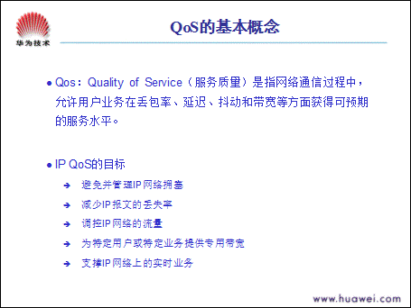

## 第1章  QoS的基本概念

### 1.1  基本概念

  

Qos：Quality of Service（服务质量）是指网络通信过程中，允许用户业务在丢包率、延迟、抖动和带宽等方面获得可预期的服务水平。更简单地说：QoS就是针对各种不同需求，提供不同服务质量的网络服务。

在传统IP网络中，对所有报文都无区别地等同对待，每个路由器对所有报文都采用先入先出的策略（FIFO）处理，也就是说：它尽力而为（Best-effort）地将报文送到目的地，但是对报文的吞吐量、延迟、延迟抖动、丢包率等都不能预期，可能很好，也可能极差，一切都要视网络状况而定。随着计算机网络的高速发展，对带宽、延迟、抖动敏感的且实时性强的语音、图像、重要数据同时在网上传输，使得网络资源极大地丰富。但是同时人们对于网络传输数据质量的要求也越来越高，人们期望报文在吞吐量、延迟、延迟抖动、丢包率等方面获得一定程度上的服务保证，期望可以根据客户类型提供有差别的服务。解决这些问题的一个途径是增加网络的带宽，但带宽的增加毕竟是有限的，且代价昂贵，它也只能在一定程度上缓解这个问题。提供QoS将是人们对未来IP网络的基本要求。

为实现上述目的，QoS需要提供以下功能：

- 避免并管理IP网络拥塞
- 减少IP报文的丢失率
- 调控IP网络的流量
- 为特定用户或特定业务提供专用带宽
- 支撑IP网络上的实时业务

### 1.2  IP QoS 的三种模型

  

服务模型，是指一组端到端的QoS功能，通常QoS提供以下三种服务模型：

- Best-Effort service（尽力而为服务模型）
  > 是目前Internet的缺省服务模型，主要实现技术是先进先出队列(FIFO)。

- Integrated service（综合服务模型，简称Intserv）
  > 业务通过信令向网络申请特定的QoS服务，网络在流量参数描述的范围内，预留资源以承诺满足该请求。

- Differentiated service（区分服务模型，简称Diffserv）
  > 当网络出现拥塞时，根据业务的不同服务等级约定，有差别地进行流量控制和转发来解决拥塞问题。

#### 1.2.1  Best-Effort 模型

  

Best-Effort是一个单一的服务模型，也是最简单的服务模型。应用程序可以在任何时候，发出任意数量的报文，而且不需要事先获得批准，也不需要通知网络。对Best-Effort服务，网络尽最大的可能性来发送报文，但对时延、可靠性等性能不提供任何保证。 Best-Effort服务是现在Internet的缺省服务模型，它适用于绝大多数网络应用，如FTP、E-Mail等，它通过先入先出（FIFO）队列来实现。

#### 1.2.2  IntServ模型

  

Integrated service是一个综合服务模型，可满足多用户的QoS需求，这种服务模型在发送报文前，需要向网络申请特定的服务。这个请求是通过信令（signal）来完成的，应用程序先通知网络发送报文的流量参数和所需的服务质量请求（如带宽、时延等）。应用程序在收到网络预留资源的确认信息后，才开始发送报文，发送报文被控制在流量参数规定的范围内。集成服务模型常常被用在网络边缘路由器上，传送QoS请求信令采用的是资源预留协议RSVP。

网络在收到应用程序的资源请求后，执行资源分配检查（Admission control），即基于应用程序的资源申请和网络现有的资源情况，判断是否为应用程序分配资源。一旦网络确认为应用程序的报文分配了资源，则只要应用程序的报文控制在流量参数描述的范围内，网络将承诺满足应用程序的QoS需求。而网络将为每个流（flow，由两端的IP地址、端口号、协议号确定）维护一个状态，并基于这个状态执行报文的分类、流量监管（policing）、排队及其调度，来实现对应用程序的承诺。

在Integrated service服务模型中，负责传送QoS请求的信令是RSVP（Resource Reservation Protocol，资源预留协议），它通知路由器应用程序的QoS需求。

Integrated service可以提供以下两种服务：

- 保证服务（Guaranteed service）：它提供保证的带宽和时延限制来满足应用程序的要求。如VoIP应用可以预留10M带宽和要求不超过1秒的时延。
- 负载控制服务（Controlled-Load service）：它保证即使在网络过载（overload）的情况下，能对报文提供近似于网络未过载类似的服务，即在网络拥塞的情况下，保证某些应用程序的报文低时延和高通过。

##### 1. RSVP原理

  

RSVP是第一个标准QoS信令协议，它用来动态地建立端到端的QoS，它允许应用程序动态地申请网络带宽等。RSVP协议不是一个路由协议，相反，它按照路由协议规定的报文流的路径为报文申请预留资源，在路由发生变化后，它会按照新路由进行调整，并在新的路径上申请预留资源。RSVP只是在网络节点之间传递QoS请求，它本身不完成这些QoS的要求实现，而是通过其他技术如WFQ等来完成这些要求的实现。

RSVP信令在网络节点之间传送资源请求，而网络节点在收到这些请求后，需要为这些请求分配资源，这就是资源预留。网络节点比较资源请求和网络现有的资源，确定是否接受请求，在资源不够的情况下，这个请求可以被拒绝。

可以对每个资源请求设置不同的优先级，这样，优先级较高的资源请求可以在网络资源不够的情况下，抢占较低优先级的预留资源，来优先满足高优先级的资源请求。

资源预留判断是否接受资源请求，并承诺对接受了的资源请求提供请求的服务。但资源预留本身不实现承诺的服务，需要通过队列等其他技术来实现。

##### 2. RSVP的问题

  

基于信令实现的RSVP协议，目前在实施过程中遇到了很多问题，主要是RSVP要求端到端所有设备支持这一协议，对于一个从源地址到目的地址要经过很多设备的IP包来讲，做到这点是相当困难的，因为IP网本质是一个没有信令无连接网络，所以RSVP经过了几年的实践并不能在网络上真正实现。采用RSVP协议的另外一个困难是很难对各种应用预留带宽。随着网络带宽快速增加和各种新应用的不断出现，DiffServ逐渐成为QoS关键所在。

#### 1.2.3  DiifServ模型体系结构

  

Differentiated -Service即差分服务模型，它可以满足用户不同的QoS需求。与Integrated Service不同，它不需要信令，即在一个业务发出报文前，不需要通知路由器。对Differentiated Service，网络不需要为每个流维护软状态，它根据每个报文指定的QoS标记（着色结果），来提供特定的服务。当网络出现拥塞时，根据不同的服务等级要求，有差别地进行流量控制和转发来解决拥塞。采用相对优先权机制，有区别地控制不同信息流的分组聚类和转发行为，从而在保证服务质量和解决拥塞之间取得一个良好的折衷。业务在进入DS(DiffServ)网络时, 基于优先级（DSCP（DiffServ CodePoint）或IP优先级）进行业务流聚合，会聚成一个行为集合（BA，Behavior Aggregate）。

PHB（per-hop behavior）：DS节点对特定的行为集合（BA）使用的转发行为，DS节点通过判别分组头中的DSCP来执行PHB。

具体的过程是：

> `首先`，在网络的边缘进行不同业务的分类，打上不同的QoS标记（着色）。分类的依据可以是报文携带的四层、三层或二层的信息。如报文的源IP地址、目的IP地址、源MAC地址、目的MAC地址，TCP或UDP端口号等。
>
> `然后`，在网络的内部，根据着色的结果在每一跳上进行相应的转发处理。比如通过拥塞管理机制，对实时业务提供快速转发处理，对普通业务提供尽力而为转发处理。流量整形，流量监管，拥塞避免等处理也类似，根据着色的结果，再逐跳的作相应的区别处理，从而获得网络两端业务不同业务类别的QoS保障。

Differentiated Service的端到端QoS保障通过以下一些技术来实现：

  >- CAR：它根据报文所携带的信息进行分类，并利用Precedence或DSCP（DiffServ Coding  Point）进行着色。CAR同时也完成流量的度量和监管。
  >- GTS：对通过网络节点，指定的业务或所有业务进行流量整形，使其符合期望的流量指标。

队列机制：通过FIFO、PQ、CQ、WFQ等队列技术，在网络拥塞时进行拥塞管理，对不同业务的报文按用户指定的策略进行调度。

拥塞避免：主要使用WRED，对网络的拥塞情况进行预测，并在此基础上采取随机丢弃部分TCP报文的方式，达到拥塞避免，并避免全球TCP同步现象的发生。

## 第2章  报文的分类及标记

  

报文分类可以把有相似QoS要求的业务的报文聚合成相应的类。分类的结果就是给报文打上某种标记，即着色。如果使用IP报文头的Precedence字段（TOS的高3个bit）进行着色，用户可以将报文最多分成8类。当然也可以按照RFC2474的定义，用DSCP（TOS的高6个bit）进行着色。报文着色以后，就可以方便下游节点进行相应的QoS处理，如拥塞管理、流量整形等。

网络管理者可以设置报文分类的策略，这个策略可以包括物理接口、源地址、目的地址、MAC地址、IP协议或应用程序的端口号等。一般的分类算法都局限在IP报文的头部所携带的信息，使用如链路层（Layer 2）、网络层（layer 3）、甚至传输层（layer 4）的信息。所以，它可以是一个由五元组（源地址、源端口号、协议号、目的地址、目的端口号）确定的流这样狭小的范围，也可以是到某某网段的所有报文。通常我们可以使用ACL来实现。

一般在网络边界，对报文进行着色，在网络的内部则简单的使用着色的结果作为队列调度、流量整形等处理的依据。QoS中用CAR来实现报文的分类及着色功能。下游（Downstream）网络可以选择接受上游（Upstream）网络的着色结果，也可以按照自己的分类标准重新进行着色。CAR是支持报文分类的主要技术，它同时承担流量监管的功能。用户可以通过不同的配置，让CAR只进行着色功能，让CAR只进行流量监管功能，或让CAR在进行流量监管的同时进行着色。CAR可以使用Precedence或DSCP进行着色。

## 第3章  流量监管与整形

### 3.1  流量监管－CAR

  

流量监管（traffic policing）的典型作用是限制进入某一网络的某一连接的流量与突发。在报文满足一定的条件时，如某个连接的报文流量过大，流量监管就可以对该报文采取不同的处理动作，例如丢弃报文，或重新设置报文的优先级等。通常的用法是使用CAR来限制某类报文的流量。 CAR使用IP头部的ToS字段来对报文进行分类，对于不同分类的流量，采取不同的动作。

CAR利用令牌桶（Token Bucket, TB）进行流量控制。

令牌桶按用户设定的速度向桶中放置令牌，并且，令牌桶有用户设定的容量，当桶中令牌的量超出桶的容量的时候，令牌的量不再增加。当令牌桶中充满令牌的时候，桶中所有的令牌代表的报文都可以瞬间被发送，这样可以允许数据的突发性传输。当令牌桶中没有令牌的时候，报文将不能被发送（丢弃），只有等到桶中生成了新的令牌，报文才可以发送，这就可以限制报文的流量只能是小于等于令牌生成的速度，达到限制流量的目的。

首先报文被分类，如果通过分类器识别出报文是某类要处理的报文，则进入令牌桶中进行处理。如果令牌桶中有足够的令牌可以用来发送报文，则认为是Conform，如果令牌不够，则认为是Exceed。然后在后面的动作机制中，可以分别对Conform的报文进行发送、丢弃、着色等处理。对Exceed的报文也可以进行发送、丢弃、着色等处理。当报文被令牌桶处理的时候，如果有一个报文被按Conform处理了，令牌桶中的令牌量按报文的长度做相应的减少。当报文被按Exceed处理了，令牌桶中的令牌不减少。

当CAR用作流量监管时，一般配置为： Conform的报文进行发送，对Exceed的报文进行丢弃。也就是令牌桶中的令牌足够时报文被发送，不够时报文被丢弃。这样，就可以对某类报文的流量进行控制。

CAR还可以进行报文的标记（Mark）或重新标记（Re-Mark）或者说着色与重着色。CAR可以通过Precedence或者DSCP来标记报文。

例如，当报文符合流量特性的时候，可以设置报文的优先级为5，当报文不符合流量特性的时候，可以丢弃，也可以设置报文的优先级为1并继续进行发送。

### 3.2  流量整形－GTS

  

通用流量整形（Generic Traffic Shaping，GTS）

利用CAR可以控制报文的流量特性，对流量加以限制，对不符合流量特性的报文进行丢弃。如果对需要丢弃的报文进行缓冲，将可以减少报文的丢弃，同时满足报文的流量特性，这就是通用流量整形（以后简称GTS）。

当报文到来的时候，首先对报文进行分类，如果分类器识别出报文需要进行GTS处理，则将报文送入GTS队列。如果GTS队令牌桶中令牌足够，则直接发送报文。如果令牌桶中的令牌不够，则进入队列中缓存。当队列中有报文的时候，GTS按一定的周期从队列中取出报文进行发送。每次发送报文时，将把GTS令牌桶中的令牌代表的数据量都发送出去。

GTS可以对不规则或不符合预定流量特性的流量进行整形，以利于网络上下游之间的带宽匹配。

每个接口，GTS选择下列两种方式之一来处理报文：

- 对接口所有流进行处理：此时若接口发送队列为空，且报文在单位时间内的流量未超过限制，报文被立即发送，否则报文进入接口发送缓存队列中。

- 对接口不同的流进行处理：将不同的流分别与*流*进行匹配，当规则匹配并且接口发送队列为空，且报文在单位时间内的流量未超过限制，报文被立即发送，否则报文进入接口发送缓存队列中。

为减少报文的无谓丢失，应在上游路由器出口对报文进行GTS处理，对于超出GTS流量特性的报文，缓存在上游路由器的接口缓冲区中。当网络拥塞消除时，GTS再从缓冲队列中取出报文继续发送。这样，发向下游路由器的报文将都符合路由器的流量规定，从而减少报文在下游路由器被丢弃的情况。若不在上游路由器出口做GTS处理，则所有超出下游路由器的CAR规定流量的报文将被下游路由器丢弃。

由于对GTS可能对报文进行缓存，那么使用GTS有可能增加报文的延迟。

### 3.3  物理接口总速率限制－LR

  

物理接口限速（Line rate, LR）

LR的处理过程仍然采用令牌桶进行流量控制。如果用户在路由器的某个接口上配置了LR ，规定了流量特性，则所有经由该接口发送的报文首先要经过LR的令牌桶进行处理。如果令牌桶中有足够的令牌可以用来发送报文，则报文可以发送。如果令牌桶中的令牌不满足报文的发送条件，则报文入QOS队列进行拥塞管理。这样，就可以对通过该物理接口的报文流量进行控制。

LR的处理过程采用了令牌桶控制流量，当令牌桶中积存有令牌时，可以允许报文的突发性传输。当令牌桶中没有令牌的时候，报文将不能被发送，只有等到桶中生成了新的令牌，报文才可以发送，这就可以限制报文的流量只能是小于等于令牌生成的速度，具有限制流量，同时允许突发流量通过的目的。

LR相比较于CAR，能够限制在物理接口上通过的所有报文。CAR由于在IP层实现，对于不经过IP层处理的报文不起作用。较之于GTS，LR 不但能够对超过流量限制的报文进行缓存，并且利用QoS丰富的队列来缓存报文，而GTS则是将报文缓存在GTS队列中。由于CAR和GTS是在IP层实现的，所以对于不经过IP层处理的报文不起作用。

## 第4章  拥塞管理

  

对于网络单元，当分组到达的速度大于该接口传送分组的速度时，在该接口处就会产生拥塞。如果没有足够的存储空间来保存这些分组，它们其中的一部分就会丢失。分组的丢失又可能会导致发送该分组的主机或路由器因超时而重传此分组，这将导致恶性循环。

造成拥塞的因素有很多。比如，当分组流从高速链路进入路由器，由低速链路传送出去时，就可能产生拥塞；分组流同时从多个接口进入路由器、由一个接口转发出去或处理器速度慢也可能会产生拥塞。

拥塞管理是指网络在发生拥塞时，如何进行管理和控制。处理的方法是使用队列技术。将所有要从一个接口发出的报文 进入多个队列，按照各个队列的优先级进行处理。不同的队列算法用来解决不同的问题，并产生不同的效果。常用的队列有FIFO、PQ，CQ，WFQ等。

拥塞管理的处理包括队列的创建、报文的分类、将报文送入不同的队列、队列调度等。在一个接口没有发生拥塞的时候，报文在到达接口后立即就被发送出去，在报文到达的速度超过接口发送报文的速度时，接口就发生了拥塞。拥塞管理就会将这些报文进行分类，送入不同的队列；而队列调度对不同优先级的报文进行分别处理，优先级高的报文会得到优先处理。

### 4.1  先进现出队列－FIFO

  

先进先出队列（First In First Out Queuing, FIFO）：

先进先出队列（以后简称FIFO）不对报文进行分类，当报文进入接口的速度大于接口能发送的速度时，FIFO按报文到达接口的先后顺序让报文进入队列，同时，FIFO在队列的出口让报文按进队的顺序出队，先进的报文将先出队，后进的报文将后出队。

Internet的默认服务模式—Best-Effort采用FIFO队列策略。

### 4.2  优先队列－PQ

  

优先队列（Priority Queuing，PQ）

PQ对报文进行分类，将所有报文分成最多至4类，分别属于PQ的4个队列中的一个，然后，按报文的类别将报文送入相应的队列。PQ的4个队列分别为高优先队列（**high**）、中优先队列（**medium**）、正常优先队列**normal**）和低优先队列（**low**），它们的优先级依次降低。发送报文时将按照等级顺序依次发送，即先发送完所有**high**队列中的报文后，再发送所有**medium**队列中的报文，然后再发送所有**normal**队列中的报文，最后才发送**low**队列中的报文。这样，分类时属于较高优先级队列的报文将会得到优先发送，并且较低优先级的报文将会在发生拥塞时被较高优先级的报文抢先，使得关键业务（如视频业务，语音业务）的报文能够得到优先处理，非关键业务（如E-Mail）的报文在网络处理完关键业务后的空闲中得到处理，既保证了关键业务的优先，又充分利用了网络资源。

### 4.3  定制队列－CQ

  

定制队列（Custom Queuing，CQ）

CQ最多可包含16个组，在每个组中指明了什么样的数据包进入什么样的队列、各队列的长度和每次轮询各队列所能连续发送的字节数等信息。CQ对报文进行分类，将所有报文分成最多至17类，分别属于CQ的17个队列中的一个，然后，按报文的类别将报文进入相应的队列。

CQ的17个队列中，0号队列是优先队列，路由器总是先把0号队列中的报文发送完，然后才处理1到16队列中的报文，所以0号队列一般作为系统队列，把实时性要求高的交互式协议报文放到0号队列。1到16号队列可以按用户的定义分配它们能占用接口带宽的比例，在报文出队的时候，CQ按定义的带宽比例分别从1到16号队列中取一定量的报文在接口上发送出去。      其中，按带宽比例分别发送的实现过程是这样的，16个普通队列采用轮询的方式进行调度，当调度到某一个队列时，从这个队列取出一定字节数的报文发送，用户通过指定这个字节数，就可以控制不同队列之间的带宽分配比例。

用户在指定每个队列每次调度时发送的字节数时，需要把握所配数值的大小，因为这关系到轮询中配置增加的粒度。
>例如，为了实现4个队列间的1：2：2：4的关系，我们可以配置这4个队列发送字节数为：1、2、2、4，也可以配置为：500、1000、1000、2000。但在考虑了线路的MTU后，若MTU为500，则后一种方式较好。因为在轮询时，所剩配额不够发送当前报文时，会只累加配额，然后等下次调度，显然当前条件下，第二种方案浪费在轮询空转上的时间要少。

PQ赋予较高优先级的报文绝对的优先权，这样虽然可以保证关键业务的优先，但在较高优先级的报文的速度总是大于接口的速度时，将会使较低优先级的报文始终得不到发送的机会。采用CQ，将可以避免这种情况的发生。CQ可以把报文分类，然后按类别将报文被分配到CQ的一个队列中去，对每个队列，可以规定队列中的报文应占接口带宽的比例，这样，就可以让不同业务的报文获得合理的带宽，从而既保证关键业务能获得较多的带宽，又不至于使非关键业务得不到带宽。当然CQ中的实时业务不能获得象PQ一样好的时延指标。

### 4.4  加权公平队列—WFQ

  

加权公平队列（Weighted Fair Queuing, WFQ）

WFQ是一个复杂的排队过程，可以保证相同优先级业务间公平，不同优先级业务间加权。在保证公平（带宽、延迟）的基础上体现权值，权值大小依赖于IP报文头中携带的IP优先级（Precedence）。WFQ对报文按流进行分类（相同源IP地址，目的IP地址，源端口号，目的端口号，协议号，Precedence的报文属于同一个流），每一个流被分配到一个队列，该过程称为散列。WFQ入队过程采用HASH算法来自动完成，尽量将不同的流分入不同的队列。在出队的时候，WFQ按流的优先级（precedence）来分配每个流应占有出口的带宽。优先级的数值越小，所得的带宽越少。 优先级的数值越大，所得的带宽越多。这样就保证了相同优先级业务之间的公平，体现了不同优先级业务之间的权值。

>如：接口中当前有8个流，它们的优先级分别为0，2，2，3，4，5，6，7。则带宽的总配额将是：所有 （流的优先级 + 1） 的和。即：`1 + 3 + 3 + 4 + 5 + 6 + 7 + 8 = 37`
>
>每个流所占带宽比例为：（自己的优先级数 + 1）/（所有 （流的优先级 + 1） 的和）。即，每个流可得的带宽分别为：1/37，3/37，3/37，4/37，5/37，5/37，6/37，7 /37，8/37。

由此可见，WFQ在保证公平的基础上对不同优先级的业务体现权值，而权值依赖于IP报文头中所携带的IP优先级。

### 4.5  拥塞避免

  

拥塞避免技术通过监控网络流量负载情况，尽力在网络拥塞发生之前预计并且避免在普通的网路上拥塞的发生。这些技术用来为不同优先级别的流量种类提供处理，在发生拥塞的情况下使得网络的吞吐量和利用效率最大化，并且使报文丢弃和延迟最小化。WRED就是一种避免拥塞的方法。

路由器允许在拥塞发生时期将输出流量存放在缓冲区中，在没有配置WRED的情况下使用尾部丢弃的方式来解决拥塞问题。由于内存资源的有限，传统的处理方法是，当队列的长度达到规定的最大长度时，所有到来的报文都被丢弃。尾部丢弃同等地对待所有的通信，不对服务等级进行区分。在拥塞发生期间，队列尾部的数据包将被丢弃，直到拥塞解决。对于TCP报文，由于大量的报文被丢弃，将造成TCP超时，从而引发TCP的慢启动和拥塞避免机制，使TCP减少报文的发送。当队列同时丢弃多个TCP连接的报文时，将造成多个TCP连接同时进入慢启动和拥塞避免，称之为：TCP全局同步。这样多个TCP连接发向队列的报文将同时减少，使得发向队列的报文的量不及线路发送的速度，减少了线路带宽的利用。并且，发向队列的报文的流量总是忽大忽小，使线路上的流量总在极少和饱满之间波动。

为了避免拥塞，在网络没有发生拥塞以前根据队列状态进行有选择的丢包，当某个TCP连接的报文被丢弃，开始减速发送的时候，其他的TCP连接仍然有较高的发送速度。这样，无论什么时候，总有TCP连接在进行较快的发送，提高了线路带宽的利用率。RED（Random Early Detection ）随机早期检测和WRED（Weighted Random Early Detection）加权随机早期检测就是用于的避免拥塞的方法。WRED与RED的区别在于前者引入IP优先权来区别丢弃策略，WRED在实际的应用中更为广泛。

#### 4.5.1  加权早期随机检测—WRED

  

加权随机早期检测（Weighted Random Early Detection, WRED）的采用随机丢弃策略，避免了尾部丢弃的方式而引起的TCP全局同步。用户可以设定队列的低限和高限。当队列的长度小于低限时，不丢弃队列。当队列的长度在低限和高限之间时，WRED开始随机丢弃报文。队列的长度越长，丢弃的概率越高。当队列的长度大于高限时，丢弃所有到来的报文。

直接采用队列的长度和低限、高限比较并进行丢弃（这是队列的实际长度），将会对突发性的数据流造成不公正的待遇，不利于数据流的传输。所以，在和低限、高限比较并进行丢弃时，采用队列的平均长度。平均队列长度既反映了队列的变化趋势，又对队列长度的突发变化不敏感。避免了对突发性的数据流造成不公正的待遇。这里需要指出，平均队列长度与实际队列长度单位不同，不可简单比较。所配置的最大、最小阀值是用来和平均队列长度比较的。

可以为不同优先级（precedence）的报文设定不同的队列长度滤波系数、队列阀值、丢弃概率。从而对不同优先级的报文提供不同的丢弃特性。

当WRED和WFQ配合使用时，可实现基于流的WRED。在进行分类的时候，不同的流有自己的队列，对于流量小的流，由于其队列长度总是比较小，所以丢弃的概率将比较小。而流量大的流将会有较大的队列长度，从而丢弃较多的报文，保护了流量较小的流的利益。
