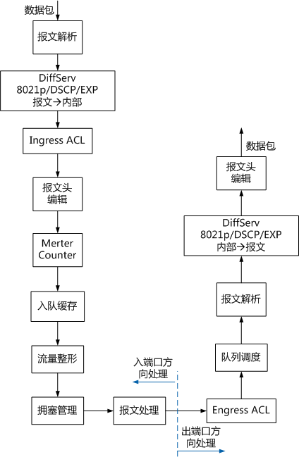
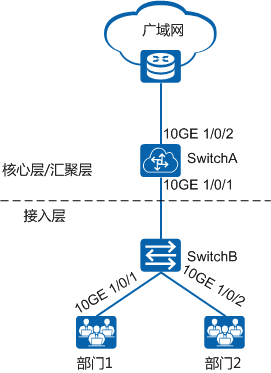

## 1 QoS是什么

随着网络技术的飞速发展，IP网络已经从当初的单一数据网络向集成数据、语音、视频、游戏的多业务网络转变。网络中所承载的数据呈几何级倍数增长，而且这些业务对网络带宽、时延有着极高的要求。同时，由于硬件芯片研发的难度大、周期长、成本高等原因，带宽逐渐成为互联网发展的瓶颈，导致网络发生拥塞，产生丢包，业务质量下降，严重时甚至造成业务不可用。所以，要在IP网络上开展这些实时性业务，就必须解决网络拥塞问题。

解决网络拥塞的最好的办法是增加网络的带宽。但从运营、维护的成本考虑，一味增加网络带宽是不现实的，最有效的解决方案就是应用一个“有保证”的策略对网络拥塞进行管理。

QoS（Quality of Service，服务质量）技术就是在这种背景下发展起来的。QoS技术本身不会增加网络带宽，而是在有限的带宽资源下，如何平衡地为各种业务分配带宽，针对各种业务的不同需求，为其提供端到端的服务质量保证。

## 2 QoS的度量指标

知己知彼，百战百胜！既然要提高网络质量，首先我们需要了解一下哪些因素会影响网络的服务质量。从传统意义上来讲，影响网络质量的因素包括：

- 带宽/吞吐量
- 时延
- 时延变化（抖动）
- 丢包率

因此，要提高网络的服务质量，就可以从保证传输链路的带宽，降低报文传送的时延和抖动，降低丢包率等方面着手。而这些影响网络服务质量的因素，也就成为QoS的度量指标。

### 带宽/吞吐量

带宽（bandwidth）也称为吞吐量（throughput），是指在一个固定的时间内（1秒），从网络一端流到另一端的最大数据位数，也可以理解为网络的两个节点之间特定数据流的平均速率。带宽的单位是比特/秒（bit/s，简写为bps）。

带宽可以用高速公路做比喻来帮助理解它的含义：高速公路的车道可以衡量传输的能力。公路的宽度好比是带宽，行驶在公路上的汽车就好比是网络传输的数据。车道越多，车辆通行能力就越强，发生堵车的概率就越低。同样的，拥有更宽的带宽，也就是有更大的数据传输能力。

在网络中，有两个常见的与带宽有关的概念——“上行速率”、“下行速率”。上行速率是指用户向网络发送信息时的数据传输速率，下行速率是指网络向用户发送信息时的传输速率。例如，用户用FTP上传文件到网上，影响上传速度的就是“上行速率”；而从网上下载文件，影响***的就是“下行速率”。

 

在网络通信中，人们在使用网络时总是希望带宽越来越宽，特别是互联网日益强大，人们对互联网的需求不再是单一地浏览网页、查看新闻。新一代多媒体、影像传输、数据库、网络电视的信息量猛增使得带宽成为了严重的瓶颈。因此，带宽成为网络设计主要的设计点，也是分析网络运行情况的要素。

### 时延

时延（Latency）是指一个报文或分组从一个网络的一端传送到另一端所需要的时间。以语音传输为例，时延是指从说话者开始说话到对方听到所说内容的时间。若时延太大，会引起通话声音不清晰、不连贯或破碎。

大多数用户察觉不到小于100毫秒的延迟；当延迟在100毫秒和300毫秒之间时，说话者可以察觉到对方回复的轻微停顿，这种停顿可能会使通话双方都感觉到不舒服。超过300毫秒，延迟就会很明显，用户开始互相等待对方的回复，当通话的一方不能及时接收到期望的回复时，说话者可能会重复所说的话，这样会与远端延迟的回复碰撞，导致重复。

图2-1 时延过大对网络质量的影响

 

### 时延变化（抖动）

时延变化是指同一业务流中不同分组所呈现的时延不同。时延变化也称为抖动（Jitter）。抖动主要是由于业务流中相继分组的排队等候时间不同引起的，是对服务质量影响最大的一个问题。某些业务类型，特别是话音和视像等实时业务是极不容忍抖动的。分组到达时间的差异将在话音或视像中造成断续。

如下图所示，研发人员向出差人员发送一句语音“**不需要重启的**“。假设每个字是一个分组，发送端将语音分割为6个分组，以均匀的时间间隔顺序发出。由于IP网络的复杂性，每个分组时延可能不同，导致在接收端收到分组时各分组之间的时间间隔与发送时的时间间隔不一致。加上说话者的语气等因素，出差人员可能会将接收到的语音理解成“**不，需要重启的！**”，从而造成语义上的误解。

图2-2 抖动对网络质量的影响

 

抖动也会影响一些网络协议的处理，有些协议是按固定的时间间隔发送交互性报文，抖动过大会导致协议震荡。所有传输系统都有抖动，只要抖动在规定容差之内就不会影响服务质量。利用缓存可以克服过量的抖动，但这将增加时延。

### 丢包率

少量的丢包（Loss）对业务的影响并不大，例如，在语音传输中，丢失一个比特或一个分组的信息，通话双方往往注意不到。在视像广播期间，丢失一个比特或一个分组可能造成在屏幕上瞬间的波形干扰，但视像很快恢复正常。即使用传输控制协议（TCP）传送数据也能处理少量的丢包，因为传输控制协议允许丢失的信息重发。但大量的丢包会影响传输效率。所以，QoS更关注的是丢包的统计数据——丢包率。丢包率是指在网络传输过程中丢失报文占传输报文的百分比。

## 3 QoS服务模型

现在我们已经了解了QoS的度量指标。那么，如何在网络中通过部署来保证这些指标在一定的合理范围内，从而提高网络的服务质量呢？这就涉及到QoS模型。需要说明的是，QoS模型不是一个具体功能，而是端到端QoS设计的一个方案。例如，网络中的两个主机通信时，中间可能会跨越各种各样的设备。只有当网络中所有设备都遵循统一的QoS服务模型时，才能实现端到端的质量保证。IETF、ITU-T等国际组织都为自己所关注的业务设计了QoS模型。下面就来介绍一下主流的三大QoS模型。

- 尽力而为（Best-Effort）服务模型
- 综合服务（Integrated Service，简称IntServ）模型
- 差分服务（Differentiated Service，简称DiffServ）模型

### 尽力而为（Best-Effort）服务模型

Best-Effort是最简单的QoS服务模型，应用程序可以在任何时候，发出任意数量的报文，而且不需要通知网络。对Best-Effort服务，网络尽最大的可能性来发送报文，但对时延、可靠性等性能不提供任何保证。Best-Effort服务模型适用于对时延、可靠性等性能要求不高的业务质量保证。Best-Effort现在Internet的缺省服务模型，它适用于绝大多数网络应用，如FTP、E-Mail等。

在理想状态下，如果有足够的带宽，Best-Effort是最简单的服务模式。而实际上，这种“简单“带来一定的限制。因此，Best-Effort适用于对时延、可靠性等性能要求不高的业务，如FTP、E-Mail等。

### 综合服务（IntServ）模型

由于网络带宽的限制，Best-Effort服务模型不能为一些实时性要求高的业务提供有力的质量保障，于是IETF在1994年的RFC1633中提出了InterServ模型。

IntServ模型是指用户在发送报文前，需要通过信令（Signaling）向网络描述自己的流量参数，申请特定的QoS服务。网络根据流量参数，预留资源（如带宽、优先级）以承诺满足该请求。在收到确认信息，确定网络已经为这个应用程序的报文预留了资源后，用户才开始发送报文。用户发送的报文应该控制在流量参数描述的范围内。网络节点需要为每个流维护一个状态，并基于这个状态执行相应的QoS动作，来满足对用户的承诺。

IntServ模型使用了RSVP（Resource Reservation Protocol）协议作为信令，在一条已知路径的网络拓扑上预留带宽、优先级等资源，路径沿途的各网元必须为每个要求服务质量保证的数据流预留想要的资源，通过RSVP信息的预留，各网元可以判断是否有足够的资源可以使用。只有所有的网元都给RSVP提供了足够的资源，“路径”方可建立。这种资源预留的状态称为“软状态”。为了保证这条通道不被占用，RSVP会定期发送大量协议报文进行探测。通过RSVP，各网元可以判断是否有足够的资源可以预留。只有所有的网元都预留了足够的资源，专用通道方可建立。

图3-1 IntServ模型

 

IntServ模型为业务提供了一套端到端的保障制度，其优点显而易见，但是其局限性一样明显。

- **实现难度大：**IntServ模型要求端到端所有网络节点支持。而网络上存在不同厂商的设备，核心层、汇聚层和接入层的设备功能参差不齐，要所有节点都支持IntServ模型，很难达到这方面要求。
- **资源利用率低：**为每条数据流预留一条路径，意味着一条路径只为一条数据流服务而不能为其他数据流复用。这样导致有限的网络资源不能得到充分的利用。
- **带来额外带宽占用：**为了保证这条通道不被占用，RSVP会发送大量协议报文定期进行刷新探测，这在无形中增大了网络的负担。

IntServ模型使用的RSVP信令需要跨越整个网络进行资源请求/预留，因此要求端到端所有网络节点支持RSVP协议，且每个节点需要周期性同相邻节点交换状态信息，协议报文开销大。更关键的是，所有网络节点需要为每个数据流保存状态信息，而当前在Internet骨干网上有着成千上万条数据流，因此IntServ模型在Internet骨干网上无法得到广泛应用。IntServ模型一般应用在网络的边沿。

### 差分服务（DiffServ）模型

由于IntServ模型一般应用在网络的边沿，可扩展性较差，为了克服以上问题，IETF在1998年提出了DiffServ服务模型。DiffServ服务模型，也叫差分服务模型，意思就是提供有差别的服务。就好比我们去银行办理业务，普通用户在营业大厅排队办理业务，VIP客户有专门的VIP区优先办理业务，当然了，如果是持有黑卡的VVIP客户，则有专人专区为其办理业务。这就是银行针对不同的用户群提供的差分服务。那么在网络中，如何去区分不同的流量呢？

DiffServ模型的基本原理是将网络中的流量分成多个类或者标记不同的优先级，每个类享受不同的处理，尤其是网络出现拥塞时不同的类会享受不同级别的处理，从而得到不同的丢包率、时延以及时延抖动。同一类的业务在网络中会被聚合起来统一发送，保证相同的时延、抖动、丢包率等QoS指标。

Diffserv模型中，业务流的分类和汇聚工作在网络边缘由边界节点完成。边界节点可以通过多种条件（比如报文的源地址和目的地址、ToS域中的优先级、协议类型等）灵活地对报文进行分类，对不同的报文设置不同的标记字段，而其他节点只需要简单地识别报文中的这些标记，即可进行资源分配和流量控制。

图3-2 DiffServ模型

 

与Intserv模型相比，DiffServ模型不需要信令。在DiffServ模型中，应用程序发出报文前，不需要预先向网络提出资源申请，而是通过设置IP报文头部的QoS参数信息，来告知网络节点它的QoS需求。网络不需要为每个流维护状态，而是根据每个报文流指定的QoS参数信息来提供服务，对报文的服务等级划分，有差别地进行流量控制和转发，提供端到端的QoS保证。

DiffServ模型充分考虑了IP网络本身灵活性、可扩展性强的特点，将复杂的服务质量保证通过报文自身携带的信息转换为单跳行为，从而大大减少了信令的工作。因此，DiffServ模型不但适合运营商环境使用，而且也大大加快了IP QoS在实际网络中应用的进程。

### 基于DiffServ服务模型的QoS组成

目前存在多种IP QoS服务模型，其中应用最广的是差分服务模型（DiffServ）。本文提到的技术都是基于DiffServ模型。

DiffServ的基本思想是在网络边缘将进入的流分成各种不同的类型，将同种类型的流合并起来进行统一管理，保证相同的传输速率、延迟、抖动等服务质量参数，并对每一种类型在网络中分别进行处理。业务分类和汇聚工作在网络的边缘节点进行，首先数据包被标识为一定的服务类型，并记录在包头字段里，然后将包按一定的流量控制策略送入网络。网络中心节点通过检查包头来确定对包进行何种处理。

图3-3 DiffServ服务模型

 

- DS节点：实现DiffServ功能的网络节点称为DS节点。
- DS边界节点：负责连接另一个DS域或者连接一个没有DS功能的域的节点。DS边界节点负责将进入此DS域的业务流进行分类和可能的流量调整。
- DS内部节点：用于在同一个DS域中连接DS边界节点和其他内部节点。DS内部节点仅需基于DSCP值进行简单的流分类以及对相应的流实施流量控制。
- DS域（DS Domain）：一组采用相同的服务提供策略和实现了相同PHB（Per Hop Behaviors）的相连DS节点组成。一个DS域由相同管理部门的一个或多个网络组成，如一个DS域可以是一个ISP，也可以是一个企业的内部网。
- PHB：在每一个DS节点上对分组的处理称为每跳行为PHB（Per-Hop Behavior）。PHB描述了DS节点对具有相同DSCP的分组采用的外部可见的转发行为。可以用优先级来定义PHB，也可以用一些可见的服务特征如分组延迟、抖动或丢包率来定义。PHB只定义了一些外部可见的转发行为，没有指定特定的实现方式。

DiffServ模型包含了四大组件，通过这四大组件实现端到端的QoS：

- 报文分类和标记

要实现差分服务，需要首先将数据包分为不同的类别或者设置为不同的优先级。报文分类即把数据包分为不同的类别，可以通过MQC配置中的流分类实现；报文标记即为数据包设置不同的优先级，可以通过优先级映射和重标记优先级实现。

   说明：

这里的标记是“外部标记”，一般是在报文离开设备的时候对在报文中进行设置，修改报文QoS优先级字段，目的是为了将QoS信息传递给下一台设备；本文后面还有“内部标记”，用于设备内部处理报文，不修改报文。一般是在报文进入设备的时候，就通过流分类，给报文打上内部标记，这样，在报文从设备发出之前，都可以根据内部标记进行QoS处理。

- 流量监管、流量整形和接口限速

**流量监管**是将流量限制在特定的带宽内。当业务流量超过额定带宽时，超过的流量将被丢弃。这样可以防止个别业务或用户无限制地占用带宽。

**流量整形**是一种主动调整流的输出速率的流控措施，使流量比较平稳地传送给下游设备，避免不必要的报文丢弃和拥塞。流量整形通常在**接口出方向**使用。

**接口限速**是对一个接口上发送或者接收全部报文的总速率进行限制。当不需要对报文类型进行进一步细化分类而要限制通过接口全部流量的速率时，接口限速功能可以简化配置。

- 拥塞管理

**拥塞管理**是在网络发生拥塞时，通过一定的调度算法安排报文的转发次序，保证网络可以尽快恢复正常。拥塞管理通常在**接口出方向**使用。

- 拥塞避免

**拥塞避免**可以监视网络资源（如队列或内存缓冲区）的使用情况。在拥塞有加剧的趋势时，主动丢弃报文，避免网络拥塞继续加剧。拥塞管理通常在**接口出方向**使用。

总结来说，报文分类和标记是QoS服务的基础，是有效进行区别服务的前提。流量监管、流量整形和接口限速则是防患于未然，是预防措施。拥塞管理和拥戴避免则是在拥塞发生时的解决措施。

## 4 QoS技术处理流程

基于Diffserv模型的QoS业务，无论是报文分类和标记、流量监管、流量整形和接口限速还是拥塞管理和拥塞避免，在设备上处理都有一定的先后顺序，一般情况下按照按下图所示的顺序处理。

图4-1 QoS技术处理流程

 

对于CE12800&CE6870EI系列交换机，设备内部处理流程具体为：

图4-2 CE12800&CE6870EI系列交换机QoS处理流程

 

数据包进入交换机后，会经过以下处理：

```bash
#1. 报文解析：
设备会截取报文的前128字节字段，解析各层次的报文头。比如：简单流分类的字段，802.1p/DSCP/MPLS EXP字段等。复杂流分类的字段，五元组、基于二层封装的协议字以及ACL、ACL6匹配的字段等。

#2. 优先级映射：
外部报文到设备内部的优先级映射，将报文携带的802.1p/DSCP/MPLS EXP等优先级字段转换为设备内部使用的内部优先级（iner-pri包括8个等级，标志为BE、AF1-AF4、EF、CS6、CS7）和丢弃优先级（GREEN、YELLOW、RED）。

#3. Ingress ACL：入端口方向ACL查找。
此处，可以对数据流进行复杂流分类，也可以应用报文过滤、策略路由等策略。

#4. 报文头编辑：
根据DiffServ映射模板的查表结果以及入端口方向ACL匹配的字段，对报文进行编辑，实现数据流的分类。

#5. Merter&Counter（度量&统计）：
通过令牌桶机制对网络流量进行度量，并对度量结果进行统计。

#6. 入队缓存：
采用HASH算法来将报文自动入队，尽量将不同的流分入不同的队列。将所有要从一个出接口发出的报文进入多个队列，按照各个队列的优先级进行处理。

#7. 流量整形：
对输出报文的速率进行监控，对超出部分的流量进行缓存，对进入设备的不规整的流量进行削峰填谷，使流量以均匀的速率发送出去，从而预防下游设备出现拥塞现象。

#8. 拥塞管理：
使用队列技术，将所有要从一个接口发出的报文分解成多个队列，按照各个队列的优先级进行处理。不同的队列算法用来解决不同的问题，并产生不同的效果。常用的队列有PQ、WFQ、WRR、DRR等。

#9. 报文处理：
根据入端口方向的度量结果，对数据包执行流量整形、拥塞管理等操作后，选择通过/丢弃等处理。

#10. Engress ACL：出端口方向ACL查找，
此处可以根据对数据流的分类结果应用报文过滤、报文重标记等策略。

#11. 报文解析：
设备同样截取报文的前128 字节字段，解析各层次的报文头，此处获取的为经过处理的设备内部优先级和丢弃优先级。

#12. 队列调度：
以队列索引号进行标识，队列索引号分别为0、1、2、3、4、5、6、7。根据本地优先级和队列之间的映射关系，自动将分类后的报文流送入各队列，然后按照各种队列调度机制进行调度。

#13. 优先级映射：
设备内部到外部报文的优先级映射，将设备内部使用的内部优先级（iner-pri包括8个等级，标志为BE、AF1-AF4、EF、CS6、CS7）和丢弃优先级（GREEN、YELLOW、RED）转换为报文携带的802.1p/DSCP/MPLS EXP等优先级字段。

#14. 报文头编辑：
根据DiffServ映射模板的查表结果以及出端口方向ACL匹配的字段，对报文进行编辑。
```

对于除CE6870EI外的CE8800&CE7800&CE6800&CE5800系列交换机，设备内部处理流程相似，区别在于入队缓存、队列调度以及拥塞管理的操作是在出端口方向完成的。设备内部处理流程如下：

图4-3 除CE6870EI外的CE8800&CE7800&CE6800&CE5800系列交换机QoS处理流程

  

## 5 QoS在企业网中的应用

在企业网络中，QoS的一系列技术不要求在同一台设备上应用，而应根据业务需要在不同位置应用。

图5-1 QoS技术在企业网络中的应用

  

理论上来说，各层次设备的功能如下：

- 接入层业务识别

接入交换机SwitchB作为边界交换机，在接入侧需要担负数据流的识别、分类以及流标记的工作；在网络侧需要担负不同应用数据流的拥塞管理、拥塞避免、流量整形等工作。

- 汇聚层/核心层提供差分服务

汇聚层和核心层设备端口信任基于接入层标识的QoS参数，通过队列调度、流量整形、拥塞避免等方式实施QoS策略，保证高优先级业务优先获得调度。

但在实际应用时，QoS策略的部署并不是那么的绝对，可以根据实际组网情况和业务需求部署相应的功能。在上图的组网中，可以在SwitchA应用报文分类和标记，用以区分不同部门的报文，然后在接口10GE 1/0/2出方向应用流量监管，限制进入广域网的流量。如果不需要区分来自不同部门的报文，可以直接在接口10GE 1/0/2出方向应用接口限速，限制进入广域网的流量。

当然，同一种QoS技术，也可能因为应用的位置不同而作用范围不同。如图5所示，如果在SwitchB的接口10GE 1/0/1和10GE 1/0/2应用出方向接口限速，则可以分别保证部门1、部门2可以使用的最大带宽。如果在SwitchA的接口10GE 1/0/1应用入方向接口限速，则保证的是部门1和部门2一共可以使用的最大带宽，并不能保证部门1、部门2分别可以使用的最大带宽。
