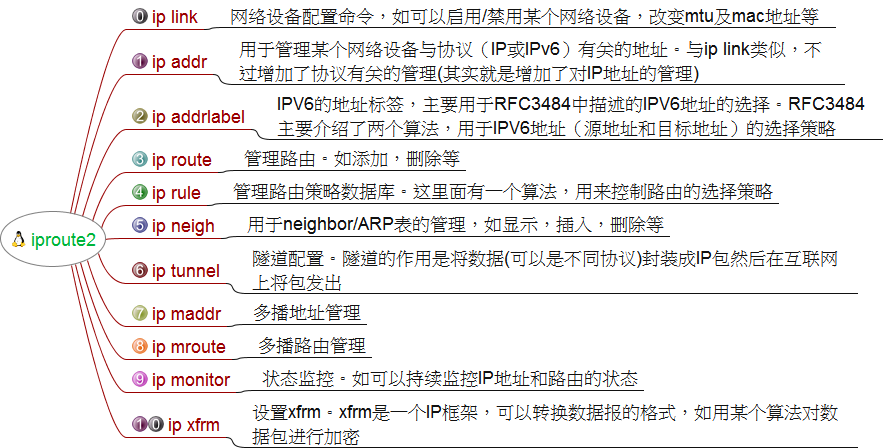

# iproute2 高级路由

linux 高级路由即基于策略的路由比传统路由在功能上更强大，使用也更灵活。
它不仅能够根据目的地址来转发路径而且也能够根据报文大小、应用或ip源地址来选择路由转发路径从而让系统管理员能轻松做到：

- 管制某台计算机的带宽。
- 管制通向某台计算机的带宽
- 帮助你公平地共享带宽
- 保护你的网络不受DOS的攻击
- 保护你的Internet不受到你的客户的攻击
- 把多台服务器虚拟成一台，并进行负载均衡或者提高可用性
- 限制你的用户访问某些计算机
- 限制对你的计算机的访问
- 基于用户帐号、MAC地址、源IP地址、端口、QOS《TOS》、时间或者content等进行路由

## 一、基础

- IPROUTE2基本命令如下图

  

- linux系统路由表

  linux可以自定义从1－252个路由表，linux系统维护了4个路由表：

  ```bash
  #   0表 --- 系统保留表
  # 253表 --- defulte table 没特别指定的默认路由都放在改表
  # 254表 --- main table 没指明路由表的所有路由放在该表
  # 255表 --- locale table 保存本地接口地址，广播地址、NAT地址 由系统维护，用户不得更改
  ```

- 查看路由表的方法：
  > `ip route list table table_number/table_name`
  
  路由表序号和表名的对应关系在/etc/iproute2/rt_tables中，可手动编辑，路由表添加完毕即时生效，下面为实例：

  ```bash
  # 在一号表中添加默认路由为192.168.1.1
  ip route add default via 192.168.1.1 table 1

  # 在一号表中添加一条到192.168.0.0网段的路由为192.168.1.2
  ip route add 192.168.0.0/24 via 192.168.1.2 table 1
  ```
  
  > 注:各路由表中应当指明默认路由,尽量不回查路由表.路由添加完毕,即可在路由规则中应用.

## 二、重点之一 `---` 路由规则( `ip rule`)

进行路由时，根据路由规则来进行匹配，按优先级（pref）从低到高匹配,直到找到合适的规则.所以在应用中配置默认路由是必要的.

```bash
#显示路由规则
ip rule show

#路由规则的添加
# 如果pref值不指定，则将在已有规则最小序号前插入
ip rule add from 192.168.1.10/32 table 1 [pref 100]

#注：创建完路由规则若需立即生效须执行#ip route flush cache;刷新路由缓冲

#-----------------------------------------------------------
# 可选参数解析如下：
# From   -- 源地址
# To     -- 目的地址（这里是选择规则时使用，查找路由表时也使用）
# Tos    -- IP包头的TOS（type of sevice）域Linux高级路由-
# Dev    -- 物理接口
# Fwmark -- iptables标签

#-----------------------------------------------------------
# 可采取的动作除了指定路由表外，还可以指定下面的动作：
# Table       -- 指明所使用的表
# Nat         -- 透明网关
# Prohibit    -- 丢弃该包，并发送 COMM.ADM.PROHIITED的ICMP信息
# Reject      -- 单纯丢弃该包
# Unreachable -- 丢弃该包， 并发送 NET UNREACHABLE的ICMP信息

#-----------------------------------------------------------
# 具体格式如下：更强大，使用更灵活
#    Usage: ip rule [ list | add | del ] SELECTOR ACTION
#    SELECTOR := [ from PREFIX ] [ to PREFIX ] [ tos TOS ][ dev STRING ] [ pref NUMBER ]
#    ACTION := [ table TABLE_ID ] [ nat ADDRESS ][ prohibit | reject | unreachable ] [ flowid CLASSID ]
#    TABLE_ID := [ local | main | default | new | NUMBER ]
#-----------------------------------------------------------
```

`添加路由范例`:

```bash
# 注:发往子网192.168.1.0/24的数据包通过分类4转发配合tc使用
ip route add 192.168.1.0/24 dev eth0 via 192.168.1.66 realm 4

ip route add default via 192.168.1.1 table int 1
ip route add 192.168.1.0/24 via 192.168.1.1 table int 2
ip route add 172.16.0.2/16 via 172.16.0.1 table int 3
```

`ip rule 配置实例`：

```bash
ip route del default
ip route add default via 192.168.33.1
ip rule add from 192.168.2.6 pref 1000 lookup cnline
ip rule add from 192.168.2.4 pref 1000 lookup cnline
ip rule add from 192.168.2.32 pref 1000 lookup cnline
ip rule add from 192.168.2.227 pref 1000 lookup cnline
ip rule add from 192.168.2.100 pref 1000 lookup cnline
ip rule add from 192.168.2.101 pref 1000 lookup cnline
ip rule add from 192.168.2.107 pref 1000 lookup cnline
ip rule add from 192.168.2.55 pref 1000 lookup cnline
ip rule add from 192.168.2.56 pref 1000 lookup cnline
ip rule add from 192.168.2.189 pref 1000 lookup cnline
ip rule add from 192.168.2.190 pref 1000 lookup cnline
ip rule add from 192.168.2.191 pref 1000 lookup cnline
ip rule add from 192.168.2.192 pref 1000 lookup cnline
ip rule add from 192.168.2.193 pref 1000 lookup cnline
ip rule add from 192.168.2.194 pref 1000 lookup cnline
ip rule add from 192.168.2.195 pref 1000 lookup cnline
ip rule add from 192.168.2.196 pref 1000 lookup cnline
ip rule add from 192.168.2.197 pref 1000 lookup cnline
ip rule add from 192.168.2.198 pref 1000 lookup cnline
ip route add 192.168.0.0/24 via 192.168.33.1 table cnline
ip route add 58.14.0.0/15 via 192.168.33.1 table cnline
ip route add 58.16.0.0/16 via 192.168.33.1 table cnline
```
