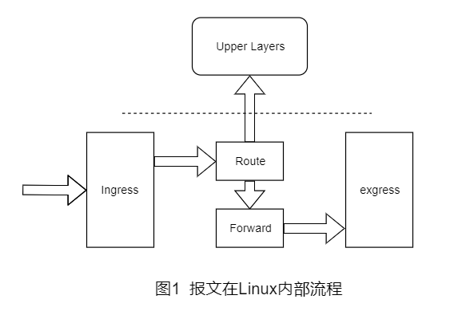
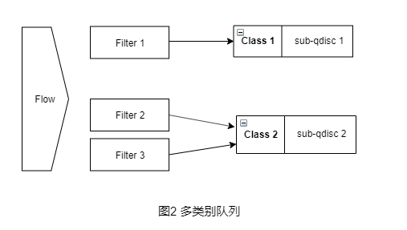
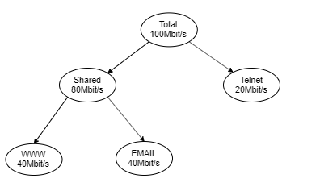

# Linux TC(Traffic Control) 简介

众所周知，在互联网诞生之初都是各个高校和科研机构相互通讯，并没有网络流量控制方面的考虑和设计，IP协议的原则是尽可能好地为所有数据流服务，不同的数据流之间是平等的。然而多年的实践表明，这种原则并不是最理想的，有些数据流应该得到特别的照顾，比如，远程登录的交互数据流应该比数据下载有更高的优先级。

针对不同的数据流采取不同的策略，这种可能性是存在的。并且，随着研究的发展和深入，人们已经提出了各种不同的管理模式。IETF已经发布了几个标准，如综合服务(Integrated Services)、区分服务(Diferentiated Services)等。其实，Linux内核从2.2开始，就已经实现了相关的流量控制功能。本文将介绍Linux中有关流量控制的相关概念， 用于流量控制的工具TC的使用方法，并给出几个有代表性实例。

## 一、相关概念

报文分组从输入网卡(入口)接收进来，经过路由的查找，以确定是发给本机的，还是需要转发的。如果是发给本机的，就直接向上递交给上层的协议，比如TCP，如果是转发的，则会从输出网卡(出口)发出。网络流量的控制通常发生在输出网卡处。虽然在路由器的入口处也可以进行流量控制，Linux也具有相关的功能，但一般说来，由于我们无法控制自己网络之外的设备，入口处的流量控制相对较难。因此我们这里处理的流量控制一般指**出口处的流量控制**。

流量控制的一个基本概念是 `队列(qdisc)`，每个网卡都与一个队列(qdisc)相关联联系，每当内核需要将报文分组从网卡发送出去，都会首先将该报文分组添加到该网卡所配置的队列中，由该队列决定报文分组的发送顺序。因此可以说，所有的流量控制都发生在队列中，详细流程图见图1。

  

有些队列的功能是非常简单的，它们对报文分组实行先来先走的策略。有些队列则功能复杂，会将不同的报文分组进行排队、分类，并根据不同的原则，以不同的顺序发送队列中的报文分组。为实现这样的功能，这些复杂的队列需要使用不同的过滤器(Filter)来把报文分组分成不同的类别(Class)。

这里把这些复杂的队列称为可分类(Classful)的队列。通常，要实现功能强大的流量控制，可分类的队列是必不可少的。因此，`类别(Class)` 和 `过滤器(Filter)` 也是流量控制的另外两个重要的基本概念。图2所示的是一个可分类队列的例子。

  

由图2可以看出，类别(Class)和过滤器(Filter)都是队列的内部结构，并且可分类的队列可以包含多个类别，同时，一个类别又可以进一步包含有子队列，或者子类别。所有进入该类别的报文分组可以依据不同的原则放入不同的子队列 或子类别中，以此类推。而过滤器(Filter)是队列用来对数据报文进行分类的工具，它决定一个数据报文将被分配到哪个类别中。

## 二、使用 `tc` 命令

### 2.1 `tc`必知

 在Linux中流量控制都是通过TC这个工具来完成的。通常，要对网卡进行流量控制的配置，需要进行如下的步骤：

```shell
#STEP1. 为网卡配置一个队列
#STEP2. 在该队列上建立分类
#STEP3. 根据需要建立子分类和子队列
#STEP4. 为每个分类建立过滤器
```

在Linux中，可以配置很多类型的队列,比较常用的是 CBQ 和 HTB。

**HTB**(`Hierarchical Token Bucket`)是一个可分类的队列， 与其他复杂的队列类型相比，HTB具有功能强大、配置简单及容易上手等优点。

在 `tc` 中，使用`major:minor`这样的句柄来标识**队列**和**类别**，其中major和minor都是数字。

对于队列来说，minor总是为0，即"major:0"这样的形式，也可以简写为`major:` 比如，队列1:0可以简写为1:

> 需要注意的是，major在一个网卡的所有队列中必须是惟一的

对于类别来说，其major必须和它的父类别或父队列的major相同，而minor在一个队列内部则必须是惟一的(因为类别肯定是包含在某个队列中的)。举个例子:

> 如果队列2:包含两个类别，则这两个类别的句柄必须是2:x这样的形式，并且它们的x不能相同，比如2:1和2:2。

需要注意的是，在TC 中使用下列的缩写表示相应的带宽:

- **`Kbps`** : kilobytes per second，千字节每秒 ;
- **`Mbps`** : megabytes per second，兆字节每秒 ，
- **`Kbit`** : kilobits per second，千比特每秒 ;
- **`Mbit`** : megabits per second， 兆比特每秒 。

### 2.2  `tc` 使用方法的示例

下面，将以HTB队列为主，结合需求来讲述TC的使用。

假设`eth0`出口有 **`100mbit/s`** 的带宽，分配给WWW、E-mail和Telnet三种数据流量,其中：

1. 分配给WWW的带宽为 **40Mbit/s**;
2. 分配给Email的带宽为 **40Mbit/s**;
3. 分配给Telnet的带宽为 **20Mbit/s**.

#### 2.2.1 为网卡eth0配置一个HTB队列

```bash
tc qdisc add dev eth0 root handle 1: htb default 11

#命令参数说明：
# add        ---- 表示要添加
# dev eth0   ---- 表示要操作的网卡为eth0
# root       ---- 表示为网卡eth0添加的是一个根队列
# handle 1:  ---- 表示队列的句柄为1:
# htb        ---- 表示要添加的队列为HTB队列
# default 11 ---- 是htb特有的队列参数，意思是所有未分类的流量都将分配给类别1:11
```

#### 2.2.2 为根队列(`1:`) 创建3个类别

```bash
tc class add dev eth0 parent 1: classid 1:11 htb rate 40mbit ceil 40mbit
tc class add dev eth0 parent 1: classid 1:12 htb rate 40mbit ceil 40mbit
tc class add dev eth0 parent 1: classid 1:13 htb rate 20mbit ceil 20mbit

#命令参数说明：
# parent 1:   ---- 表示类别的父亲为根队列1:
# classid1:11 ---- 表示创建一个标识为1:11的类别
# rate 40mbit ---- 表示系统将为该类别确保带宽40mbit
# ceil 40mbit ---- 表示该类别的最高可占用带宽为40mbit
```

#### 2.2.3 为各个类别设置过滤器

```bash
myTCF='tc filter add dev eth0 parent 1:0 protocol ip'
$myTCF prio 1 u32 match ip dport 80 0xffff flowid 1:11
$myTCF prio 1 u32 match ip dport 25 0xffff flowid 1:12
$myTCF prio 1 u32 match ip dport 23 oxffff flowid 1:13

#命令参数说明：
# protocol ip ---- 表示该过滤器应该检查报文分组的协议字段
# prio 1      ---- 表示它们对报文处理的优先级是相同的
#    对于不同优先级的过滤器，系统将按照从小到大的优先级顺序来执行
#    对于相同的优先级的过滤器，系统将按照命令的先后顺序执行

# 这几个过滤器还用到了u32选择器(命令中u32后面的部分)来匹配不同的数据流。
# 以第一个命令为例: 判断的是dport字段，如果该字段与0xffff进行与操作的结果是80,
# 则 flowid 1:11 表示将把该数据流分配给类别 1:11
```

### 2.3 带宽控制的复杂示例

这里需要用到HTB的一个特性 `----` 即 **对于一个类别中的所有子类别，它们将共享该父类别所拥有的带宽，同时，又可以使得各个子类别申请的各自带宽得到保证**。
这也就是说，当某个数据流的实际使用带宽没有达到其配额时，其剩余的带宽可以借给其他的数据流。而在借出的过程中，如果本数据流的数据量增大，则借出的带宽部分将收回，以保证本数据流的带宽配额。

下面考虑这样的需求，同样是三个数据流WWW、E-mail和Telnet， 其中的Telnet独立分配20Mbit/s的带宽。另一方面，WWW 和SMTP各自分配40Mbit/s的带宽。同时，它们又是共享的关系，即它们可以互相借用带宽。如下图所示。

  

```bash
# 所需的 tc 命令格式如下:

tc qdisc add dev eth0 root handle 1: htb default 21

myTCC='tc class add dev eth0'
$myTCC parent 1: classid 1:1 htb rate 20mbit ceil 20mbit
$myTCC parent 1: classid 1:2 htb rate 80mbit ceil 80mbit
$myTCC parent 1:2 classid 1:21 htb rate 40mbit ceil 20mbit
$myTCC parent 1:2 classid 1:22 htb rate 40mbit ceil 20mbit

myTCF='tc filter add dev eth0 parent 1: protocol ip prio 1'
$myTCF u32 match ip dport 80 0xffff flowid 1:21
$myTCF u32 match ip dport 25 0xffff flowid 1:22
$myTCF u32 match ip dport 23 0xffff flowid 1:1
```

从这个例子可以看出，利用HTB中类别和子类别的包含关系，可以构建更加复杂的多层次类别树，从而实现的更加灵活的带宽共享和独占模式，达到企业级的带宽管理目的。
