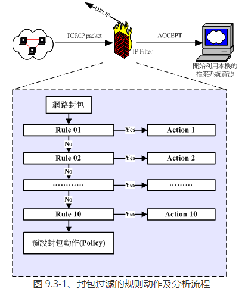
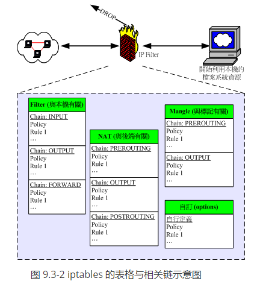
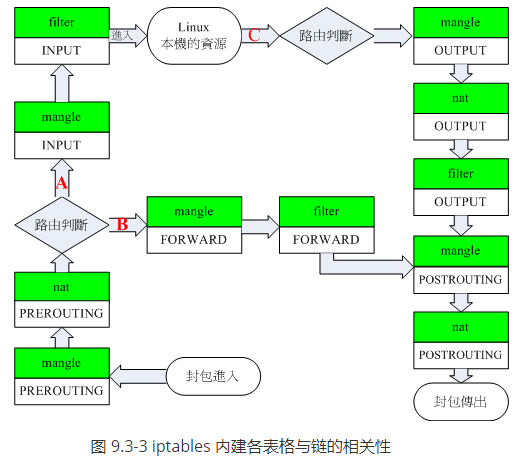
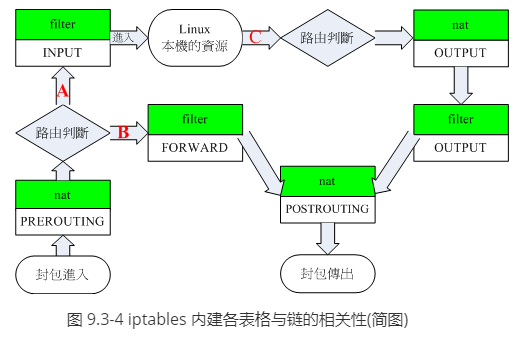

# Linux netfilter 原理

## 一、封包进入流程：规则顺序的重要性

前面的几个小节里面我们一直谈到：“防火墙规则”，咦！啥是规则啊？因为iptables是利用封包过滤的机制，所以他会分析封包的表头资料。根据表头资料与定义的 “规则” 来决定该封包是否可以进入主机或者是被丢弃。意思就是说：根据封包的分析资料”`比对`“你预先定义的规则内容，若封包资料与规则内容相同则进行动作，否则就继续 下一条规则的比对！“重点在那个”比对与分析顺序“上。

举个简单的例子，假设我预先定义10条防火墙规则好了，那么当互联网来了一个封包想要进入我的主机，那么防火墙是如何分析这个封包的呢？我们以底下的图示来说明好了：

  

当一个网路封包要进入到主机之前，会先经由 NetFilter 进行检查，那就是 iptables 的规则了。检查通过则接受 (ACCEPT) 进入本机取得资源，如果检查不通过，则可能予以丢弃 (DROP) ！上图中主要的目的在告知你：“规则是有顺序的”！例如当网路封包进入Rule 1 的比对时， 如果比对结果符合Rule 1 ，此时这个网路封包就会进行Action 1 的动作，而不会理会后续的Rule 2, Rule 3....等规则的分析了。

而如果这个封包并不符合 Rule 1 的比对，那就会进入 Rule 2 的比对了！如此一个一个规则去进行比对就是了。那如果所有的规则都不符合怎办？此时就会透过预设动作 (封包政策, Policy) 来决定这个封包的去向。所以啦，当你的规则顺序排列错误时，就会产生很严重的错误了。怎么说呢？让我们看看底下这个例子：

假设你的Linux 主机提供了WWW 的服务，那么自然就要针对port 80 来启用通过的封包规则，但是你发现IP 来源为192.168.100.100 老是恶意的尝试入侵你的系统，所以你想要将该IP 拒绝往来，最后，所有的非WWW 的封包都给他丢弃，就这三个规则来说，你要如何设定防火墙检验顺序呢？

1. Rule 1 先抵挡 192.168.100.100 ；
2. Rule 2 再让要求 WWW 服务的封包通过；
3. Rule 3 将所有的封包丢弃。

这样的排列顺序就能符合你的需求，不过，万一你的顺序排错了，变成：

1. Rule 1 先让要求 WWW 服务的封包通过；
2. Rule 2 再抵挡 192.168.100.100 ；
3. Rule 3 将所有的封包丢弃。

此时，那个 192.168.100.100 “可以使用你的 WWW 服务”喔！只要他对你的主机送出 WWW 要求封包，就可以使用你的 WWW 功能了，因为你的规则顺序定义第一条就会让他通过，而不去考虑第二条规则！这样可以理解规则顺序的意义了吗！现在再来想一想，如果 Rule 1 变成了“将所有的封包丢弃”，Rule 2 才设定“WWW 服务封包通过”，请问，我的 client 可以使用我的 WWW 服务吗？呵呵！答案是“否～”想通了吗？ ^_^

## 二、 iptables 的表格 (table) 与链 (chain)

事实上，那个图 9.3-1 所列出的规则仅是 iptables 众多表格当中的一个链 (chain) 而已。什么是链呢？这得由 iptables 的名称说起。为什么称为 ip"tables" 呢？因为这个防火墙软体里面有多个表格 (table) ，每个表格都定义出自己的预设政策与规则， 且每个表格的用途都不相同。我们可以使用底下这张图来稍微了解一下：

  

刚刚图 9.3-1 的规则内容仅只是图 9.3-2 内的某个 chain 而已！而预设的情况下，咱们Linux 的iptables 至少就有三个表格:

- 包括管理本机进出的filter
- 管理后端主机(防火墙内部的其他电脑) 的nat
- 管理特殊旗标使用的mangle (较少使用) 。

更有甚者，我们还可以自定义额外的链呢！真是很神奇吧！每个表格与其中链的用途分别是这样的：

- `filter (过滤器)`：主要跟进入 Linux 本机的封包有关，这个是预设的 table 喔！
- `INPUT`：主要与想要进入我们 Linux 本机的封包有关；
- `OUTPUT`：主要与我们 Linux 本机所要送出的封包有关;
- `FORWARD`：它可以『转递封包』到后端的电脑中，与下列 nat table 相关性较高。

nat (位址转换)：是Network Address Translation 的缩写， 这个表格主要在进行来源与目的之IP 或port 的转换，与 Linux 本机较无关，主要与Linux 主机后的区域网路内电脑较有相关。
PREROUTING：在进行路由判断之前所要进行的规则(DNAT/REDIRECT)
POSTROUTING：在进行路由判断之后所要进行的规则(SNAT/MASQUERADE)
OUTPUT：与发送出去的封包有关

mangle (破坏者)：这个表格主要是与特殊的封包的路由旗标有关， 早期仅有 PREROUTING 及 OUTPUT 链，不过从 kernel 2.4.18 之后加入了 INPUT 及 FORWARD 链。由于这个表格与特殊旗标相关性较高，所以像咱们这种单纯的环境当中，较少使用 mangle 这个表格。
所以说，如果你的 Linux 是作为 www 服务，那么要开放用户端对你的 www 要求有回应，就得要处理 filter 的INPUT 链； 而如果你的 Linux 是作为区域网路的路由器，那么就得要分析 nat 的各个链以及 filter 的 FORWARD 链才行。也就是说， 其实各个表格的链结之间是有关系的！简单的关系可以由下图这么看：

  

上面的图示很复杂喔！不过基本上你依旧可以看出来，我们的 iptables 可以控制三种封包的流向：

- 封包进入 Linux 主机使用资源 (路径 A)： 在路由判断后确定是向 Linux 主机要求资料的封包，主要就会透过 filter 的 INPUT 链来进行控管；

- 封包经由Linux 主机的转递，没有使用主机资源，而是向后端主机流动(路径B)： 在路由判断之前进行封包表头的修订作业后，发现到封包主要是要透过防火墙而去后端，此时封包就会透过路径B 来跑动。也就是说，该封包的目标并非我们的 Linux 本机。主要经过的链是 filter 的 FORWARD 以及 nat 的 POSTROUTING, PREROUTING。这路径 B 的封包流向使用情况，我们会在本章的 9.5 小节来跟大家作个简单的介绍。

- 封包由 Linux 本机发送出去 (路径 C)： 例如回应用户端的要求，或者是 Linux 本机主动送出的封包，都是透过路径 C 来跑的。先是透过路由判断， 决定了输出的路径后，再透过 filter 的 OUTPUT 链来传送的！当然，最终还是会经过 nat 的 POSTROUTING 链。

> `Tips`:  有没有发现有两个『路由判断』呢？因为网路是双向的，所以进与出要分开来看！因此，进入的封包需要路由判断， 送出的封包当然也要进行路由判断才能够发送出去啊！了解乎？

由于 mangle 这个表格很少被使用，如果将图 9.3-3 的 mangle 拿掉的话，那就容易看的多了:

 

透过图9.3-4 你就可以更轻松的了解到，事实上与本机最有关的其实是filter 这个表格内的INPUT 与OUTPUT 这两条链，如果你的iptables 只是用来保护Linux 主机本身的话，那nat 的规则根本就不需要理他，直接设定为开放即可。

不过，如果你的防火墙事实上是用来管制LAN 内的其他主机的话，那么你就必须要再针对filter 的FORWARD 这条链，还有nat 的PREROUTING, POSTROUTING 以及OUTPUT 进行额外的规则订制才行。 nat 表格的使用需要很清晰的路由概念才能够设定的好，建议新手先不要碰！最多就是先玩一玩最阳春的 nat 功能『IP 分享器的功能』就好了！
