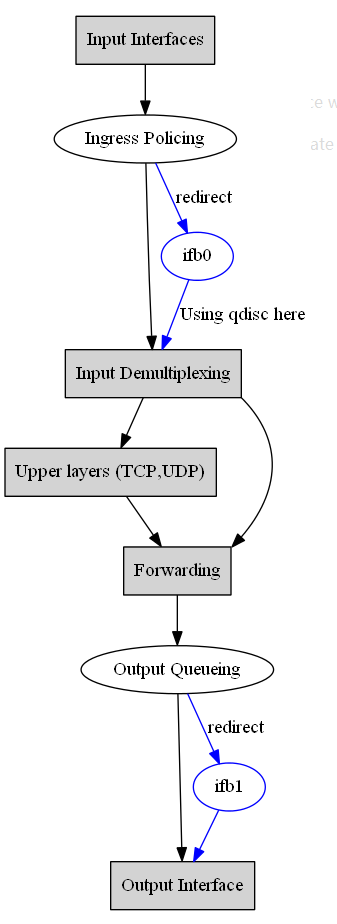

# IMQ(Intermediate queueing device,中介队列设备)

中介队列设备不是一个队列规定，但它的使用与队列规定是紧密相连的。

就Linux而言，队列规定是附带在网卡上的，所有在这个网卡上排队的数据都排进这个队列规定。

所以出现了两个局限：

1. >只能进行出口整形(虽然也存在入口队列规定，但在上面实现分类的队列规定的可能性非常小)。
2. >一个队列规定只能处理一块网卡的流量，无法设置全局的限速。

IMQ就是用来解决上述两个局限的。

简单地说，你可以往一个队列规定中放任何东西。被打了特定标记的数据包在netfilter的NF_IP_PRE_ROUTING 和NF_IP_POST_ROUTING两个钩子函数处被拦截，并被送到一个队列规定中，该队列规定附加到一个IMQ设备上。对数据包打标记要用到iptables的一种处理方法。

这样你就可以对刚刚进入网卡的数据包打上标记进行入口整形，或者把网卡们当成一个个的类来看待而进行全局整形设置。你还可以做很多事情，比如：把http流量放到一个队列规定中去、把新的连接请求放到一个队列规定中去。

## ifb 原理

ifb 是基于 IMQ, 并移除了 IMQ 依赖于 netfilter的缺点。其原理如下图：

