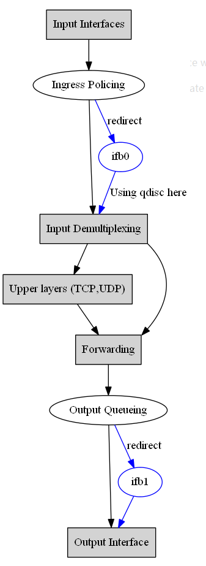

# IMQ(Intermediate queueing device,中介队列设备)

中介队列设备不是一个队列规定，但它的使用与队列规定是紧密相连的。

就Linux而言，队列规定是附带在网卡上的，所有在这个网卡上排队的数据都排进这个队列规定。

所以出现了两个局限：

1. >只能进行出口整形(虽然也存在入口队列规定，但在上面实现分类的队列规定的可能性非常小)。
2. >一个队列规定只能处理一块网卡的流量，无法设置全局的限速。

IMQ就是用来解决上述两个局限的。

简单地说，你可以往一个队列规定中放任何东西。被打了特定标记的数据包在netfilter的NF_IP_PRE_ROUTING 和NF_IP_POST_ROUTING两个钩子函数处被拦截，并被送到一个队列规定中，该队列规定附加到一个IMQ设备上。对数据包打标记要用到iptables的一种处理方法。

这样你就可以对刚刚进入网卡的数据包打上标记进行入口整形，或者把网卡们当成一个个的类来看待而进行全局整形设置。你还可以做很多事情，比如：把http流量放到一个队列规定中去、把新的连接请求放到一个队列规定中去。

## ifb 原理

ifb 是基于 IMQ, 并移除了 IMQ 依赖于 netfilter的缺点。其原理如下图：



ifb 范例

```bash

# 用ingress qdisc和ifb做ingress方向的队列调度。

modprobe ifb

ip link set dev ifb0 up txqueuelen 1000

tc qdisc add dev eth1 ingress

tc filter add dev eth1 parent ffff: protocol ip u32 match u32 0 0 flowid 1:1 action mirred egress redirect dev ifb0

tc qdisc add dev ifb0 root netem delay 50ms loss 1%
```

## 从 `tc` 的角度来看 `上传` 与 `下载`

对于 tc 来说，上传和下载行为是这样区分：

- >上传，就是用户端发送数据包给服务器，假设路由器是双网卡，所以负责发送数据包给服务器的是外网网卡，所以限制上传速度在外网网卡处，
- >下载，就是服务器发送数据包给用户，因为路由器是双网卡的关系，所以负责发送数据包给用户的是内网网卡，所以限制下载速度是在内网网卡

因为 tc 是一个能够负责接收数据包的工具,所以:

- >限制上传速度其实就是限制外网网卡接收用户发送的数据包的速度
- >限制下载速度其实就是限制内网网卡接收到要发送给用户的数据包的速度。
