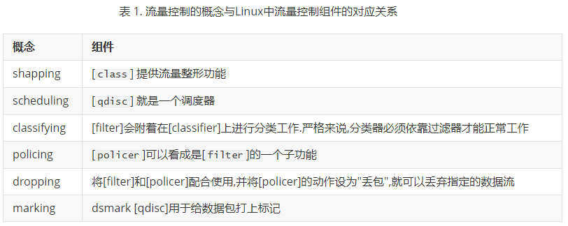
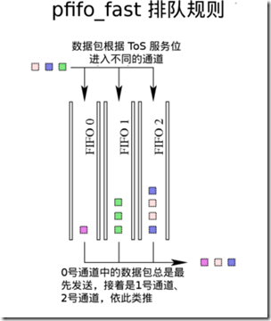
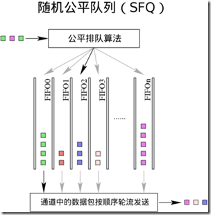
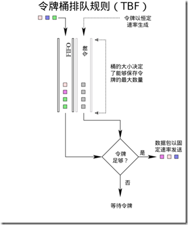
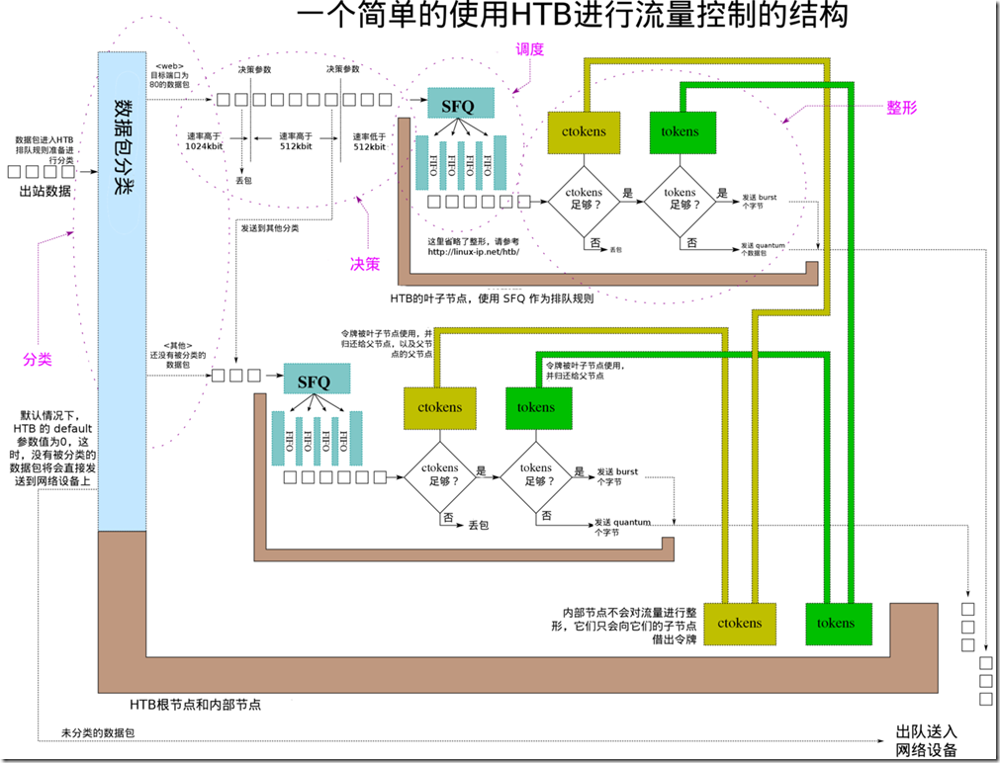

## 1. Linux 流量控制思想简介

### 1.1 什么是流量控制

流量控制就是在路由器上通过一系列队列，对数据包进行排序以控制它们的发送顺序，并通过一系列策略控制收到的和发送的数据包是否应该被丢弃，同时还要对数据包的发送速率进行控制。

在大部分情况下，流量控制只有一个队列，接收由本机应用程序产生的数据包把它们放入队列，并以网络硬件所能支持的最大速度发送出去。这种类型的队列叫做FIFO。

不同的应用有不同类型的队列。队列就是一种用于组织未能立即开始的任务或数据流的方法。网络链路通常要求数据包以一定的顺序发送，因此我们需要在本机网络出口上使用队列来管理数据包。

**举个例子说明**：

> 如果一台桌面电脑和一台流量较大的网站服务器共用一条网络链路，那就有可能发生带宽争夺。由于网站服务器的上行流量很大，超过了链路速度，从而路由器上的队列被来自网站服务器的数据包挤满。路由上的队列被挤满后，路由器就会开始丢包，这会导致桌面电脑的丢包率上升，数据延时增大。过大的延时会让桌面用户抓狂的。如果我们把这条链路分成两部分，分别给桌面电脑和网站服务器使用，就能较好地分配带宽资源，让两者都能比较正常地工作。

在Linux下，用户可以通过一系列工具在网络端口上应用不同类型的队列和策略来实施流量控制。这些工具提供的功能都很强大，同时也很复杂。但是，虽然实施流量控制可以改善网络质量，但提高带宽所得到的效果总是优于实施流量控制的。

QoS（Quality of Service，服务质量）通常也被当做是一种实施流量控制的方法。

### 1.2 为什么要实施流量控制

分组(或 `数据包`)交换网络和电路交换网络的一个重要不同之处是，分组交换网络是无状态的，而电路交换网络是有状态的（如电话线路）。分组交换网络被设计成和IP网络一样，是无状态的网络，无状态属性保证了包交换网络的健壮性。

无状态网络的缺点是无法很好地区分网络上的数据流类型。而通过实施流量控制，我们可以根据数据包的类型来决定其发送的方法和顺序，这就可以在无状态网络上模拟出一个有状态网络。

流量控制还可以用于很多网络环境下。下面列出了一些例子，在这些情况下，实施流量控制通常可以解决问题，至少也能把糟糕的情况改善一些。流量控制可用于很多情况，下面的例子并没有完全包括所有的情况。但列出这些例子可以帮助读者了解，在何种情况下实施流量控制可以收到不错的效果。

**常见的流量控制实践**:

> - 使用 TBF 和HTB把带宽限制在一个数值之下。
> - 使用 HTB和 classifying，并配合使用filter，限制某个用户、某个服务或某个程序所能使用的带宽。
> - 在非对称线路（如ADSL）上最大化TCP协议的吞吐量。这可以通过提高ACK数据包的优先级来实现。
> - 为某个用户或某个应用保留一定的带宽。这可以通过HTB和classifying来实现。
> - 提高延时敏感性型用的性能。这要通过在HTB内使用PRIO来实现。
> - 合理分配多余的带宽。可以通过HTB的租借机制来实现。
> - 在无限制的网络上实现公平分配资源。这可以通过HTB的租借机制来实现。
> - 丢弃某种类型的数据包。这可以通过policer和filter来实现。

记住，在大多数情况下，购买更多的带宽会比实施流量控制取得更好的效果。实施流量控制并非长久之计。

### 1.3 实施流量控制的优缺点

#### 1.3.1  好处

若能正确地实施流量控制，那就能让网络得到更充分地使用，减少网络上的竞争。大流量的下载不会破坏实时程序的交互性，同时也能让低优先级的数据传输（如电子邮件）正常进行。

更广义上，如果流量控制的策略能很好地符合与用户约定好的网络使用规则，那么用户也就能更合理地使用有限的网络资源。

#### 1.3.2 缺点

复杂性是实施流量控制的一个主要缺点。

> 虽然可以借助一系列工具的帮助来降低实施流量控制的复杂性，但是要想从已经配置好的流量控制方案中找出不恰当的配置也依旧不是一件容易的事情。

正确实施流量控制可以更公平地分配网络资源，但若配置不恰当，可能反而会恶化网络环境，使网络资源的分配更加不公平。

流量控制的规则越多，路由器就要使用更多的处理器资源来处理这些流量控制规则，我们要保证路由器有足够的能力来处理我们所设定的流量控制规则。幸运的是，路由器不需要消耗太多的计算资源就能处理比较复杂的规则。从另一方面来说，我们更应把注意力放在如何保证如此复杂的流量控制规则不会出现错误。

对于个人用户来说，实施流量控制几乎是零成本的。但对于企业来说，实施流量控制所付出的成本可能要比购买更大的带宽还要多，因为雇用一个了解流量控制的员工所需的工资可能比每月的带宽费用还要多。

### 1.4 队列

队列是调度的实现。一个队列中会有有限多个对象，这些对象将在队列中排队等待以便被处理。在网络中，队列中的对象就是**数据包**，数据包在队列中排队等待网卡将它们发送出去。

> 最简单的一种情况是，队列中的数据包按照先进先出规则进行排队，最先进入队列的数据包将会被最先传输出去，而最后进入队列的数据包将被最后传输出去。在计算机网络（或计算机科学）中，这种排队方式就叫做 FIFO.

如果不使用其他组件，单纯的队列无法提供流量控制的功能。队列只有两种操作，当数据包到来时执行入队操作，当有数据包可以发送时执行出队操作。

当队列配合其他组件使用时，就能实现很多的功能。我们可以同时使用多个队列，对数据包进行重排、丢弃、改变优先级等操作。

对运行在高层的应用来说，数据包只要能被发送出去就可以，至于发送顺序如何倒不是很重要。因此，对高层应用来说，流量控制系统就只是一条单一的队列。只有对于流量控制本层来说，流量控制结构才是可见的和有意义的。

### 1.5 数据包和帧

一块数据被称为什么取决于它位于哪一层网络栈中。虽然这里写出了数据包和帧两个名词，但在整个文档中将不会刻意区分这两个词在技术上的区别（这通常是错误的做法！）。

帧通常被用于描述位于第二层（数据链路层）的数据块。以太网接口、PPP接口和T1接口都把位于第二层的数据块称为帧。在这种情况下，帧就是流量控制所要操作的对象。

在其他情况下，位于第三层（网络层）的数据块被称为数据包。虽然不太精确，但本文将会使用数据包这一名词进行说明。

### 1.6 数据流

一个数据流就是两台主机间建立的一条连接。任何经由这条连接发送的一系列数据包都可以看成这两台主机间的一条数据流。

> 在TCP中，源IP和端口及目的IP和端口唯一决定了一条数据流。在UDP中也类似如此。

流量控制可以将网络流量分割成不同类型的数据流，这些数据流可以作为一个整体进行传输（参考DiffServ）。不同的流量控制结构可以将网络流量平均地分割成不同的数据流。

当网络中的数据流发生冲突时，对数据流进行处理就显得非常重要。这种情况常见于一个应用程序产生了大量的数据流时。

### 1.7 令牌桶

在流量整形中，令牌桶算法是一种很常用的整形方法。

为了控制队列中数据包出队的速率，就需要精确计算单位时间内出队的数据包数或数据包总大小，而这通常是很复杂的。为了进行简化，现在一般都使用另一种机制：系统以一定的速率产生令牌，每个数据包（或一个字节）对应一个令牌，只有当令牌充足的时候数据包才能出队。

> 打个比方来说，在游乐园里有很多游客在排队等待乘坐过山车。让我们假设过山车按照固定的时间到来。游客必须等待一列过山车到来后才能乘坐。在这里，过山车上的位置就相当于令牌，而游客就相等于数据包。这就是网络速率限制，或者称为shaping。在单位时间内，只能有固定数量的游客乘上过山车（出队）。
> 继续这个过山车的比喻，假设某个时刻没有游客排队，而车站里有很多车子，这时候来了一大波游客，那么这些游客的大多数人（甚至是全部）都能立刻乘上过山车（因为此时车站里有很多空车）。车站里所能停放的过山车数量就是令牌桶中“桶”的大小。桶中积攒起来的令牌能在突然出现大量数据包时全部使用出去。
> 让我们完成这个比喻。游乐园里的过山车以恒定速率到来，如果没有游客排队的话，就停放在等待区里，直到等待区里停满了车子。在令牌桶模型中，令牌以恒定的速率填充到桶中，直到桶满了为止。使用令牌桶模型进行流量整形能应付诸如HTTP应用之类会产生突发数据传输的情形。

概括来说，系统会以恒定的速率产生令牌，直到令牌桶满了为止。令牌桶能够在保证较长一段时间内网络流量在限制值以下，又能处理大速率的突发数据传输。

令牌桶模型也被应用于TBF（一种classless qdiscs）和HTB（一种classful qdiscs）中。

## 2. 流量控制中的概念

### 2.1 整形

整形就是流量控制，把数据包的发送速率控制在一个固定的水平以下。

这是最常用的流量控制手段。由于整形通过延迟数据包的发送来控制数据包发送速率，故整形机制是非工作保存的。“非工作保存”可以理解为：系统必须进行一些操作来延迟数据包的发送。

反过来说，一种非工作保存的队列是可以进行流量整形的，而工作保存的队列（参考 PRIO）不能进行流量整形，因为工作保存队列无法延迟发送数据包。

流量整形的好处之一是可以控制数据包的延迟时间。
在流量整形中，通常会使用令牌桶机制来实现整形。

### 2.2 调度

一个调度器会对将要发送的数据包顺序进行排列或重排。

对队列中对数据包顺序进行排列或重排就叫做调度。最常见的调度器是FIFO（先入先出队列）。由于数据包必须按顺序出队，因此队列实际上就是一个调度器。

对于不同的网络环境，我们可以使用不同的调度器。

> - 一个公平队列算法（参考SFQ）能防止一个客户端或一个数据流占用过多的带宽。
> - 一个循环算法（参考WRR）可以让各个客户端或数据流都有平等的使用网络的机会。

此外, 还有一些更复杂的算法可用于防止骨干网流量过载，或者是对一些常见算法的改进。

### 2.3 分类

分类器能把不同类型的网络流量划分到不同的队列中去。

把数据包按照不同类型进行划分叫做分类。通常我们只对上行流量进行分类。在路由器接收、路由并转发一个数据包的时候，网络设备可以以几种不同的方式给数据包进行分类。其中一种方式是【标记】数据包。标记数据包的操作可以在一个网络中由管理员进行设置，也有可能在数据包经过每一跳时发生。

Linux允许数据包通过一系列的流量控制结构，期间允许用户使用【决策器】对数据包进行分类。

### 2.4 策略

决策器能计算并限制某个特定队列的流量。

在流量控制中使用决策器来控制流量是非常简单的。决策器通常会应用于网络边界上，某个节点使用的流量不会超过分配给它的流量。当网络流量在预设值以下时，决策器什么都不会做。但当网络流量超过预设值时，决策器就开始发挥作用，它能将流量速率控制在一个固定的水平之下。

> 最不近人情的操作是即使在数据包能够继续[分类]的情况下依旧直接将其[丢弃]。

### 2.5 丢弃

丢弃一个数据包，一个数据流或一个分类下的数据包，都可以叫做丢弃。

> 丢弃一个数据包就叫做丢包。

### 2.6 标记

标记是一种对数据包进行一些修改的操作。

> 这里说的标记不是`fwmark`。

流量控制中的标记操作会给数据包加上一个`DSCP`，接下来在由一个管理员控制的一个网络下的其他路由器上将会使用这个标记。

## 3. Linux 流量控制中的组件

### 3.1 概念与组件的对应关系

### 3.2  qdisc `--` 排队规则

简单来说，qdisc其实就是一个调度器。每个网络接口都会有一个调度器，默认的调度器是FIFO。qdiscs会根据调度器的规则重新排列数据包进入队列的顺序。

qdisc 是 Linux 流量控制系统的核心。qdisc 也被称为排队规则。

- > `classful qdiscs` 可以包含多个 class，数据包根据 filter 的设置被分发到特定的 classful qdiscs 上。分类排队规则可以没有子类，但这样做通常会导致系统资源被白白浪费。

- > `classless qdiscs` 是没有分类的。由于非分类的排队规则没有子对象，所以 classifying 中也没有针对其的操作。因此，非分类的排队规则无法和过滤器相关联。

许多人常常弄不清楚 `root` qdisc 和 `ingress` qdisc 有何区别。这两者都不是真正的排队规则，他们只是一个供我们建立自己的流量控制结构的地方。出站数据包规则可以附加到 egress 上，而入站数据包可以附加到 ingress 上。

网络接口上收到的数据包都将经过 ingress qdisc。ingress qdisc 下无法创建任何分类，且只能与一个 filter 相关联。一般情况下，ingress qdisc 仅仅被当成是一个用于附加 policer 来控制入站流量的对象。

简而言之，egress 要比 ingress 更强大，更像是一个真正的排队规则。ingress 只能和决策器配合使用。本文也将重点介绍 `root` qdisc，除非特别说明，否则所有的操作都是默认针对 egress 进行的。

### 3.3 classifying `--` 分类

- 类仅存在于可分类的 qdisc 之下（如 HTB CBQ 等）。

- 理论上，类能无限扩展，一个类可以仅包含一个排队规则，也可以包含多个各自排队规则的子类。这就给 Linux 流量控制系统予以了极大的可扩展性和灵活性。

- 每一个类都有一个数字编号，filter 将根据这个编号与指定的类相关联。对数据包进行重分类或丢弃操作时也需要用这个数字编号来指定相应的分类器对象。

- 排队规则上的最末尾的分类成为叶子分类。叶子分类默认包含一个 FIFO 排队规则，且不会包含任何子分类。任何包含子分类的分类都不是叶子分类。

- 一个排队规则只能包含与其类型相同的类。

  > 举例来说，HTB 排队规则只能包含 HTB 分类，CBQ 排队规则不能将 HTB 分类作为自己的类。

### 3.4 filter `--` 过滤器

过滤器是 Linux 流量控制系统中最复杂的对象，它是连接各个流量控制核心组件的纽带。
过滤器最简单和最常见的用法就是对数据包进行分类。
Linux允许用户使用一个或多个过滤器将出站数据包分类并送到不同的出站队列上。

- > 一个过滤器`必须`有一个  【classifier】
- > 一个过滤器`可以`有一个  【policer(策略)】

过滤器能与 【qdisc】 相关联，也可以和 【class】 相关联。所有的出站数据包首先会通过 【root qdisc】，接着被与 【root qdisc】 关联的过滤器进行分类，进入子分类，并被子分类下的过滤器继续进行分类。

### 3.5  分类器

最常用的分类器是 `u32` 分类器，它可以根据数据包中的属性对数据包进行分类。

分类器可以根据数据包的元数据对数据包进行分类，识别不同类型的数据包。在 Linux 流量控制中，分类器的使用是最基本的东西。

### 3.6 决策器

决策器只能配合 filter 使用。决策器只有两种操作，当流量高于用户指定值时执行一种操作，反之执行另一种操作。灵活使用决策器可以模拟出三色计（three-color meter）。
policing 和 shaping 都是 Linux 流量控制中的基本组件，两者都可以对带宽进行限制。但不同的是， shaping 能保存并延迟发送数据包，而 **`policing` 只会直接丢弃数据包**。

### 3.7 丢包

丢包操作只能在 policer 中使用。任何已经与 filter 关联的 policer 都可以使用丢包操作。

在 Linux 流量控制系统中，想要丢弃数据包只能依靠决策器;。决策器可以把进入队列的数据包流速限定在一个指定值之下。另外，它也可以配合分类器，丢弃特定类型的数据包。

另外，当网络流量很大时，整形器或调度器可能会用光分配给它们的内存，这时候整形器和调度器也会开始丢弃数据包。

### 3.8 句柄

每个 class 和分类的 qdisc 都需要一个唯一的标识符。标识符就是句柄。标识符由一个主编号和一个子编号组成，编号必须是数字。用户可以自由指定编号，但必须遵守以下规则: **`主编号` : `子编号`**

- `主编号` 对内核来说没有意义。用户可以随意指定一个数字。但是，在流量控制结构中，一个对象下所有子对象的主编号必须相同。
  
  > 另外，按照惯例，root qdisc 的主编号通常应指定为1。
  
- `子编号`

  - 排队规则 的子编号必须为 0
  - 分类器的子编号必须是 非 0 值. 一个qdisc下的所有分类器必须有相同的主编号
  - **特别地,`ingress qdisc` 的编号总是 `ffff:0`**

- 在使用 tc filter 时，句柄将会作为 classid 和 flowid 的参数值，以指定操作对象。

  > 句柄仅供用户使用，内核会使用自己的一套编号来管理流量控制组件对象。

## 4. 常见qdisc的图示

### 4.1 无分类qdisc

- **pfifo_fast**,  是 Linux 下所有网络接口默认的排队规则。

  

  `pfifo_fast` 没有为用户提供任何可以修改的参数。

- **SFQ, 随机公平队列**

  
  
  SFQ 会使用随机算法尽力让每一个 flows 都能公平地将自己的数据发送出去。
  
  SFQ 会使用一个散列函数来完成随机分配，根据散列函数的值将数据包分配到由它自己维护的一系列 FIFO 中，并循环发送这些 FIFO 中的数据，以此实现随机发送。

  由于一直使用固定的散列算法可能会造成不公平的情况，所以散列算法每隔一段固定的时间就会更改一次，用户可以修改 perturb 参数的值来控制这一时间间隔。

- **TBF, 令牌桶**

  

  令牌桶排队规则是基于 tokens 和 buckets 这两个概念之上的。要对网络设备上的出站流量进行整形，使用令牌桶排队规则是个不错的解决方案，因为它只会减慢数据包发送速率而不会丢弃数据包。

  当有足够的令牌时，数据包才能被发送出去，否则，数据包将被暂存起来延迟发送。通过这种方法延迟数据包的发送将会人为的增大数据包的来回时间。

### 4.2 分类qdisc

- **HTB(分层令牌桶)**

  
  
  此图中有多个 HTB 根分类，每一个根分类都可以模拟成一条虚电路。

## 5. 约定和一些常见场景

### 5.1 一般性提示

- 实行流量整形的路由应该是整条链路上的瓶颈。

  > 一般情况下路由器都应该把整形流量限制为比线路带宽稍低一些，这样可以避免过量的数据包阻塞路由器，让路由器能够有效地工作。

- 理论上来说，流量控制系统只能对上行流量进行整形。

  > 因为下行流量是从网络上发送过来的，我们无法直接控制接收到的数据流量。虽然可以使用在 ingress 上使用决策器来控制入站流量，但本机和上级路由间的线路上的流量并不会因此减少。

- 每个网络接口都有必须有一个 qdisc。

  > 如果用户没有为网络接口指定 qdisc，系统就会默认使用 pfifo_fast 作为网络接口的默认排队规则。

- 如果向网络接口上关联了一个 classful qdiscs，而又没有向这个排队规则上添加任何子分类，那只会白白浪费处理器时间。

- 新创建的分类默认包含一个 FIFO 排队规则。

  > 如果用户为分类指定了一个新的排队规则，那么用户指定的排队规则就会取代 FIFO。
  >
  > 如果用户为分类指定了子类，那么 FIFO 就会自动被删除。

- 可以直接往 root qdisc 上关联分类来模拟一条虚电路。
- filter 可以与分类器或 classful qdiscs 相关联。

### 5.2 在已知带宽的线路上实施流量控制

如果线路的带宽是已知的，那么使用 HTB 是个不错的决定。因为用户可以把根节点的整形流量设置为线路的最大带宽。整个线路的流量可以一级一级细分到子分类去，用户可以灵活地指定各种不同的应用和流量可用的带宽。

### 5.3 在带宽可变（或未知）的线路上实施流量控制

理论上来说，PRIO 是最适合用在带宽未知或带宽可变的线路上的，因为 PRIO 是一种工作保存（work-conserving）的排队规则，也就是说 PRIO 是不会对流量进行整形的。在这样一种带宽不稳定的线路上，PRIO 可以优先发送高优先级的数据包，然后再发送低优先级的数据包。

### 5.4 基于数据流的流量控制

由于网络上存在多种多样的连接，使用 SFQ 能简单而有效地管理这些连接。SFQ 会将网络流量分为多个不同的数据流，然后随机并公平地发送这些数据流。如果网络上都是行为良好的用户和程序，那么使用 SFQ 会让用户觉得网络的状态和稳定性是很不错的。

的弱点在于当它面对非常规的网络应用时，其随机公平服务算法就会显得十分无力。有一些客户端（如 迅雷，eMule，eDonkey，Kazaa 等）会创建大量的网络会话，这些网络会话会占领所有的数据流，于是随机公平服务算法对这些客户端来说就成了优先服务算法，其它的应用将得不到公平的服务。SFQ 没办法对这种应用进行惩罚，所以在这种情况下，我们需要使用其它的排队规则。

### 5.5 基于IP地址的流量控制

对于许多网络管理员来说，这是控制用户对网络的使用的最好办法。但遗憾的是，tc 没有提供简单的方法来对一大堆IP地址分别设置不同的流量控制参数，用户数越多，流量控制结构也就越复杂。

> 如果要控制 N 个 IP 地址的流量，就需要至少 N 个分类。
