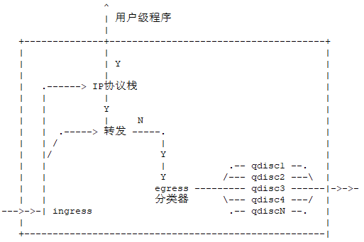

# TC工作原理

通过设置不同类型的网络接口队列，从而改变数据包发送的速率和优先级，达到流量控制的目的。

内核如果需要通过某个网络接口发送数据包，它都需要按照为这个接口配置的qdisc（队列规则）把数据包加入队列，然后内核会尽可能多的从qdisc里取出数据包，把它们交给网络适配器驱动模块。

## 一、 `QoS` 相关的术语

流量的处理由三种对象控制：`qdisc（队列）`，`class（类）`，`filter（分类器）`

`qdisc（队列规则）`：用来实现控制网络的收发速度和调度。通过队列，linux可以将网络数据包缓存起来，然后根据用户的设置，在尽量不中断连接的前提下平滑网络流量，linux对接收队列控制不够好，所以一般只控制发送队列（’控发不控收‘）。Qdisc封装了class和filter。

- 无类队列：pfifo_fast,tbf ,sfq等,流量整形手段是排序，限速和丢包。
- 分类队列：htb，cbq，prio，适用于同时进行调度和流量控制的场合。

`class(类)`：控制策略,当对多种数据流需要区别对待的时候,需要class来表示不同的控制策略。

`filter(分类器)`：用来将来自不同用户的数据包划入到具体的控制策略中(即不同的class中).常用的分类器有:

- `u32`（根据数据包中的各个字段进行判断），
- `route`（根据数据包将被哪条路由进行路由来判断）。

```bash
#filter 示例
tc filter add dev eth0 \
  parent 10:0 protocol ip prio 1 u32 match ip src 1.2.3.4/32 flowid 10:1
# 上述语句的作用是：把来自1.2.3.4的数据包送到最高有限的队列 10:1 中
# 分类器相关的参数
protocol ---- 分类器所接受的协议。一般来说只会接受IP数据。
parent   ---- 分类器附带在哪个句柄上。必须是一个已经存在的类的句柄。
prio     ---- 分类其的优先权值，优先权值低的优先。
handle   ---- 过滤器不同，意义不同。指定由哪种算法来处理
```

上面的概念对应的位置如下图:



```bash
#上图 图示说明：
1. 整个大方框表示内核。
2. 最左面的箭头表示从网络上进入机器的数据包。它们进入Ingress队列，并有可能被某些过滤器丢弃即所谓策略。(在进入内核之前丢弃数据有利于节约CPU时间）。
3. 数据包顺利通过的话，如果它是发往本地进程的，就会进入IP协议栈处理并提交给该进程。

4. 如果它需要转发而不是进入本地进程，就会发往egress。本地进程也可以发送数据，交给Egress分类器。
5. 然后经过审查，并放入若干队列规定中的一个进行排队。这个过程叫做“入队”。在不进行任何配置的情况下，只有一个egress队列规定——pfifo_fast——总是接收数据包。
6. 数据包进入队列后，就等待内核处理并通过某网卡发送。这个过程叫做“出队”。
这张图仅仅表示了机器上只有一块网卡的情况，图中的箭头不能代表所有情况。每块网卡都有它自己的ingress和egress。
```

`数据包如何出队并交给硬件`
当内核决定把一个数据包发给网卡的时候，根队列规定1:会得到一个出队请求，然后把它传给1:1，然后依次传给10:、11:和12:，然后试图从它们中 进行dequeue(出列)操作。也就是说，内核需要遍历整颗树，因为只有12:2中才有这个数据包。换句话说，类及其兄弟仅仅与其“父队列规定”进行交 谈，而不会与网卡进行交谈。只有根队列规定才能由内核进行出队操作！
更进一步，任何类的出队操作都不会比它们的父类更快。这恰恰是你所需要的：我们可以把SFQ作为一个子类，放到一个可以进行流量整形的父类中，从而能够同时得到其父类的流量整形功能和SFQ的调度功能。

## 二、内核支持的队列分类

**无类队列**：`内部不包含可配置子类的队列`

- `pfifo_fast（先进先出队列）`: 是系统缺省配置。可通过‘ip link list’命令来查看当前的网络队列设置。

> pfifo_fast只起到调度作用，对数据流量不进行控制

- `tbf(令牌桶过滤器)`: 只允许不超过事先设定的速率到来的数据包通过，但允许短暂突发流量超过设定值。

> tbf适合于把速率降低到某个值

- `sfq(随机公平队列)`:  主要针对一个TCP会话或者UDP流，流量被分成相当多数量的fifo队列中，每个队列对应一个会话，数据按照简单轮转的方法发送，每个会话都按顺序得到发送机会。SFQ使用一种散列算法，把所有的会话映射到有限的几个队列中。SFQ会频繁的改变散列算法，使多个会话分配在同一个队列中而共享带宽的机率减小。

> sfq也同pfifio_fast一样只起到调度作用，对数据流量不进行控制

```bash
# 在eth0上设置sfq队列，每10s钟重新设置一次散列算法
tc qdisc add dev eth0 root sfq perturb 10
```

**分类队列**：内部包含一个或多个子类，使用过滤器对数据包进行处理分类，然后交给相应的子类处理。

- `HTB(分层的令牌桶队列)` ，可以很容易的保证每个类别的带宽，允许特定的类可以突破带宽上限，占用别的类的带宽。htb可以通过tbf实现带宽限制，也可以划分类别的优先级。

> 实际工作场景应用的HTB比较多，后续会详细讲解

```bash
# htb的应用示例:
tc qdisc add dev eth0 root handle 1: htb default 1
tc class add dev eth0 parent 1: classid 1:1 htb rate 6mbit burst 15k
# 限制整个网络的速率小于6mbit，突发传输为15kbytes
```

- CBQ: `基于类别排队，既有限制带宽的能力，也具有带宽优先级管理的能力`。

  工作机制：确认链路的闲置时间足够长，以达到降低链路实际带宽的目的。所以，它要计算两个数据包的平均发送间隔。

  - 最佳链路负载情况下，avgidle为0，数据包严格按照计算出来的时间间隔到来
  - 过载链路负载时,avgidle的值应该是负的.若负值太严重, cbq就会暂时禁止发包, 即overlimit(越限)。
  - 闲置链路负载时，应该有很大的avgidle值，这样闲置几个小时后，会造成链路允许非常大的带宽通过。为了避免这种情况出现，用maxidle来限制avgidle的值不能太大。

```bash
# cbq 的应用示例:
tc qdisc add dev eth0 root handle 1: cbq bandwidth 10Mbit avpkt 1000 cell 8 mpu 64
tc class add dev eth0 parent 1:0 classid 1:1 cbq bandwidth 100Mbit rate 6Mbit weight 0.6Mbit prio 8 allot 1514 cell 8 maxburst 20 avpkt 1000 bounded
# 设置了根队列为1:0，并且绑定了类1：1.即整个带宽不超过6mbit，且不能借入带宽

# 需要在根上设置的过滤器，以保证数据流被送到正确的队列规定中去
tc filter add dev eth0 parent 1:0 \
  protocol ip prio 1 u32 match ip dport 80 0xffff flowid 1:3
tc filter add dev eth0 parent 1:0 \
  protocol ip prio 1 u32 match ip sport 25 0xffff flowid 1:4
# dport 表示 目的端口, sport 表示源端口

# cbq的参数说明:
bandwidth      --- 网卡的物理带宽，用来计算闲置时间。
avpkt          --- 平均包的大小，单位是字节。
cell           --- 用于设置时间力度，通常设置为8，必须是2的整数次幂。
mpu            --- 最小包大小。
weight         --- 偏袒数量.当其中一个类要求的带宽高于其他的类,那它每次就会比其他类处理weight数量的数据。
prio           --- 优先级参数。当prio值较低时，只要有数据就必须先服务，其他类要延后处理。
allot          --- 当一个类发送数据时，它发送的数据量的基值。
maxburst       --- 决定了计算maxidle所使用的数据包的个数。在avgidle跌落到0之前，maxburst的数据包可以突发传输出去。值越高，越能容纳突发传输。
miniburst      --- 当发生越限时，cbq禁止发包。一段时间后，突发性传输miniburst个数据包。值越大，整形越精确，一定程度上会有越多的突发传输。
bounded/borrow --- bounded表示不会向其兄弟类借入带宽。borrow与bounded相反。
```

- PRIO： 不能限制带宽，因为属于不同类别的数据包是顺序离队的。但可以很容易实现流量的优先级管理。只有属于高优先级类别的数据包全部发送完毕，才会发送属于低优先级类别的数据包。

  > PRIO是pfifo_fast的衍生，它的每个频道都是一个单独的类。缺省情况下类的命名为‘主标号:1/2/3’，数据包过滤到‘主标号:1’有最高优先级。

```bash
tc qdisc add dev eth0 root handle 1: prio     //该命令运行后即创建了类1:1,1:2,1:3
tc qdisc add dev eth0 parent 1:1 handle 10: sfq
tc qdisc add dev eth0 parent 1:2 handle 20: tbf rate 20kbit buffer 1600 limit 3000
tc qdisc add dev eth0 parent 1:3 handle 30: sfq

# 大批量数据（如scp操作）都是经过30：处理
# 交互数据则经过高优先级的10：或20：处理
```

## 三、应用 `tc` 命令实现 `QoS` 的步骤方法

**`STEP 1`** :  针对网络物理设备（如eth0）绑定一个根队列qdisc；

> 一般情况下，针对一个网卡只需要建立一个根队列

**`STEP 2`** 在该队列规定上建立分类class；

> 一般情况下，针对一个队列需要建立一个根分类，然后再在其上建立子分类。
> 对于分类，按其分类的编号顺序起作用，编号小的优先，一旦符合某个分类匹配规则，通过该分类发送数据包，则其后的分类不再起作用。

**`STEP 3`** 为每一个分类建立一个过滤器filter；

**`STEP 4`** 最后与过滤器相配合，将流量送入相应的类进行排队；

## 四、 过滤器(`filter`)的简单范例

就象在“分类器”那章所解释的，借助一些复杂的语法你可以详细地匹配任何事情。
下面我们就开始简单地匹配一些比较有明显特征的语法开始。
比方说，我们有一个PRIO队列规定，叫做“10:”，包含3个类，我们希望把去往22口的数据流发送到最优先的频道中去。应该这样设置过滤器：

```bash
# 向eth0上的10:节点添加一个u32过滤规则，它的优先权是1：凡是去往22口（精确匹配）的IP数据包，发送到频道10:1。
tc filter add dev eth0 protocol ip parent 10: prio 1 u32match ip dport 22 0xffff flowid 10:1

# 向eth0上的10:节点添加一个u32过滤规则，它的优先权是1：凡是来自80口（精确匹配）的IP数据包，发送到频道10:1。
tc filter add dev eth0 protocol ip parent 10: prio 1 u32 match ip sport 80 0xffff flowid 10:1

# 向eth0上的10:节点添加一个过滤规则，它的优先权是2：凡是上面未匹配的IP数据包，发送到频道10:2。
tc filter add dev eth0 protocol ip parent 10: prio 2 flowid 10:2

#### 想通过IP地址进行筛选的话，这么敲：
# 这个例子把去往4.3.2.1和来自1.2.3.4的数据包送到了最高优先的队列，其它的则送到次高权限的队列。
tc filter add dev eth0 parent 10:0 protocol ip prio 1 u32 match ip dst 4.3.2.1/32 flowid 10:1
tc filter add dev eth0 parent 10:0 protocol ip prio 1 u32 match ip src 1.2.3.4/32 flowid 10:1
tc filter add dev eth0 protocol ip parent 10: prio 2 flowid 10:2

# 你可以连续使用match，想匹配来自1.2.3.4的80口的数据包的话，就这么敲：
tc filter add dev eth0 parent 10:0 protocol ip prio 1 u32 \
  match ip src 4.3.2.1/32 \
  match ip sport 80 0xffff flowid 10:1
```

**常用的过滤器命令一览**:

- `根据源/目的地址`:

源地址段   match ip src 1.2.3.0/24
目的地址段 match ip dst 4.3.2.0/24
单个IP地址使用“/32”作为掩码即可。

- `根据(所有IP协议)源/目的端口`：
  - > 源    match ip sport 80 0xffff
  - > 目的  match ip dport 80 0xffff
  
- `根据IP协议(tcp, udp, icmp, gre, ipsec)` -- 也可使用/etc/protocols所指定的数字。
  - > 比如： icmp是 match ip protocol 1 0xff

- `根据fwmark（防火墙标记功能）`

  你可以使用ipchains/iptables给数据包做上标记，并且这个标记会在穿过网卡的路由过程中保留下来。如果你希望对来自eth0并从eth1发出的数据包做整形，这就很有用了。其语法如下：
  
  ```bash
  # 给指定的数据包打标签(其中，N可以是任意预先指定的数字)
  iptables -A PREROUTING -t mangle -i eth0 -j MARK --set-mark N
  
  # 然后使用过滤器来匹配 标号为 N 的数据包
  tc filter add dev eth1 protocol ip parent 1:0 prio 1 handle N fw flowid 1:1
  ```

  > 注意，这不是一个u32匹配！
  > 如果你不想去学习所有的tc语法，就可以与iptables结合，仅仅学习按fwmark匹配就行了。?

- `按TOS字段选择交互和最小延迟的数据流`：

  ```bash
  tc filter add dev ppp0 parent 1:0 protocol ip prio 10 u32 match ip tos 0x10 0xff flowid 1:4
  ```

- `想匹配大量传输的话，使用"0x08 0xff"`。

  ```bash
  tc filter add dev ppp0 parent 1:0 protocol ip prio 10 u32 match ip tos 0x08 0xff flowid 1:4
  ```
