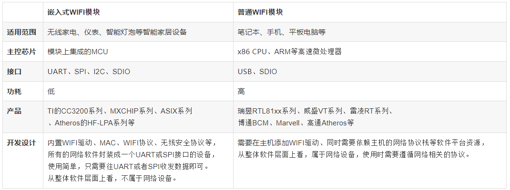

## 一、什么是`Wi-Fi`模块

        百度百科上这样定义：

        Wi-Fi模块又名串口Wi-Fi模块，属于物联网传输层，功能是将`串口或TTL电平转为符合Wi-Fi无线网络通信标准的嵌入式模块`，`内置无线网络协议IEEE802.11b.g.n协议栈以及TCP/IP协议栈`。传统的硬件设备嵌入Wi-Fi模块可以直接利用Wi-Fi联入互联网，是实现无线智能家居、M2M等物联网应用的重要组成部分。 

## 二、WiFi 模块主要分类

Wi-Fi模块可分为三类：

- `通用Wi-Fi模块`

       比如手机、笔记本、平板电脑上的USB or SDIO接口模块，Wi-Fi协议栈和驱动是在安卓、Windows、IOS的系统里跑的，是需要非常强大的CPU来完成应用；

- `路由器方案Wi-Fi模块`

      典型的是家用路由器，协议和驱动是借助拥有强大Flash和Ram资源的芯片加Linux操作系统；

- `嵌入式Wi-Fi模块`

      32位单片机，内置Wi-Fi驱动和协议，接口为一般的MCU接口如UART等。适合于各类智能家居或智能硬件单品。

我觉得这里有必要普及一下`普通Wi-Fi模块` 与 `嵌入式Wi-Fi模块`的区别：

> 我们都知道笔记本、手机、平板电脑等这类产品具有强大的CPU和大容量的存储器进行网络通信数据的处理和存储，因此在使用WIFI时不需要额外的MCU，完全借助其高速处理器和庞大的软件系统。但是对于家电，仪表，LED灯等智能家居产品，因为该类产品的主控芯片可能是成本很低、功能简单的MCU，因此这类产品无法支持普通Wi-Fi的功能。同时，还有一个重要的原因就是普通WIFI的功耗比较高，而嵌入式WIFI在功耗上做了很大的改善，比较适合对功耗要求高的无线家电设备。

基于上述原因，各个无线厂商相继推出了嵌入式WIFI模块。嵌入式WIFI模块的特点是软硬件集成度高，整个嵌入式WIFI模块集成了射频收发器、MAC、WIFI驱动、所有WIFI协议、无线安全协议、一键连接等。总之，一句话：`嵌入式WIFI应物联网而生`！

下面我们针对嵌入式WIFI与普通WIFI来进行对比，通过下表的对比，我们大致上可以理解到什么是嵌入式WIFI:

 

下面是笔者所用一款USB接口的WiFi模块原理图：

三、WiFi模块主要功能

      Wifi 模块 包括两种类型的拓扑形式：基础网（Infra）和自组网（Adhoc），要说明无线网络的拓扑形式，首先要了解两个基本概念：

a -- AP

       也就是无线接入点，是一个无线网络的创建者，是网络的中心节点。一般家庭或办公室使用的无线路由器就是一个AP。

b -- STA站点

       每一个连接到无线网络中的终端（如笔记本电脑、PDA及其它可以联网的用户设备）都可称为一个站点。

1、基于AP组建的基础无线网络（Infra）

      Infra：也称为基础网，是由AP创建，众多STA加入所组成的无线网络，这种类型的网络的特点是AP是整个网络的中心，网络中所有的通信都通过AP来转发完成。

附：  

 笔者所用WiFi模块有两种系统设置：  无线网类型AP 和 Infra   

AP是将wifi模块当路由器使用，这样手机和电脑就可以直接连接wifi模块了。

 Infra 是将wifi模块当基础设备使用，用于连接别的路由器。

2、基于自组网的无线网络（Adhoc）

      Adhoc：也称为自组网，是仅由两个及以上STA自己组成，网络中不存在AP，这种类型的网络是一种松散的结构，网络中所有的STA都可以直接通信。

3、安全机制

     本模块支持多种无线网络加密方式，能充分保证用户数据的安全传输，包括：WEP64/WEP128/ TKIP/CCMP(AES) WEP/WPA-PSK/WPA2-PSK。

4、快速联网

      本模块支持通过指定信道号的方式来进行快速联网。在通常的无线联网过程中，会首先对当前的所有信道自动进行一次扫描，来搜索准备连接的目的AP创建的（或Adhoc）网络。本模块提供了设置工作信道的参数，在已知目的网络所在信道的条件下，可以直接指定模块的工作信道，从而达到加快联网速度的目的。

5、地址绑定

     本模块支持在联网过程中绑定目的网络BSSID地址的功能。根据802.11协议规定，不同的无线网络可以具有相同的网络名称（也就是SSID/ESSID），但是必须对应一个唯一的BSSID 地址。非法入侵者可以通过建立具有相同的SSID/ESSID的无线网络的方法，使得网络中的STA联接到非法的AP上，从而造成网络的泄密。通过BSSID地址绑定的方式，可以防止STA 接入到非法的网络，从而提高无线网络的安全性。

6、无线漫游

    本模块支持基于802.11协议的无线漫游功能。无线漫游指的是为了扩大一个无线网络的覆盖范围，由多个AP共同创建一个具有相同的SSID/ESSID的无线网络，每个AP用来覆盖不同的区域，接入到网络的STA可以根据所处位置的选择信号最强的AP接入，而且随着STA的移动自动在不同的AP之间切换。

四、工作方式

1、主动型串口设备联网

      主动型串口设备联网指的是由设备主动发起连接，并与后台服务器进行数据交互（上传或下载）的方式。典型的主动型设备，如无线POS机，在每次刷卡交易完成后即开始连接后台服务器，并上传交易数据。PUSH型串口设备联网的拓扑结构如右图所示。其中，后台服务器作为TCP Server端，设备通过无线AP/路由器接入到网络中，并作为TCP Client端。

2、被动型串口设备联网

      被动型串口设备联网指的是，在系统中所有设备一直处于被动的等待连接状态，仅由后台服务器主动发起与设备的连接，并进行请求或下传数据的方式。典型的应用，如某些无线传感器网络，每个传感器终端始终实时的在采集数据，但是采集到的数据并没有马上上传，而是暂时保存在设备中。

      而后台服务器则周期性的每隔一段时间主动连接设备，并请求上传或下载数据。

     此时，后台服务器实际上作为TCP Client端，而设备则是作为TCP Server端主要特性2.4GHz, IEEE 802.11b/g内部PCB天线，可选外部天线支持基于AP的网络（Infrastructure）/对等网络Ad-Hoc （IBSS))/ 虚拟AP 模式 ，IPHONE/IPAD/Android 设备也能不用AP/路由器而直接连接支持802.11i加密方式：WEP-64/128,TKIP (WPA-PSK) and AES(WPA2-PSK)MCU内置TCP/IP协议栈3路UART串行接口(其中1路支持DMA 模式, 全功能串口,波特率最高支持921.6Kbps)SPI接口、I2S/PCM接口Digital Video端口高达24个GPIO口（部分GPIO将会和上述接口复用）全功能TCP/IP协议栈，TCP/IP传输带宽达到10Mbps以上支持三种带有定时自动唤醒功能的WiFi节能模式
