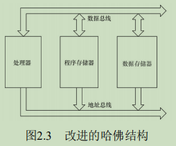
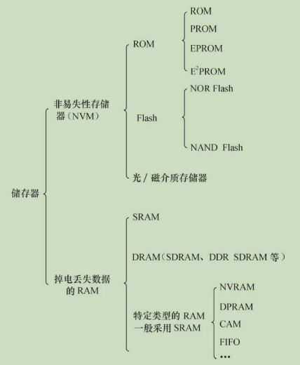

## 2.1 处理器(Processor)

### 2.1.1 通用处理器(GPP `--` General Purpose Processor)

目前主流的通用处理器（GPP）多采用SoC（片上系统）的芯片设计方法，集成了各种功能模块，每一种功能都是由硬件描述语言设计程序，然后在SoC内由电路实现的。

中央处理器的体系结构可以分为两类:

- 一类为冯·诺依曼(或**普林斯顿**)结构 `--`  将程序指令存储器和数据存储器合并在一起的存储器
- 一类为哈佛结构 `--` 将程序指令和数据分开存储，指令和数据可以有不同的数据宽度。

> ${ARM9^+}$ 系列的处理器已经是 切换到 改进后的 `哈佛结构` 了。
> 

从指令集的角度来讲，中央处理器也可以分为两类：

- RISC（精简指令集计算机）`--`强调尽量减少指令集、指令单周期执行，但是目标代码会更大。

- CISC（复杂指令集计算机）`--` 强调增强指令的能力、减少目标代码的数量，但是指令复杂，指令周期长

> ARM、MIPS、PowerPC等CPU内核都采用了RISC指令集。目前，RISC和CSIC两者的融合非常明显。

### 2.1.2 数字信号处理器(`DSP -- Digital Signal Processor`)

`DSP`针对通信、图像、语音和视频处理等领域的算法而设计。它包含独立的硬件乘法器。DSP的乘法指令一般在单周期内完成，且优化了卷积、数字滤波、FFT（快速傅里叶变换）、相关矩阵运算等算法中的大量重复乘法。

DSP分为两类：

- 定点DSP `--`  用定点运算模拟浮点运算。
- 浮点DSP `--` 浮点运算用硬件来实现，可以在单周期内完成

### 2.1.3 处理器分类总结

 

## 2.2 存储器

存储器主要可分类为只读储存器（ROM）、闪存（Flash）、随机存取存储器（RAM）、光/磁介质储存器。

Flash 闪存分为 NOR(或非) Flash 和 NAND(与非) Flash

一个NAND Flash的接口主要包含如下信号:

 

Flash的编程原理都是**只能将1写为0，而不能将0写为1**。因此在Flash编程之前，必须将对应的块擦除，而擦除的过程就是把所有位都写为1的过程，块内的所有字节变为0xFF。

`IDE（Integrated Drive Electronics）`接口可连接硬盘控制器或光驱，IDE接口的信号与SRAM类似。人们通常也把IDE接口称为ATA（Advanced Technology Attachment）接口.

很多SoC集成了一个eFuse电编程熔丝作为`OTP（One-Time Programmable，一次性可编程）`存储器。

以上所述的各种ROM、Flash和磁介质存储器都属于`非易失性存储器（NVM）`的范畴，掉电时信息不会丢失，而RAM则与此相反。

RAM也可再分为:

- 静态RAM（SRAM）`--` 是静态的， 只要供电它就会保持一个值，SRAM没有刷新周期。

  > SRAM每个SRAM存储单元由6个晶体管组成

- 动态RAM（DRAM）`--` 以电荷形式进行存储，数据存储在电容器中。由于电容器会因漏电而出现电荷丢失，所以DRAM器件需要定期刷新。

  > - 而DRAM存储单元由1个晶体管和1个电容器组成。
  > - 通常所说的SDRAM、DDR SDRAM皆属于DRAM的范畴，它们采用与CPU外存控制器同步的时钟工作.
  > - 与SDRAM相比，DDR SDRAM同时利用了时钟脉冲的上升沿和下降沿传输数据，因此在时钟频率不变的情况下，数据传输频率加倍。

### 2.2.1 特定类型的RAM

- `DPRAM：双端口RAM`  可以通过两个端口同时访问，具有两套完全独立的数据总线、地址总线和读写控制线，通常用于两个处理器之间交互数据，如图2.6所示。

 

- `CAM: 内容寻址RAM`  一种特殊的存储阵列RAM，它的主要工作机制就是同时将一个输入数据项与存储在CAM中的所有数据项自动进行比较，判别该输入数据项与CAM中存储的数据项是否相匹配，并输出该数据项对应的匹配信息。

 

-  `FIFO -- 先进先出队列`  是先进先出，进出有序，FIFO多用于数据缓冲。

### 2.2.2 存储器分类总结

 

