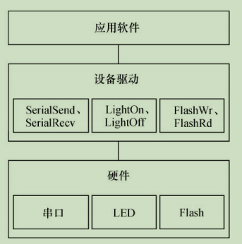

### 1.1 设备驱动的作用

对设备驱动最通俗的解释就是**“`驱使硬件设备行动`”**。

> 驱动与底层硬件直接打交道，按照硬件设备的具体工作方式，读写设备的寄存器，完成设备的轮询、中断处理、DMA通信，进行物理内存向虚拟内存的映射等，最终让通信设备能收发数据，让显示设备能显示文字和画面，让存储设备能记录文件和数据。

驱动程序负责硬件和应用软件之间的沟通，而驱动工程师则负责硬件工程师和应用软件工程师之间的沟通。

### 1.2 无操作系统时的设备驱动

虽然不存在操作系统，但是设备驱动则无论如何都必须存在。

在没有操作系统的情况下，设备驱动的接口被直接提交给应用软件工程师，应用软件没有跨越任何层次就直接访问设备驱动的接口。驱动包含的接口函数也与硬件的功能直接吻合，没有任何附加功能。图1.1所示为无操作系统情况下硬件、设备驱动与应用软件的关系。 

 

### 1.3 有操作系统时的设备驱动

当系统中存在操作系统的时候，驱动变成了连接硬件和内核的桥梁。如图1.4所示，操作系统的存在势必要求设备驱动附加更多的代码和功能，把单一的“驱使硬件设备行动”变成了操作系统内与硬件交互的模块，它对外呈现为操作系统的API，不再给应用软件工程师直接提供接口。

  

