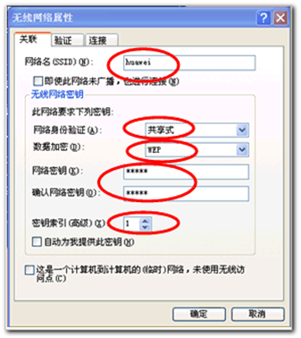
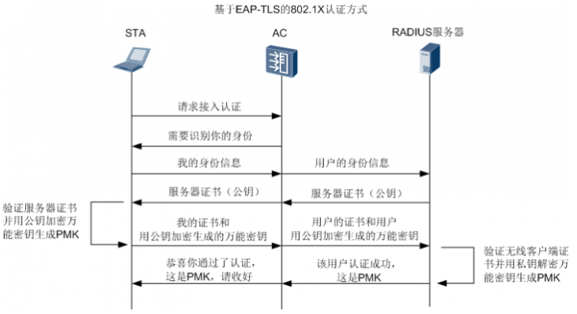
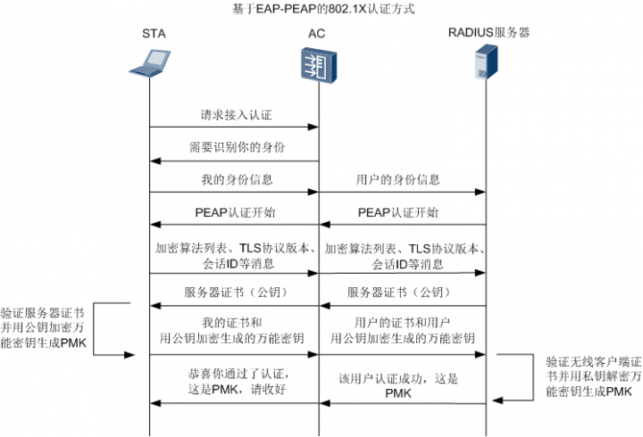
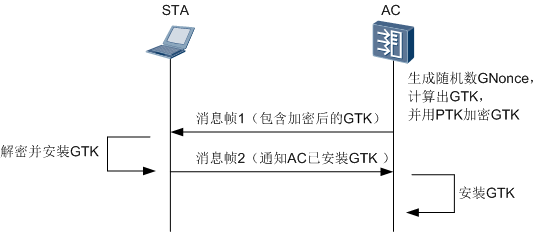
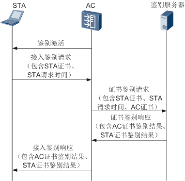
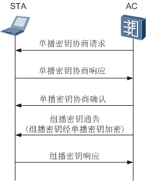
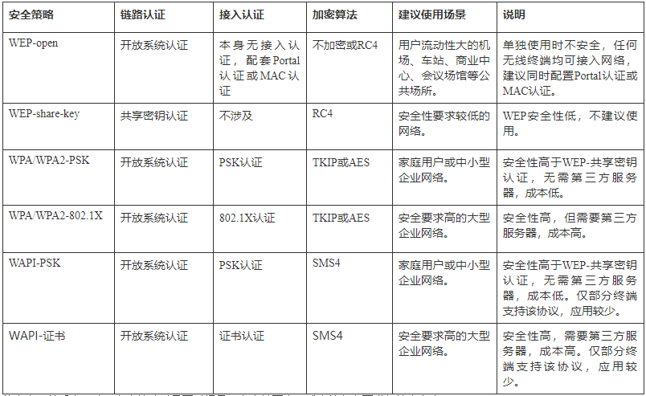

无线网络几乎已经无处不在，但是，大部分情况下，即使可以扫描到无线信号，不通过认证也是访问不了的。我们的手机无线网络列表中有的SSID下方会显示“通过WPA2进行保护”、“通过802.1X进行保护”等类似信息，正是因为这些无线网络使用了本期我们要分享的WLAN安全策略。

## 一、为什么需要WLAN安全策略

如同小区入口需要门禁卡、保险柜需要密码……我们的生活中有太多需要安全保护的地方。WLAN因其灵活性、移动性等优势受到越来越多的青睐，但是由于其自身的特性，极易受到攻击，且用户信息很容易泄漏，因此提高安全性成了WLAN的重要课题。于是WLAN安全策略应运而生。

我们拿起手机打开WLAN，选择待接入网络的SSID，输入密码（有的认证方式下可能还需要输入用户名等），连接成功，上网。在此期间，系统成功应用了WLAN安全策略，包含一整套的安全机制，涉及链路认证、接入认证、密钥协商和数据加密。

进行链路认证的是终端硬件设备，只有通过了链路认证，终端才能连接AP。如果采用开放系统认证，用户不必做任何操作，所以感知不到这种认证。如果采用共享密钥认证，需要事先在STA上设置用于链路认证的密钥。

而接入认证通常需要用户输入密码等用于认证的凭证，可以理解为需要认证的是使用通过了链路认证的设备的人。如果设备通过了链路认证，但人没有被授权（没有密码），也是上不了网的。接入认证确保了只有知道正确密码的人才能访问无线网络。

我们的上网操作会产生大量的数据交互和传输，对数据加密后再进行传输，才能使数据在传输过程中不易被窃取或篡改，保障信息安全和个人隐私。用于加密的密钥通常是终端和接入设备预先通过动态的交互过程协商出来的。对于密码协商和数据加密，都是系统自动完成，用户不需要做任何操作。

有了这一整套的安全机制，WLAN就有了基本的安全保障。

## 二、WLAN有哪些安全策略

WLAN提供的安全策略包括WEP、WPA、WPA2和WAPI，下面来看看WLAN的安全策略经历了怎么样的演进过程。

### 1. WEP

WEP（Wired Equivalent Privacy），即有线等效加密协议，是WLAN的第一个安全协议，由802.11标准定义，采用RC4加密算法。RC4是一种密钥长度可变的流加密算法，系统生成24位的初始向量，WLAN服务端和客户端上配置40位、104位或128位密钥，将两者进行校验和得到最终用于加密的密钥为64位、128位或152位。

WEP安全策略涉及链路认证和数据加密，不涉及接入认证和密钥协商。

`链路认证`

WEP支持两种链路认证方式：开放系统认证和共享密钥认证。

- 开放系统认证方式，可以理解为实际上不进行认证。任何STA对AP说“请求验证”，AP均答复“验证通过”。

  > 举个例子，如果你想连接上搜索到的某个无线网络，如果该无线网络采用开放系统认证，你不需要输入任何认证凭证，系统就会提示你已经关联上了该无线网络。

- 共享密钥认证方式，STA和AP需预先配置相同的密钥，AP在链路认证过程验证两边的密钥是否相同。如果一致，则认证成功；否则，认证失败。
 

  > 需要注意的是，这里STA上配置好的密钥只用于链路认证，和接入认证无关。任何用户使用这个配置了正确共享密钥的STA都能关联上无线网络。但是，如果该无线网络配置了接入认证，那么，用户还需要输入SSID的接入密码（假设STA不会自动记录SSID的接入密码）才能上网。

`数据加密`

- 如果选择开放系统认证，用户上线后，可以通过配置选择是否对业务数据进行加密。选择加密，则需要配置加密密钥。
- 如果选择共享密钥认证，用户上线后，使用共享密钥对业务数据进行加密。

WEP安全策略的数据加密，所有用户使用的是同一个加密密钥。目前在实际应用中，如果使用WEP安全策略时选择开放系统认证方式，通常会配合使用MAC认证或Portal认证，对用户进行接入控制，提高网络的安全性。

在WLAN发展初期WEP一定程度上保障了无线网络的安全性，但是它存在诸多隐患，例如：

- 采用静态密钥，即接入同一SSID下的所有STA使用相同的密钥访问无线网络。一个STA的密钥泄漏将导致其他用户的密钥泄漏。
- 24位的初始向量很容易重复使用，并且明文传输，如果通过无线收集到包含特定初始向量的分组信息并对其进行解析，很可能破解出完整密钥。
- WEP采用的RC4加密算法被证明本身是存在安全漏洞的。

WEP无论从加密机制还是加密算法本身，都很容易受到安全威胁，它的诸多缺点使得802.11组织开始定制新的安全标准。

### 2. WPA/WPA2

为了解决WEP安全策略的问题，在没有正式推出安全性更高的安全策略之前，Wi-Fi联盟推出了WPA安全策略。WPA采用了临时密钥完整性协议TKIP（Temporal Key Integrity Protocol）加密算法，提供密钥重置机制，并且增强了密钥的有效长度，很大程度上弥补了WEP的不足。

随后802.11i安全标准组织又推出加强版的WPA2。WPA2采用区块密码锁链-信息真实性检查码协议CCMP（Counter Mode with CBC-MAC Protocol）加密机制，该加密机制使用的AES（Advanced Encryption Standard）加密算法是一种对称的块加密技术，比TKIP更难被破解。

目前，WPA和WPA2都可以使用TKIP或AES加密算法，以达到更好的兼容性，它们在安全性上几乎没有差别。

WPA/WPA2安全策略涉及链路认证、接入认证、密钥协商和数据加密。

`链路认证`

WPA/WPA2仅支持开放系统认证（同上面WEP安全策略中讲的开放系统认证）。

`接入认证`

WPA/WPA2提供两种接入认证方式：

- WPA/WPA2企业版：在大型企业网络中，通常采用802.1X的接入认证方式。802.1X认证是一种基于接口的网络接入控制，用户提供认证所需的凭证，如用户名和密码，通过特定的用户认证服务器（一般是RADIUS服务器）和可扩展认证协议EAP（Extensible Authentication Protocol）实现对用户的认证。

  WPA/WPA2支持基于EAP-TLS（Transport Layer Security）和EAP-PEAP（Protected EAP）的802.1X认证方式。

 
 

- WPA/WPA2个人版：对一些中小型企业网络或者家庭用户，部署一台专用的认证服务器代价过于昂贵，维护也很复杂，通常采用WPA/WPA2预共享密钥模式，事先在STA和WLAN设备端配置相同的预共享密钥，然后通过是否能够对协商的消息成功解密，来确定STA配置的预共享密钥是否和WLAN设备配置的预共享密钥相同，从而完成STA的接入认证。

`密钥协商`

根据接入认证阶段生成的成对主钥PMK（Pairwise Master Key）产生成对临时密钥PTK（Pairwise Transient Key）和群组临时密钥GTK（Group Temporal Key）。

> 其中，PTK用来加密单播报文，GTK用来加密组播和广播报文。

- 单播密钥协商过程是一个四次握手过程。

  

- 组播密钥协商过程是一个二次握手过程，是在单播密钥协商过程之后进行的。

  

`数据加密`

经过了上述重要过程后，通信双方就开始了经过加密处理后的数据传输。加密算法使用TKIP或AES，加密密钥使用密钥协商阶段协商出的密钥。

WPA/WPA2解决了WEP的诸多问题，但是只能实现WLAN设备对STA的单向鉴别，不能对WLAN设备的身份进行认证。

### 3. WAPI

WAPI（WLAN Authentication and Privacy Infrastructure），即无线局域网鉴别与保密基础结构，是由中国提出的无线安全标准。WAPI采用了基于公钥密码体制的椭圆曲线签名算法ECDSA和对称密码体制的分组加密算法SMS4，分别用于无线设备的数字证书、证书鉴别、密钥协商和传输数据的加解密。通过双向身份鉴别、数字证书身份凭证和完善的鉴别协议，提供比WPA/WPA2更强的安全性。

WAPI安全策略涉及链路认证、接入认证、密钥协商和数据加密。

`链路认证`

WAPI仅支持开放系统认证。

`接入认证`

WAPI提供两种接入认证方式：

- 基于证书的方式：在大型企业网络中，通常采用基于证书的方式。鉴别前STA与AC必须预先拥有各自的证书，然后通过鉴别服务器对双方的身份进行鉴别

 

从上图中可以看出，WAPI提供了双向身份鉴别，鉴别服务器不仅对STA进行身份鉴别，还对AC进行身份鉴别。AC根据STA证书鉴别结果对STA进行接入控制，STA根据AC证书鉴别结果决定是否接入该WLAN服务。采用这种方式，既能防止非法STA接入WLAN网络，STA也不必担心接入非法的WLAN设备了。

- 基于预共享密钥的方式：对一些中小型企业网络或者家庭用户，部署证书系统过于昂贵，通常采用基于预共享密钥的认证方式（同上面WPA/WPA2个人版中讲的预共享密钥认证）

`密钥协商阶段`

身份鉴别成功后，WLAN设备会发起与STA的密钥协商过程，先协商出用于加密单播报文的单播密钥，再协商出用于加密组播报文的组播密钥。

 

除了密钥动态协商，WAPI还提供了基于时间和基于报文数的密钥更新机制，避免STA长时间使用同一密钥带来的安全隐患。

`数据加密阶段`

经过了上述重要过程后，通信双方就开始了经过加密处理后的数据传输。加密算法使用SMS4，加密密钥使用密钥协商阶段协商出的密钥。

## 三、选择哪种WLAN安全策略

WLAN提供了这么多安全策略，到底该选择哪种呢？下表总结了各种安全策略的使用场景和安全性等信息。

从上表可以看出，选用安全策略时需要对场景、安全性要求、成本等多方面进行综合考虑。
