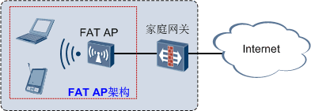
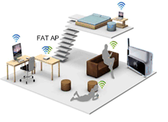
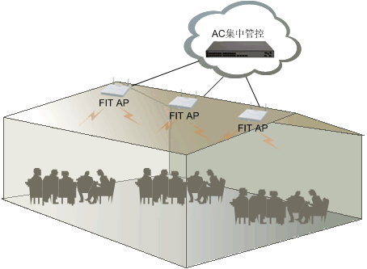

# WLAN定义和基本架构

关于WLAN，相信大家对它早已不陌生了。几乎每天我们都能体验到WLAN给我们的生活带来的高效和便捷。在家里，通过无线路由器，我们不必再端端正正的坐在电脑旁，可以坐在沙发上，躺在床上，甚至可以坐在马桶上收发邮件，在线欣赏欧美大片，尽情享受摆脱有线束缚带来的自由。在候车室，手捧笔记本和Pad的人们正逐渐代替手捧报纸和杂志的人们。走进咖啡厅，越来越多的人第一件事不是点餐，而是询问咖啡厅无线网络的密码……。

 

随着WLAN的来势汹汹，越来越多的人想了解WLAN技术，WLAN也成为当前热门话题之一。小编不才，愿意和大家一起学习探讨WLAN技术，解决一些WLAN方面的问题。下面请大家泡杯茶，耐心的读完下面这段文字，开始我们知道而又不知道的WLAN之旅吧。

为什么说是知道而又不知道的WLAN呢？其中一个原因是很多人对WLAN已经很熟悉了，都知道WLAN，但是让大家完整的说出WLAN的定义，却很少人能说的出。**`WLAN`**的全称是**Wireless Local Area Network**，中文含义是无线局域网，WLAN的定义有广义和狭义两种：

> 广义上讲WLAN是以各种无线电波（如激光、红外线等）的无线信道来代替有线局域网中的部分或全部传输介质所构成的网络。
>
> WLAN的狭义定义是基于IEEE 802.11系列标准，利用高频无线射频（如2.4GHz或5GHz频段的无线电磁波）作为传输介质的无线局域网。

说到这里，大家不妨和我们日常生活中的WLAN联系一下，我们经常听到的“802.11n、2.4G、5G”是不是感觉和WLAN的狭义定义有种千丝万缕的关系呀？其实，我们日常生活中的WLAN，就是指的WLAN的狭义定义。在WLAN的演进和发展过程中，其实现技术标准有很多，如蓝牙、802.11系列、HyperLAN2等。而802.11系列标准由于其实现技术相对简单、通信可靠、灵活性高和实现成本相对较低等特点，成为了WLAN的主流技术标准，且802.11系列标准也成为了WLAN技术标准的代名词。

> *关于802.11系列标准我们后面会有详细介绍，这里大家先了解下WLAN的定义。*

了解了WLAN的定义之后，小编再问大家一个不太能想的到的问题，大家都有在家使用WLAN和在候车厅等大型场所使用WLAN的经历吧。大家有没有发现这两个地方的WLAN有什么不同呀？有没有想过这样一个问题：家庭房屋的面积相对较小，而候车厅面积很大，如果像家庭一样，候车厅也使用家庭使用的无线路由器，怎么覆盖候车厅那么大的面积。家庭接入的用户较少，一般不会超过几十个，而在候车厅里可能是成百上千的用户在使用WLAN，候车厅怎么满足那么多的用户接入呢？

有人会说是不是在候车厅里布放了很多无线路由器，以实现候车厅的大范围覆盖和多用户接入呢？但是，如果在候车厅布放很多无线路由器，当我们在硕大的候车厅来回移动时是不是要出现信号中断提醒你接入新的无线路由器的情况，就像从自己家移动到了邻居家一样，即使邻居家的无线网络名字和密码跟自己家的一样，也会出现网络中断重新获取IP地址的现象。有兴趣的童鞋可以回家和邻居试一试^_^。
 

那么，是什么造成有的WLAN仅可以满足家庭等小场所的使用，而有的WLAN却可以满足候车厅等中大型场所使用呢。下面小编就给大家介绍一下WLAN的基本架构，在大家了解了WLAN基本架构后，上面的问题就迎刃而解了。

WLAN有两种基本架构：

- 一种是FAT AP架构，又叫自治式网络架构。
- 一种是AC FIT AP架构，又叫集中式网络架构。

我们先从最熟悉的家庭无线路由器入手，家庭无线路由器采用的是FAT AP架构，即自治式网络架构。FAT AP英文全称是**FAT Access Point**，中文称为胖接入点，也有很多人直接称为胖AP。FAT AP不仅可以发射射频提供无线信号供无线终端接入，还能独立完成安全加密、用户认证和用户管理等管控功能。想一下我们家里的无线路由器，我们可以为WLAN设置密码，可以配置黑名单或白名单控制用户接入，还可以管理接入的用户（如设置用户的接入速率）等，这些都符合FAT AP的特征。所以，家庭使用的无线路由器就是一种FAT AP。下面的组网图是一个简单的基于FAT AP架构的组网应用：
 

FAT AP功能强大，独立性强，具备自治能力，因此FAT AP架构人们又称为自治式网络架构。不需要介入专门的管控设备，独自就可以完成无线用户的接入，业务数据的加密和业务数据报文的转发等功能。

独立自治是FAT AP的特点，也是FAT AP的缺点。当单个部署时，由于FAT AP具备较好的独立性，不需要另外部署管控设备，部署起来很方便，成本也较低廉，在类如家庭WLAN或者小企业WLAN的使用场景中，FAT AP往往是最适合的选择。给我们感受最深刻的就是我们在家里使用一个无线路由器就能享受WLAN带给我们的便捷。但是，在大的使用场景中，如我们上面提到的候车厅，FAT AP的独立自治就变成了自身的缺点。由于WLAN覆盖面积较大，接入用户较多，需要部署许多FAT AP设备，而每个FAT AP又是独立自治的，缺少统一的管控设备，管理这些设备就变得十分麻烦。不说别的，光为这些FAT AP升一次级就是一场灾难。所以，在大量部署的情况下，FAT AP会带来巨大的管理维护成本。而且由于独自控制用户的接入，FAT AP无法解决用户的漫游问题。一般在中大型使用场景中人们往往不会选择FAT AP架构，而是使用我们下面要讲的 **`AC-FIT AP`** 架构。

> *如果大家不了解漫游，可以想象下我们日常使用的手机，当坐在高铁上从一个城市移动到另一个城市，手机信号要在沿途不停的断开旧网络，接入新网络。或者想象下，我们拿着Pad等无线终端，从自己家移动到邻居家并接入邻居家的WLAN，这个过程也可以理解为漫游。后面在介绍WLAN各种特性的时候会讲到什么是漫游，大家先了解下漫游大概的概念。*

 既然有胖AP，那对应的就应该有瘦AP。FIT AP英文全称是**FIT Access Point**，中文称为瘦接入点，也有很多人直接称为瘦AP。和胖AP不同，瘦AP除了提供无线射频信号外，基本不具备管控功能。也正是因为这一点，它被称为瘦AP，而上面具备管控功能的AP被称为了胖AP。为了实现WLAN的功能，除了FIT AP外，还需要具备管理控制功能的设备——AC。AC英文全称是**Access Controller**，中文称为无线接入控制器。AC的主要功能是对WLAN中的所有FIT AP进行管理和控制，AC不具备射频（AC只是管理控制设备，不能发射无线射频信号），它和FIT AP配合共同完成WLAN功能。这种架构就被称为了AC FIT AP架构。下图为某大型企业基于AC FIT AP架构部署的WLAN组网示意图。

 

由上图我们可以看到，根据AC所管控的区域和吞吐量的不同，AC可以出现在汇聚层，也可以出现在核心层。而FIT AP一般部署在接入层和企业分支。这种层级分明的协同分工，更能体现出AC FIT AP架构的集中控制的特点，这种架构又被大家称为集中式网络架构。

使用AC FIT AP架构为像候车厅这种大型场所部署WLAN时，比使用FAT AP架构更经济、高效。在AC FIT AP架构下，可以统一为FIT AP下发配置，统一为FIT AP进行软件升级，还可以按照时段控制FIT AP的工作数量等等，这些大大降低了WLAN的管控和维护的成本。而且，由于用户的接入认证可以由AC统一管理，解决用户漫游的问题就变得很容易。综上所述，AC FIT AP架构适用于中大型使用场景，而FAT AP架构适用于小型使用场景。

- *普通家庭使用的无线路由器是FAT AP架构*

 

- *大型场所一般使用AC FIT AP架构*

 
