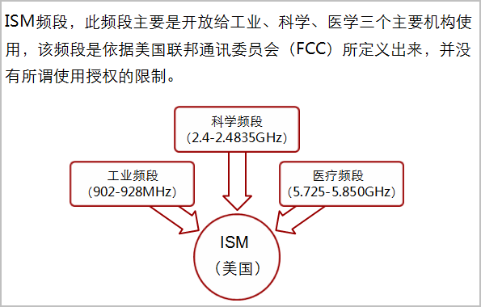

有这样一个段子“嫁到俺村吧，俺村条件不赖，穿衣基本靠纺，吃饭基本靠党，致富基本靠抢，娶妻基本靠想，交通基本靠走，通信基本靠吼，治安基本靠狗，取暖基本靠抖……”。拿这个段子作为本期的开篇，是想让大家开心一笑，然后借用里面的“通信基本靠吼”进入本期的主题。

通信靠吼看着很落后，但仔细想想它会很先进，它哪里先进呢？想出来了吗？………………

它可是“无线通信”啊！有没有被小编欺骗的感觉没想到大声喊话是无线通信，高科技啊。如果不留心的话我们不会想到人类历史上最早的通信手段和现在一样可以是“无线”的，而且还不止这些，古代的击鼓鸣金和烽火连天也可以称为某种“无线通信”吧。

学过物理的都知道，击鼓鸣金，是物体振动在介质中产生声波，传递信息到人耳，信息载体是传递声波的介质。烽火连天，或者更先进的旗语，是通过物体反射的可见光线传入人眼从而传递信息，载体是可见光。WLAN同样是无线通信的范畴，虽跟原始的“无线通信”有本质区别，但却有着共同点 `--` **都需要载体**。

WLAN跟日常生活中的无线广播、无线电视、手机通信一样，都是用**射频**作为载体。

> *射频是频率介于3赫兹（Hz）和约300G赫兹（Hz）之间的电磁波，也可以称为射频电波或射电*。

人们为这段电磁波又定义了无线频谱，按照频率范围划分为极低频、超低频、中频、高频、超高频等，WLAN使用的射频频率范围是2.4GHz频段（2.4GHz～2.4835GHz）和5GHz频段（频率范围是5.150GHz～5.350GHz和5.725GHz～5.850GHz），分别属于`特高频`(300MHz～3GHz)和`超高频`(3GHz～30GHz)，用一张图来看下我们WLAN射频所在频谱的位置。
 

>5GHz频段的5.150GHz～5.350GHz和5.725GHz～5.850GHz为中国使用，各个国家使用的频宽范围不一样，贴子下方附有国家信道顺从表的参考链接，感兴趣的同学可以查看各个国家使用的5GHz频段。

WLAN使用的2.4GHz频段和5GHz频段属于ISM频段。

>ISM，即工业（Industrial）、科学（Scientific）与医疗（Medical）。

ISM频段主要开放给工业、科学、医疗三个机构使用，只要设备的功率符合限制，不需要申请许可证（Free License）即可使用这些频段，大大方便了WLAN的应用和推广。

 

了解了什么是射频后，射频是怎么作为载体传递信息的呢？

我们高中物理都有学过射频传输信息的基本调制方式：**`调频`、`调相` 和 `调幅`**。

> 发送端将信息调制到载波上，通过改变载波的频率、相位和振幅传递信息，接收端收到信息后，再解调还原信息。

通过这样一个调制解调的过程，就实现了信息的传递。

我们日常生活中遇到的调频广播，调幅广播等就是这样传递信息的。

WLAN射频传输信息的基础也是调频、调相或调幅。只不过调频、调相和调幅通常用在模拟信号的传输，在数字通信领域射频的调制方式较为复杂，主要有：振幅键控、频率键控、相位键控和正交幅度调制（一种幅度、相位联合调制的技术，它同时利用了载波的幅度和相位来传递信息）。通过下图大家可以看下载波在调制后的样子。
 

这样看来使用射频通信和有线通信是不是没有多大区别？我们更为熟悉的有线通信其实也是将信号调制成电脉冲或光脉冲，然后放到电缆或光缆上传输。只不过射频需要解决更多的问题，如射频的反射、衍射等问题。无论是使用射频通信还是使用有线媒介的通信，其过程都可以简单的看成是`信源` -> `信道` -> `信宿`，信源是信息的发送者，信宿是信息的接收者。那么信道是什么呢？有线的信道我可以简单的理解为线缆，WLAN的信道是不是可以简单的理解为射频呢？根据“信源->信道->信宿”的描述，信道就是发送者和接收者的中间部分，那可不就是射频了。

WLAN的信道是具有一定频宽的射频，就像公路要有一定的宽度一样，以便可以承载要传输的信息。对于2.4GHz频段来说，2.4GHz频段的频宽是2.4835GHz-2.4GHz=0.0835GHz=83.5MHz，WLAN是不是就使用全部的83.5MHz的频宽作为一个信道呢？这里我们使用一个比喻，有助于大家对WLAN信道的理解。我们看广播电视的时候，都知道频道吧：1频道、2频道、中央1台、中央5台。我们要看中央1台，就不能看中央5台，每次只能选定1个频道。如果中央5台使用中央1台的频率发射信号会怎样？那两个频道大家都收不到，或满屏幕的雪花。高中物理告诉我们一条波如果遇到频率相同的波会产生干扰，会根据相位差进行叠加或衰减（如：频率相同，相位相差180°的波彼此会抵消）。所以，中央1台有个固定的频率，中央5台也有它的固定的频率，互不干扰。
 

我们可以把WLAN信道理解为电视机的频道，如果WLAN使用整个2.4GHz频段作为一个信道，当同一覆盖范围内有两个及两个以上的AP，大家都用相同的信道，会造成严重的干扰（如同中央5台使用了中央1台的频道一样），两个AP都无法有效提供WLAN服务。所以，在WLAN标准协议里将2.4GHz频段划分出13个相互交叠的信道，每个信道的频宽是20MHz（802.11g、802.11n每个信道占用20MHz，802.11b每个信道占用22MHz），每个信道都有自己的中心频率（如同CCTV-1的200MHz）。

这13个信道可以找出3个独立信道，即没有相互交叠的信道。独立信道由于没有频率的交叠区，相邻AP使用这3个独立信道不会彼此产生干扰。如下图中的1、6、11就是三个互不交叠的独立信道。
 

> *14信道是特别针对日本定义的，各个国家2.4GHz频段开放的信道不一样，北美地区（美国，加拿大）开放1～11信道，欧洲开放1～13信道，中国同样开放1～13信道。一般，我们更多的讲述是2.4GHz频段分13个相互交叠的信道。*

 

在部署WLAN时，为避免相邻AP产生同频干扰，多采用蜂窝式信道布局。蜂窝式布局中相邻AP间使用不交叠的独立信道，可以有效避免同频干扰。

 

华为AP产品2.4G射频默认使用1信道，如果用户在部署WLAN时忘了配置信道，可能会造成某些AP覆盖重合的区域产生同频干扰，使用户无法上线。但是，为众多AP配置信道也是件很累人的事情，华为产品支持射频信道的自动模式。AP上线后，AC会根据AP周围的无线环境，自动为AP射频设置信道，避免了用户为多个AP配置信道的繁杂工作。

> 华为产品还支持射频调优功能，可以根据射频周围的无线环境自动调整信道和发射功率，保持整个无线网络处于一个最佳的状态。在**WLAN**初次部署完成后，建议执行一次射频调优。比如周围的卖场也有**WLAN**，很可能会和我们自己部署的**WLAN**有部分区域的射频冲突，射频调优可以让**WLAN**自己根据无线环境调整信道部署和发射功率，减少射频的冲突。而且无线环境可能是变化的，在低峰时段执行定期的射频调优也是有必要的。

2.4GHz频段射频在各个国家已经放开使用，越来越多的无线设备都工作在2.4GHz频段（如蓝牙设备），使得2.4GHz频段日益拥挤，信道干扰严重，有时会影响WLAN用户的正常业务。

华为产品在V2R3C00版本开始支持频谱分析功能，频谱分析可以分析出AP周围存在的干扰设备，如婴儿监视器、微波炉、蓝牙设备等。

WLAN 可以使用的另一个频段——5GHz频段，有更高的频率和频宽，可以提供更高的速率和更小的信道干扰。WLAN标准协议将5GHz频段分为24个20MHz宽的信道，且每个信道都为独立信道。这为WLAN提供了丰富的信道资源，更多的独立信道也使得信道绑定更有价值，信道绑定是将两个信道绑定成一个信道使用，能提供更大的带宽。如两个20MHz的独立信道绑定在一起可以获得20MHz两倍的吞吐量，这好比将两条道路合并成一条使用，自然就提高了道路的通过能力。

802.11n支持通过将相邻的两个20MHz信道绑定成40MHz，使传输速率成倍提高。802.11n也同时定义了2.4GHz频段的信道绑定，但由于2.4GHz频段较拥挤的信道资源，降低了2.4GHz频段信道绑定的实用性，一般不推荐使用2.4GHz频段的信道绑定。下图为5GHz频段的信道划分情况。
 

图中，黑色的半圆表示独立信道，红色的半圆表示标准协议推荐的信道绑定，UNII-2e为5GHz新增频段，该频段中国尚未放开使用。目前中国已放开使用的信道有36, 40, 44, 48, 52, 56, 60, 64, 149, 153, 157, 161, 165。各个国家开放的信道不一样，可以参照国家信道顺从表，参考地址：[国家信道顺从表](assets/国家码与信道顺从表.pdf)。

5GHz频段并非只有WLAN设备在使用，很多国家的军用雷达也在使用5GHz频段，使用该频段的民用无线设备很可能对雷达等重要设施产生干扰。为了解决这一安全顾虑，在一些国家出售的WLAN产品必须具备TPS和DFS这两个功能，即发射功率控制和动态频率选择。TPS是为了防止无线产品发放过大的功率来干扰军方雷达。DFS是为了使无线产品能主动探测军方使用的频率，如频率冲突并主动选择另一个频率，以避开军方频率。在这些国家这两个功能是属于强制性的，不符合标准的产品将不会获得这些国家的上市许可。

大概了解了WLAN射频和信道之后，我们以WLAN里经常出现的dBm和dB是什么来结束本期内容。

dBm的含义是分贝毫瓦，通俗的说就是每1毫瓦产生多少分贝能量。dB是个相对值是增益的意思，X (dBm) - Y (dBm) = Z (dB)，如10dB=20dBm-10dBm。

dBm和毫瓦的换算关系是：P(dBm)=10logP(mW)，也就是100mW=10Log102=20dBm。

大家可以牢记一个规律: 

> 功率减少10倍，换算出来的dBm降低10dB。
> 功率减少一半，换算出来的dBm降低3dB。

>如：50mW=17dBm，25mW=14dBm，5mW=7dBm。

 

本期的问题：

在中国2.4GHz频段可以使用1～13信道，那么我们部署WLAN时只能使用1，6，11这三个独立信道吗？