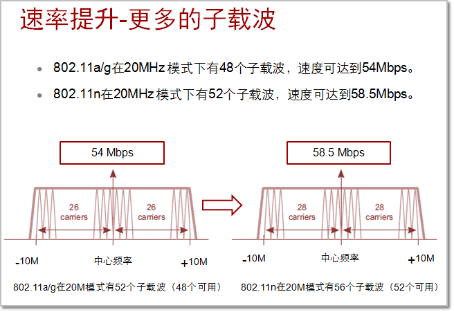

# WLAN 标准协议

在WLAN的发展历程中，一度涌现了很多技术和协议，如IrDA、Blue Tooth和HyperLAN2等。但发展至今，在WLAN领域被大规模推广和商用的是IEEE 802.11系列标准协议，WLAN也被定义成基于IEEE 802.11标准协议的无线局域网。我们对802.11已不陌生，在购买支持WLAN功能的产品时都能看到802.11的影子。本期我们讲下802.11主要的具有里程碑意义的标准协议：`802.11a`、`802.11b`、`802.11g`、`802.11n`和`802.11ac`。

>虽然协议比较枯燥乏味,但了解了这些协议,有助于我们部署WLAN,下面就跟随小编一起看下这几个主要协议!

WLAN和有线局域网最大的区别就是“无线”，通过上期的学习我们知道WLAN通信媒介是射频，射频和有线局域网的媒介（电缆或光纤）相比具有完全不一样的物理特性，这就导致**WLAN的物理层（PHY）** 和 **媒介访问控制层（MAC）**不同于有线局域网。所以，802.11协议主要定义的就是WLAN的物理层和MAC层。

在20世纪90年代初为了满足人们对WLAN日益增长的需求，IEEE成立了专门的802.11工作组，专门研究和定制WLAN的标准协议，并在1997年6月推出了第一代WLAN协议——**`IEEE 802.11-1997`**，协议定义了物理层工作在ISM的2.4G频段，数据传输速率设计为2Mbps。该协议由于在速率和传输距离上的设计不能满足人们的需求，并未被大规模使用。

随后，IEEE在1999年推出了 **802.11a** 和 **802.11b**。802.11a工作在5GHz的ISM频段上，并且选择了正交频分复用OFDM（Orthogonal Frequency Division Multiplexing）技术，能有效降低多路径衰减的影响和提高频谱的利用率，使802.11a的物理层速率可达54Mbps。802.11b则依然工作在2.4GHz的ISM频段，但在802.11的基础上进行了技术改进，使802.11b的通信速率达到11Mbps。

> OFMD是一种多载波调制技术，主要是将指定信道分成若干子信道，在每个子信道上使用一个子载波进行调制，并且各子载波是并行传输，可以有效提高信道的频谱利用率。

虽然802.11b提供的接入速率比802.11a低，但当时5GHz芯片研制过慢，待芯片推出时802.11b已被广泛应用。由于802.11a不能兼容802.11b，再加上5GHz芯片价格较高和地方规定的限制等原因，使得802.11a没有被广泛采用。

在2000年初，IEEE 802.11g工作组开始开发一项既能提供54Mbps速率，又能向下兼容802.11b的协议标准。并在2001年11月提出了第一个IEEE 802.11g草案，该草案在2003年正式成为标准。802.11g兼容了802.11b，继续使用2.4GHz频段。为了达到54Mbps的速率，802.11g借用了802.11a的成果，在2.4GHz频段采用了正交频分复用（OFDM）技术。IEEE 802.11g的推出，满足了当时人们对带宽的需求，对WLAN的发展起到了极大的推动作用。

大家可能会有疑问：为什么不在1999年制定802.11b标准时就直接采用和802.11a相同的OFDM技术，这样就可以更早的在2.4GHz频段上取得54Mbps的速率了，而不必等到2001年底的802.11g的出现。事实上在1999年讨论802.11b的时候，OFDM技术确实被提出应用到802.11b标准中，但当时美国联邦通信协会（FCC）禁止在2.4GHz频段使用OFDM，这条禁令直到2001年5月才被撤销，6个月后，采用OFDM技术的802.11g草案才得以顺利出台。

在急速发展的网络世界54Mbps的速率不会永远满用户需求。在2002年一个新的IEEE工作组——IEEE 802.11任务组N即TGn（Task Group n）成立，开始研究一种更快的WLAN技术，目标是达到100Mbps的速率。该目标的实现一波三折，由于小组内两个阵营对协议标准的争论不休，新的协议直到2009年9月才被敲定并批准，这个协议就是802.11n。在长达7年的制定过程中，802.11n的速率也从最初设计的100Mbps，完善到了最高可达600Mbps，802.11n采用了双频工作模式，支持2.4GHz和5GHz，且兼容802.11a/b/g。

802.11n标准刚刚尘埃落定后， IEEE就开始了下一代的WLAN标准协议——802.11ac的制定工作。并在2013年正式推出了802.11ac标准协议，802.11ac工作在5GHz频段，向后兼容802.11n和802.11a，80.211ac沿用了802.11n的诸多技术并做了技术改进，使速率达到1.3Gbps。通过下表有助于我们了解802.11各协议的主要参数。
 

当前在802.11各协议中由于802.11ac刚推出，大众终端产品支持802.11ac的还不多，802.11n产品仍旧是主流产品。802.11n较之前的标准协议主要有如下优势：更多的子载波、更高的编码率、更短的GI（Guard Interval）、更宽的信道、更多的空间流和MAC层的报文聚合功能等，而获取这些优势的技术802.11ac也有沿用。下面我们看下华为产品如何配置才能更好的发挥802.11n的优势。

- **更多的子载波：** 802.11n比802.11a/g多了4个有效子载波（802.11b没有使用OFMD技术不做对比），用户无需配置只要使用802.11n通信即可获得802.11n的此项优势。下图中58.5Mbps是802.11n较之前的标准更多的子载波可以带来的理论速率。
   

- **更高的编码率：** WLAN使用射频传输数据时，除了用户的有效传输数据外，还需附有更错码FEC（Forward Error Correction），当有效数据在传递过程中因衰减、干扰等因素而导致数据错误时，通过更错码可将数据更正、还原成正确数据。802.11n将之前3/4的有效编码率提高到5/6，此项改进点使得802.11n的速率提升了11%。用户无需配置只要使用802.11n通信也可以直接获得802.11n的此项优势。
   

- **更短的GI（Short Guard Interval）：** 使用802.11a/b/g发送数据时，必须要保证在数据之间存在800 ns的时间间隔以避免数据帧间的干扰，这个间隔被称为Guard Interval (GI)。802.11n缺省仍然使用800ns的GI，但在空间环境较好时，可以将该间隔配置为400ns，此项改进可以将吞吐提高近10%（约72.2Mbps）。 这里需要注意，并不是所有的环境都适合配置short GI。在复杂的空间环境里，射频遇到障碍物可能会产生反射等现象，会造成AP和STA之间的多路径传输（多径效应）。在多径环境中，前一个数据块还没有发送完成，后一个数据块可能通过不同的路径先到达了，合理的GI长度能够避免相互干扰。如果GI时长不合理，会降低链路的使用效率。
 
所以，在复杂的环境中建议关闭short GI功能。

- **更宽的信道：** 我们在讲射频的时候已经提及，802.11n支持将相邻两个20MHz的信道绑定成40MHz的信道，信道更宽传输能力就更大，可以带来2倍以上的提升。

- **更多的空间流：** 802.11a/b/g技术的无线接入点和客户端是通过单个天线单个空间流以单入单出SISO（Single Input Single Output）的方式来实现数据传送的。在802.11n支持最大4个空间流的多入多出MIMO（Multiple Input and Multiple Output）方式传输数据（802.11ac最大支持8*8的MIMO）。华为多天线AP都支持MIMO，如AP5130、AP7110、AP5030支持3*3 MIMO，AP3010、AP6510、AP6610支持2*2 MIMO。
 

- **MAC层的报文聚合：** 在802.11的MAC层协议中，有很多固定的开销，尤其在两个帧之间的确认信息。在最高数据率的传输下，这些多余的开销甚至比需要传输的整个数据帧还要长。例如：802.11g理论传输速率为54Mbps，实际上却只有22Mbps，将近有一半多的速率浪费了。802.11n的MAC协议数据单元MPDU（MAC Protocol Data Unit）帧汇聚功能，可以将多个MPDU聚合为一个物理层报文，只需要进行一次信道竞争或退避，就可完成N个MPDU的同时发送，从而减少了发送N-1个MPDU报文所带来的信道资源消耗。

803.802.11ac默认支持MPDU功能，且支持最大长度为1048575字节的汇聚帧。
 

另外，802.11ac还支持MAC服务数据单元MSDU（Mac Service Data Units）汇聚，大大提高了数据的传输效率
 

除了802.11标准协议外，在WLAN领域还有一个更常见更常用的名词 `--` **Wi-Fi**。

我们技术贴连载已经进行到第3期，一直没有提及什么是Wi-Fi。在了解了802.11各协议后，正好也是解释什么是Wi-Fi的时机了。

WiFi是无线保真（**Wireless Fidelity**）的英文缩写。在802.11b时代，虽然所有的802.11b产品都使用相同的802.11b标准，但为了保证不同厂商的产品能够具有良好的兼容性，1999年一些WLAN设备生产厂商一起成立了一个工业联盟——无线以太网兼容性联盟WECA（**Wireless Ethernet Compatibility Alliance**），后更名为Wi-Fi联盟。Wi-Fi联盟建立了一套验证802.11b产品兼容性的测试程序，称为Wi-Fi认证，通过该程序认证的产品可以使用Wi-Fi认证标签。后来，Wi-Fi认证的范围逐步扩展到802.11a，802.11g和802.11n。

另外，由于忍受不了802.11n漫长的标准化进程和市场需求的推动，Wi-Fi联盟以802.11n 2.0版草案作为产品认证的依据，在802.11n标准推出之前已经认证批准了数百个802.11n产品。这也是为什么当时802.11n标准还未正式发布，而我们在市场上早已可以购买到各类兼容性良好的802.11n产品的原因。