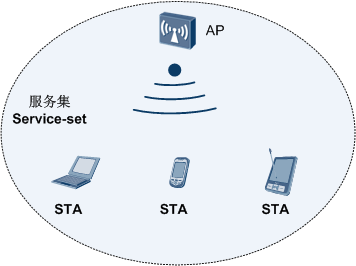
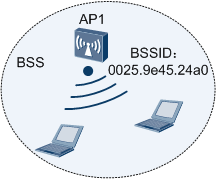
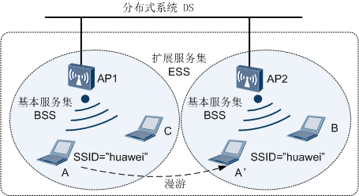
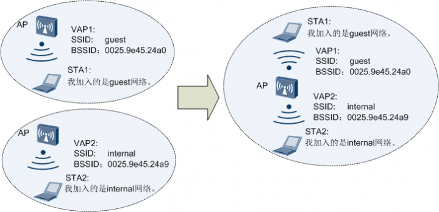
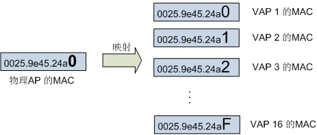
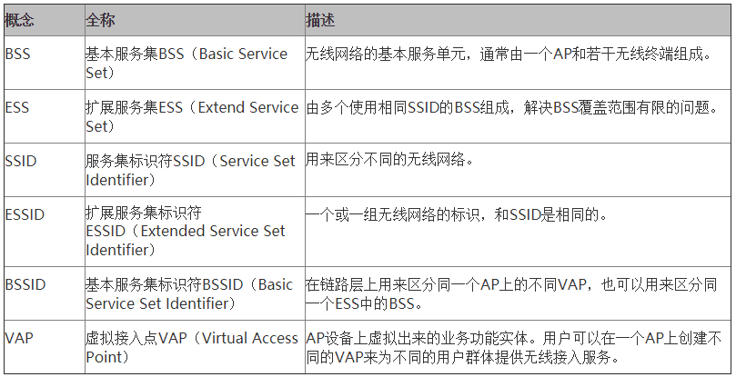

最近小编在微博上看到一个笑话，说是：楼主一时心血来潮，把家里的WIFI名设置成了who will love me，密码是nobody。结果第二天，整栋楼都连上了楼主的WIFI。

这个笑话是略夸张了，不过里面出现的WIFI名正好引出本期的主题——本期小编将为大家介绍一下WLAN的基础概念。

首先为大家隆重介绍的就是微博中提到的“who will love me”，WLAN术语称之为SSID。SSID是大家日常生活中接触的最多的，比如我们去星巴克，一边喝咖啡一边上网，当我们用手机搜索无线网络，弹出的“CMCC-STARBUCKS”就是SSID。

SSID的全称是Service Set Identifier，也就是服务集标识符，用于标识一个服务集，按照大部分人的理解，也就是用来标识一个可用的网路。

而所谓服务集，就是一组互相有联系的无线设备，这样理解起来有点抽象，举个例子，在星巴克咖啡馆提供的无线网络中，我们的手机、平板电脑，带无线网卡的笔记本这一系列无线终端（在WLAN中称之为工作站STA，Station），只要连上AP，实际上就构成了一个服务集。在这个服务集内，只要终端和AP关联，终端就能够相互通信（当然是需要通过AP），也可以通过AP访问外部网络。

 

如果这个咖啡店很小，只要一个AP就能hold住全场，也就是说这个服务集中只有一个AP，那么这个服务集就可以被认为一个基本服务集`BSS`(Basic Service Set)。BSS是无线网络的基本服务单元。所有的终端关联到一个AP上，该AP连接其他有线设备，并且控制和主导整个BSS中的全部数据的传输过程。

 

如果咖啡店非常大，又或者这不是一个咖啡馆，而是一个大型商场，那么势必会存在多个AP，要知道一个BSS所覆盖的地理范围有限，直径不超过100米，这个时候就会有一个扩展服务集`ESS`（Extend Service Set）的概念。

ESS简单理解，就是多个使用相同SSID的BSS组成，但是这中间隐含2个条件：

> 这些BSS是要比邻安置。
>
> 这些BSS通过各种分布系统互联，有线无线都可以，不过一般都是以太网。

只有满足上述条件后，我们才认为这些BSS可以被统一为一个ESS。

> 当然了，如果是两家星巴克里提供的网络，虽然提供的网络号一样，都叫“CMCC-STARBUCKS”，但这显然不是一个ESS。

 

由于使用的是相同的SSID，我们根本感不到我们是接在多个BSS上，而是如同接在同一个AP上一样。终端在ESS内的通信和在BSS中类似，不过如果BSS中终端A想和另一个BSS中的终端B通信，则是需要经过2个接入点AP1和AP2，即A->AP1->AP2->B。

> 特别的，在同一个ESS中的不同BSS之间切换的过程称为漫游。上图也画出了终端A从BSS1域漫游到BSS2（图上的A’的位置），此时A仍然可以保持和B的通信，不过A在漫游前后的接入点AP改变了。

在前文讲了，我们用SSID来标识一个网络，还记得吗? 我们讲的SSID通常是一个不超过32个字符的字符串，这个SSID又叫ESSID，是对ESS的标识。小编说过，只要在一个ESS中，我们是感觉不到接在哪个BSS上的对吧，你不知道没事，但终端设备得知道吧，于是就有了BSSID这个概念。这个BSSID就是用来标识BSS的。这个标识符是一个长度为48位的二进制标识符，通常是**这个BSS里面AP的MAC地址**。

前面讲过，我们在咖啡店想用无线网上网，可是有的会搜到网络名很类似好几个SSID。为什么会这么做呢，其实内有乾坤。会提供两个SSID，是因为其中一个是提供给大众的，密码是公开的，不过上网质量就一般般，而另一个是提供给内部员工的，上网质量会更好，不过密码就不公开啦，这样一般都是为了保证内部员工的上网质量。按照前面的说法，一个AP构建一个服务集，那么要组建这么一个网络是不是势必需要2个AP呢？

当然不是。华为的设备还可以配置VAP，为用户提供差异化的WLAN业务。所谓VAP就是在一个物理实体AP上虚拟出多个虚拟的AP，每一个被虚拟出的AP就是一个VAP，每个VAP提供和物理实体AP一样的功能。VAP的优势显而易见，多个虚拟的AP工作在同一个硬件平台，提高了硬件的利用率；网络管理员可以为不同VAP设置不同SSID,安全设置,QoS设置等策略和功能,也增加了网络的灵活性。

 

看到这里，有人要问小编了，你刚才讲了在一个ESS中怎么区分BSS，可是这是在一个一个AP上啊，我咋知道我接的是哪个VAP啊？其实VAP也是用BSSID来区分的，但是这是BSSID不是用的物理AP的MAC地址，而是用的VAP的MAC地址。而这个VAP的MAC地址实际上和物理AP的MAC地址是有影射关系的，见图。

 

> 一般第一个VAP的MAC是跟AP的MAC地址一样的，后面的VAP的MAC地址是在AP的MAC的最后一位顺序加一。当然，BSSID没有ESSID来的好记，毕竟是一串无序数据，所以也会为VAP添加一个SSID来方便记忆。

顺便说一句，在一个AP上可以创建16个VAP。

**好了，总结一下，本期为大家介绍的基本概念有**：

 
