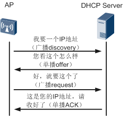
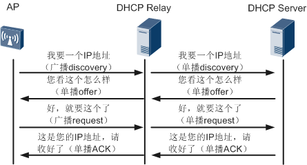

话说AP家有兄弟俩，哥哥胖AP（FAT AP）身强体健，单打独斗，无人能出其右，弟弟瘦AP（FIT AP）天生体质薄弱，独自一人无法支撑大梁。有天弟弟对哥哥说：“大哥，我真是羡慕你，一个人就能轻松承担无线用户接入、用户数据加密和转发等功能，而我自己一人，却什么都干不了啊。”哥哥说到：“弟弟莫要灰心，俗话说，天生我材必有用，虽说单打独斗你不是我对手，可是我的能力也仅限于小型企业、商店、SOHO办公、家庭等这类的小型WLAN网络应用场景，对于更大的WLAN网络场景，却是心有余而力不足了。反观弟弟你，若是能找到一个好的师傅（AC），在师傅的带领下，和众多师兄弟（其它的FIT AP）一起，应对各类大中小型企业总部、分支机构、高校、机场、体育场等等大中型WLAN网络应用场景，还不是手到擒来。”听完此话，弟弟恍然大悟：“大哥言之有理，小弟这就准备准备，寻找名师拜入门下。”

于是FIT AP就开始了他的拜师之旅-这就是我们本次分享的内容：**AP上线过程**。

> `从前面的WLAN技术贴中，我们了解到了AP分胖瘦，FAT AP能够独自承担无线用户接入、用户数据加密和转发等功能，而FIT AP必须依赖于AC才能共同完成这些功能。`
>
> **AC在协同 FIT AP 共同工作之前，必先要实现 FIT AP 在AC中上线的过程。**

拜师之前，FIT AP心想，出门在外，得先有个联系方式（IP地址）才行，不然要是有师傅愿意接收自己，却没有联系方式找到自己，岂不是错过了机会。于是FIT AP来到了DHCP Server营业厅办理IP地址业务。

### AP获取IP地址

AP的IP地址可以是静态配置的，也可以是通过DHCP动态获取的。
> `如果是静态配置的，AP的IP地址立即就确定了，这一步也就结束了。`

一进营业厅，FIT AP就大喊一声（广播方式）：“我要办理一个IP地址。”这时有多位DHCP Server的工作人员热情回复，“您好，来看看我这的IP地址，是否满意。”FIT AP毫不犹豫，直接走向第一个回复的工作人员，“好，就要你给的IP地址了。”工作人员打包好IP地址、租期日期、网关地址、DNS Server的IP地址等等信息，一起交给FIT AP，道：“请拿好，这就是您要的货物了。”收好自己的IP地址，FIT AP满意的走出了营业厅大门。

>`如果是通过DHCP动态获取，AP不知道谁是DHCP Server，会以广播discovery报文的方式去发现DHCP Server，所有收到这个广播信息的DHCP Server都会单播offer回应AP。`
>
>`AP只接收第一个到达的offer，并广播request告诉所有人，我已经选择好了一个DHCP Server了，其他人不需要再准备为我提供DHCP Server服务了。`
>
>`被选中的DHCP Server会把AP的IP地址、租期日期、网关地址、DNS Server的IP地址等信息用ACK报文反馈给AP。`*值得注意的是这个ACK报文里面有个option43字段，里面可以用来填充AC的IP地址。作用就是直接告诉AP有AC的IP地址可用。具体在后面的AP发现AC阶段中描述其作用。*

 

有的时候AP与DHCP Server不在同一个VLAN中，AP通过广播discovery报文不能直接发现DHCP Server，这个时候，可以通过DHCP Relay来发现DHCP Server。AP获取IP地址的流程就变成了下面的样子：

 

AP原来只需要直接和DHCP Server交流，现在变成了和DHCP Relay直接交流，由DHCP Relay将AP的请求单播给DHCP Server，DHCP Server回复给AP的消息也要通过DHCP Relay来转达。

> `Ps：具体的DHCP客户端和服务器的交互过程本帖不做过多的介绍，本帖仅关注AP上线的关键过程。可以参考DHCP特性的原理描述来了解详细过程。`

联系方式既然已经获取到，下一步就是要寻找师傅了。

### AP发现AC

这个时候AP突然想起，DHCP Server营业厅的工作人员给过自己一份广告传单。上书“你想升职加薪，当上总经理，出任CEO，赢取白富美，走上人生巅峰吗！赶紧拨打我们的电话，成为我们大企业WLAN的一份子吧，圆你美梦。机不可失，时不再来，名师在向您招手”。原来是一份招聘广告，上面还有一位AC师傅的号码（Option43）。AP深吸一口气，平复一下略微紧张的心情，拨通了传单上的师傅电话。

 

想象中的场景没有出现，而是

 

对方的电话一直没有人接听，AP感到一阵失望，但并未气馁。既然此路不通，只好找其它方法了。有了，AP脑中灵光一闪，迅速坐到电脑前，打开AC师傅招收学徒的网页，注册了个账号，填写一份简历，然后群发了出去。很快AP就收到了来自多个AC的回复，AP根据各个AC师傅的特点，仔细对比，选择出了一个最适合自己的AC，准备拜师。

```bash
#静态方式
AP上是支持静态配置AC的IP地址的，如果静态配置了AC的IP地址，AP就会向所有配置的AC单播发送发现请求报文，然后根据AC的回复，根据优先级，选择一个AC，准备进行下一个阶段的建立CAPWAP隧道。

#动态方式
如果AP上没有配置AC的IP地址，AP会根据当前的情况来决定是使用"单播"方式还是"广播"方式来发现AC。

"首先"，AP会查看AP获取IP地址阶段中DHCP Server回复的ACK报文中的option43字段是否存在AC的IP地址，这个字段是可选择配置的，如果有AC的IP地址，AP就会向这个地址单播发送发现请求报文。在AC和网络都正常的情况下，AC会回应AP的请求，至此，AP就完成了发现AC的过程。我们可以把这种发现AC的方式称为"DHCP"方式。

与"DHCP"方式类似的还有"DNS"方式。在"DNS"方式中，DHCP Server回复的ACK报文中存放的不是AC的IP地址，而是AC的域名和DNS服务器的IP地址，并且报文中携带的option15字段用来存放AC的域名，AP先通过获取的域名和DNS服务器进行域名解析，获取AC IP地址，然后向AC单播发送发现请求。之后的过程就和DHCP方式一致了。

无论是DHCP方式还是DNS方式，都是属于"单播"方式("AP都是发送的单播报文给AC")。
```

如果AP上没有配置静态的AC的IP地址、DHCP-Server回复的ACK报文中没有AC的信息、或者AP单播发送的发现请求报文都没有响应，`此时AP就会通过广播报文来发现AC`。和AP处于同一个网段的所有AC都会响应AP的请求，AP会选择优先级最高的AC来作为待关联的AC，如果优先级相同，则继续比较AC的负载，负载轻的作为待关联AC，如果负载也相同，则选择IP地址小的作为待关联AC。然后准备进行下一阶段的CAPWAP隧道建立。

 

> `Ps：Option 43在AC和AP间的网络是二层的场景下，存在的作用不明显，因为通过单播发现不了AC，可以再次通过广播来发现，但是如果AC和AP间的网络是三层的，广播报文是无法直接传递到AC的，所以必须要通过Option43来告知AP要找的AC是哪个。`

### CAPWAP隧道建链

虽然有点小困难，但最终还是找到了师傅，AC师傅看到AP后，直言道：“当今的社会，大家都非常注意信息安全，你我之间的谈话内容和下发的工作信息，我不希望被其他有心人听取到，所以今后我们之间的交流方式要加一套保险措施。”AP略一思索，觉得也有道理，便问道：“什么保险措施能够起到有效的保障呢？”。师傅捋了捋自己的长须，得意的道：“CAPWAP隧道”

> CAPWAP全称是**Control And Provisioning of Wireless Access Points**，中文名叫无线接入点控制与规范，CAPWAP是由RFC5415协议定义的实现AP和AC之间的互通的通用封装和传输机制。
>
>CAPWAP隧道又细分为控制隧道和数据隧道。控制隧道是用来传输AC管理控制AP的报文、业务配置以及AC与AP间的状态维护报文；数据隧道则只有在隧道转发（又称集中转发）方式下才用来传输业务数据。

AP发现了AC后，就可以开始CAPWAP隧道的建立了。

### AP接入控制

接下来，到了考验AP入门资格的时候了，不是每一个AP都是符合入门要求的AP。在AP提出要拜师的想法后，为了保证入门AP的合法性，防止有外人或间谍（非法AP）混入，AC师傅设置了一系列的考核要求进行检验，AP必须过五关斩六将，才能最终通过考验，拜入AC门下。鉴于AP是带艺投师，AC还要验证AP的内功（AP版本）是否与本门是一个路数，是否和本门武功相冲。

 

`AP在找到AC后，会向AC发送加入请求(请求的内容中会包含AP的版本和胖瘦模式信息)`
> `Ps`: 如果配置了CAPWAP隧道的DTLS加密功能，会先建立DTLS链路，此后CAPWAP控制报文都要进行DTLS加解
密。

`AC收到AP的加入请求后，会判断是否允许AP接入，然后AC进行回应。`
>`PS`:如果AC上有对应的升级配置，则AC还会在回应的报文中携带AP的版本升级信息(升级版本、升级方式等)。

AC判断AP是否能够接入的流程：

 

> `第一关`，首先查看AP是否被列入了黑名单，如果在黑名单中能匹配上AP，则不允许AP接入，然后就没有然后了。如果很幸运，没有匹配上黑名单，那么将进入第二关。
>
> `第二关`，判断AP的认证模式，如果AC上对AP上线要求不严格，认证方式为不认证，则到这一关的AP都将闯关成功，允许接入。实际使用场景还是建议使用MAC或SN认证，严格控制AP的接入。如果是MAC或SN认证，还需要继续闯关。
>
> `第三关`，本关MAC或SN认证分别要验证MAC或SN对应的AP是否离线添加，如果已添加，则允许AP接入，否则进入下一关。
>
> `第四关`，查看AP的MAC或SN是否能在白名单中匹配上，如果匹配上，则允许接入，否则AP被放入到未认证列表中。
>
> `第五关`，未认证列表中的AP可以通过手动配置的方式，允许其接入，如果不对其进行手动确认，AP也无法接入。

### AP版本升级

AC收下AP为徒后，递给AP一本本门的内功心法要求，AP打开一看，发现自己所学的内功心法（AP版本）竟然与师傅所要求的相冲，AP一咬牙，不破不立，毅然散去所学内功，重修本门的心法。

> `AP收到前一阶段AC回应的报文后，如果发现里面有指定了AP的版本，并且指定的版本与AP当前的版本不一致，会进行AP版本升级。升级完成后，AP自动重新启动，并且重复之前的所有上线过程。如果AP发现AC回应的报文里面指定的AP版本和自身的版本一致，或者没有指定AP的版本，则AP不需要进行版本升级。直接进入下一个阶段。`

### CAPWAP隧道维持

“为了便于关注你的工作状态，对你进行管理和任务分发，你和为师之间要通过CAPWAP隧道来维持联系。平时会通过定时收发echo报文来确认控制隧道、keepalive报文来确认数据隧道的连通性，你要记住了，平时别偷懒忘记收发这些报文了。”“徒儿记住了。”

> `根据CAPWAP协议的要求，AP和AC间还需要进行一些其它报文的交互，然后AP和AC间开始通过keepalive和echo报文来检测数据隧道和控制隧道的连通性。Keepalive报文的出现，标志着数据隧道已经建立起来，echo报文的出现，则标志着控制隧道的已经建立。`

### 配置下发

“师傅，一切都已准备就绪，请下发工作任务给我吧”，AP急不可耐的道。“好，我这就下发。从现在起你就和其他师兄弟一起，共同承担我分发的任务，一起保障WLAN业务的正常运行吧。”

> `CAPWAP隧道建立完成后，AC就可以把配置下发给AP了。AP收到AC的配置信息后，就能以AC上配置的业务来展开WLAN业务了。`

### 后记

FIT AP拜师入门已经过去一段时日，这日，FIT AP遇到了哥哥FAT AP，哥哥道：“如何，现在已经拜得名师，大展身手了吧。”弟弟喜笑颜开：“多亏大哥当时指点，前些日子我已经顺利拜入师傅名下，习得高深的内功，现在被师傅委以重任，与诸位师兄弟一起，支撑起来XXX的WLAN网络场景。”“好，你我兄弟各有短长，今后我们可以携手并进，轻松应对各类无线组网场景。在WLAN江湖中闯出自己的一片天地。”
