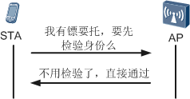
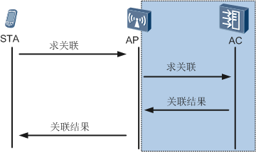

> `上期和大家分享了FIT AP在AC上的上线过程，其实无论是FAT AP还是上线的FIT AP，最终目的都是要用来提供无线网络覆盖环境，以供无线终端STA接入。这样我们才能在日常的生活和工作中，在无线网络覆盖范围内，通过便捷的无线方式，经AP连接到网络中，进行娱乐或办公。本期将要为大家介绍的是在无线网络环境中，STA是如何接入到AP上的——STA接入过程。`

上一回我们说到FIT AP经过一段不轻松的过程，成功拜入AC师傅的门下，获得师傅的认可后，修习了高深的内功，此后，和诸位师兄弟一起，被师傅委以重任。在玉树临风风流倜傥才高八斗学富五车的师傅的英明领导下，众师兄弟齐心协力建立起了名噪一时的龙门镖局，师傅AC任总镖头，AP作为镖师专为各类主顾押镖。龙门镖局以响应主顾速度快，托镖安全有保障而为众人熟知。故坊间有传言“挖掘技术哪家强，中国山东找蓝翔；托运镖物谁最能，首屈一指是龙门”。经过一段时间的打拼，龙门镖局现已名声在外，能够走到这一步，镖局处理托镖事务的标准规范流程起了重要的作用。那么我们就来看看要想找龙门镖局托镖，具体需要怎么做吧。
主顾STA找镖局托镖，具体过程有三：

- `其一`、寻找到满意的镖师AP（**扫描**：用于STA发现无线网络）；
- `其二`、向镖师出示自己的托镖资格（**链路认证**：STA和AP间无线链路的认证过程，通过了这个认证，才表示STA有资格和AP建立无线链路）；
- `其三`、签订托镖协议（**关联**：确定STA有资格和AP建立无线链路后，STA还需要与AP协商无线链路的服务参数，才能完成无线链路的建立）。

本文以STA找镖局托镖的流程来喻指 **STA接入过程**，托镖则指数据传输。这里我们说的STA接入过程，包括三个阶段：`扫描`、`链路认证` 和 `关联`。

 

> `完成了这三个阶段后，STA就连接上了AP。后续STA还要根据实际情况，来决定STA是获取IP地址后就可以接入网络，还是需要再进行各种接入认证和密钥协商后才能接入网络（图中是以Portal认证的流程为例，获取IP是在接入认证之前，不同的认证方式获取IP的顺序可能不一样，例如MAC认证，获取IP是在接入认证之后进行的）。`
>
> `Ps：接入认证和密钥协商不是一定要进行的，在STA关联阶段，STA会根据收到的关联回应报文来决定是否需要进行接入认证和密钥协商。具体会在后面的关联阶段描述。但在实际的应用中，考虑到无线网络的安全性，通常都会选择进行接入认证和密钥协商的。`

## 第一阶段： `扫描`

主顾STA在托镖之前，首先要找到自己满意的镖师。因为镖局为适应市场需求，在不同区域安排有不同的镖师负责业务，而主顾可能会在不同的区域中移动，因此主顾就需要及时的了解到当前有哪些镖师可以雇佣。主顾找到可雇佣镖师的过程，用行话来说就是扫描。主顾可以主动的去寻找镖师，也可以被动的等待镖师推送给你的服务信息。

联系到平时我们使用手机连接Wi-Fi之前，通常都是要先看看当前手机上能搜索到哪些无线信号，然后再选中一个网络接入。图中是手机搜索到的无线网络，里面的那一串串字母是啥？对了，就是我们之前介绍过的SSID，也就是每个无线网络的标志。而我们就是通过点击其中的一个想要连接的SSID来进行联网的。

其实在这里就体现了一个信息，要想连接无线网络，就需要先搜索到无线网络。STA搜索无线网络的过程就叫做扫描。当然现在很多手机在开启Wi-Fi连接功能的时候，如果以前连接的网络能够连上，会自动就连接以前的网络，这是手机软件为简化用户的操作而设计的功能，并不是说手机就不用再进行扫描过程了。实际上扫描过程是手机等这类STA自动进行的过程，我们在使用的时候，看到的已经是扫描到的结果了。

扫描分为两类：主动扫描和被动扫描。正如字面的含义，主动扫描是指STA主动去探测搜索无线网络，而被动扫描则是指STA只会被动的接收AP发送的无线信号。具体过程请看下文描述。

**主动扫描**

主动寻找镖师的过程中，主顾STA会在其力所能及的范围内，主动去寻找都有哪些镖师可以帮忙押镖。现在STA已经前往镖局，寻找所有能提供服务的镖师。进入镖局后，STA找了个稍高的位置站好，喊了一嗓子，“有镖师可以帮忙托镖没，这有一宗大买卖”，也许是大买卖三个字引起了众镖师的关注，几乎是最短的时间内，所有的镖师的回应了STA的请求。一般按照龙门镖局的规范要求，所有在位的镖师都要回应主顾的需求，为的就是能够让主顾能够完整的获取到镖师的信息，为主顾提供更多的选择。而STA现在需要做的就是从中选择一个最中意的镖师。

主动扫描情况下，STA会主动在其所支持的信道上依次发送探测信号，用于探测周围存在的无线网络，STA发送的探测信号称为探测请求帧（Probe Request）。探测请求帧又可以分为两类，一类是未指定任何SSID，一类是指定了SSID的。

1、探测请求帧里面如果**没有指定****SSID**，就是意味着这个探测请求想要获取到周围所有能够获取到的无线网络信号。所有收到这个广播探测请求帧的AP都会回应STA，并表明自己的SSID是什么，这样STA就能够搜索到周围的所有无线网络了。（注意如果AP的无线网络中配置了Beacon帧中隐藏SSID的功能，此时AP是不会回应STA的广播型探测请求帧的，STA也就无法通过这种方式获取到SSID信息。）

有时候STA发现热情的镖师实在是太多了，为了能够迅速找到想要雇佣的镖师，STA会直接喊出镖师的名字，这样其他的镖师自然不会再来打扰，而只有被点名的镖师才会找上前来，与主顾沟通交流。

2、探测请求帧中**指定了****SSID**，这就表示STA只想找到特定的SSID，不需要除指定SSID之外的其它无线网络。AP收到了请求帧后，只有发现请求帧中的SSID和自己的SSID是相同的情况下，才会回应STA。

**被动扫描**

除了通过主动去镖局的方式寻找镖师外，镖师也会定期发送信息或传单来告诉主顾们这里有镖师可以提供押镖服务。通过这些主动送上门的信息或传单上的联系方式，STA也能找到可以雇佣的镖师。这样做的好处当然就是让主顾更加的省力省事了。

被动扫描情况下，STA是不会主动发送探测请求报文的，它要做的就只是被动的接收AP定期发送的信标帧（Beacon帧）。

AP的Beacon帧中，会包含有AP的SSID和支持速率等等信息，AP会定期的向外广播发送Beacon帧。例如AP发送Beacon帧的默认周期为100ms，即AP每100ms都会广播发送一次Beacon帧。STA就是通过在其支持的每个信道上侦听Beacon帧，来获知周围存在的无线网络。（注意如果无线网络中配置了Beacon帧中隐藏SSID的功能，此时AP发送的Beacon帧中携带的SSID是空字符串，这样STA是无法从Beacon帧中获取到SSID信息的。）

STA是通过主动扫描还是被动扫描来搜索无线信号呢？这完全是由STA的支持情况来决定的。手机或电脑的无线网卡，一般来说这两种扫描方式都会支持。无论是主动扫描还是被动扫描探测到的无线网络都会显示在手机或电脑的网络连接中，供使用者选择接入。而一般VoIP语音终端通常会使用被动扫描方式，其目的是可以节省电量。

当手机扫描到无线网络信号后，我们就可以选择接入哪个网络了，这时STA就需要进入链路认证阶段了。

**第二阶段：链路认证**

当STA找到满意的镖师后，并不能够直接就让镖师押送货物，而是需要先通过镖师的认证，验证STA的合法资格后才能签订押镖协议，避免不合法或恶意的STA进行不可告人的活动。

龙门镖局为主顾们提供了好几种服务套餐（安全策略），每种服务套餐都会包含有不同的方式来验证STA的合法资格。但总的来说验证STA资格的方式分有两种：开放系统认证和共享密钥认证。

STA和AP之间是通过无线链路进行连接的，在建立这个链路的过程中，需要要求STA通过无线链路的认证，只有通过认证后才能进行STA和AP之间的无线关联。但此时尚不能判断，STA是否有接入无线网络的权限，需要根据后续STA是否要进行接入认证、是否通过接入认证才能判断。

一说到认证，可能大家就会想到802.1X认证、PSK认证、Open认证等等一堆的认证方式。那这些认证方式和链路认证有什么关系呢？在解决这个问题前，我们先来简单的了解下安全策略。

安全策略体现的是一整套的安全机制，它包括无线链路建立时的链路认证方式，无线用户上线时的用户接入认证方式和无线用户传输数据业务时的数据加密方式。如同下表中，列举出来几种安全策略所对应的链路认证、接入认证和数据加密的方式。

| **安全策略**              | **链路认证方式** | **接入认证方式** | **数据加密方式**       | **说明**                                         |
| ------------------------- | ---------------- | ---------------- | ---------------------- | ------------------------------------------------ |
| WEP                       | Open             | 不涉及           | 不加密或WEP加密        | 不安全的安全策略                                 |
| Shared-key Authentication | 不涉及           | WEP加密          | 仍然是不安全的安全策略 |                                                  |
| WPA/WPA2-802.1X           | Open             | 802.1X（EAP）    | TKIP或CCMP             | 安全性高的安全策略，适用于大型企业。             |
| WPA/WPA2-PSK              | Open             | PSK              | TKIP或CCMP             | 安全性高的安全策略，适用于中小型企业或家庭用户。 |
| WAPI-CERT                 | Open             | 预共享密钥鉴别   | SMS4                   | 国产货，应用的少，适用于大型企业和运营商。       |
| WAPI-PSK                  | Open             | WAPI证书鉴别     | SMS4                   | 国产货，应用的少，适用于小型企业和家庭用户       |

这里再配合下面这张图一起理解下。**链路认证和接入认证是先后两个不同阶段的认证**。

从表中可以看出，安全策略可分为WEP、WPA、WPA2和WAPI几种，这几种安全策略对应的链路认证其实只有Open和Shared-key Authentication两种，而802.1X和PSK则是属于接入认证方式。另外用户接入认证方式其实还包括表中未列出的MAC认证和Portal认证。

（Ps：更多的安全策略、MAC认证和Portal认证的内容，可以参考WLAN安全特性和安全特性的特性描述。）

现在回到我们的主题上来，链路认证包括Open和Shared-key Authentication，具体认证过程是怎么样的呢？

**开放系统认证(Open System Authentication)**

为加快镖师处理业务的速度能力，龙门镖局使用了一种叫做开放系统认证的方式来检查主顾的合法资格，只要主顾有托镖请求，镖师都会直接同意。当然这样做会存在安全隐患，让不合法的主顾有机可趁，所以为了提高镖局的安全保障，通常配合这套认证方式，会在后面的托镖流程中再进行一次严格的方式来专门检查主顾的合法资格。

开放系统认证简称就是Open认证，又叫不认证。但是要注意，不认证也是一种认证方式，只不过这种链路认证方式下，只要有STA发送认证请求，AP都会允许其认证成功，是一种不安全的认证方式，所以实际使用中这种链路认证方式通常会和其它的接入认证方式结合使用，以提高安全性。

**共享密钥认证(Shared-key Authentication)**

另一种方式叫共享密钥认证，需要主顾和镖师间先确定好一个暗语，主顾发出托镖请求后，镖师会用暗语的方式验证主顾的身份合法性。通过了认证会给主顾办理托镖业务。

看到共享密钥认证，从名称上很容易就让人联想到预共享密钥认证PSK（Pre-shared key Authentication），其实共享密钥认证是一种链路认证方式，而预共享密钥认证是一种用户接入认证方式，两种认证方式的过程实际上是类似的。

共享密钥认证的过程只有四个步骤，在认证前，需要在STA和AP上都配置相同的密钥，否则是不能认证成功的。

认证的第一步，是由STA向AP发送一个认证请求。

接着，AP在收到请求后会生成一个挑战短语，再将这个挑战短语发送给STA，假设这个挑战短语是A。

然后，STA会用自己的密钥Key将挑战短语进行加密，加密后再发给AP，假设加密后变为了B。

最后，AP收到STA的加密后信息B，用自己的密钥Key进行解密。只要STA和AP上的密钥配置的一致，解密出来的结果就会是A，AP会将这个结果与最开始发给STA的挑战短语进行对比，发现结果一致，则告知STA认证成功，结果不一致则就会认证失败。

链路认证成功后，STA就可以进行下一步的关联阶段了。

**第三阶段：关联**

验证完了主顾的合法资格后，镖师将主顾请到会客室，准备签订托镖协议。STA将准备好的各类协议材料提交给镖师，然后镖师会把这些材料递交给镖头，由现任的镖头AC来审核签订协议。审核签订完成后，镖师再把镖头的审核签订结果递交给主顾。至此，STA完成了托镖的流程。

关联总是由STA发起的，实际上关联就是STA和AP间无线链路服务协商的过程。

关联阶段也是一个只有关联请求和回应的两步的过程。

STA在发送的关联请求帧中，会包含一些信息，包括STA自身的各种参数，以及根据服务配置选择的各种参数。（主要包括STA支持的速率、信道、QoS的能力，以及选择的接入认证和加密算法等等。）如果是FAT AP收到了STA的关联请求，那么FAT AP会直接判断STA后续是否要进行接入认证并回应STA；如果是FIT AP接收到了STA的关联请求，FIT AP要负责将请求报文进行CAPWAP封装后发送给AC，由AC进行判断处理，并且FIT AP还要负责将AC的处理结果解CAPWAP封装后再发送给STA。（在这个过程中FIT AP起到一个传话筒的作用，且AP和AP间的这类关联报文需要通过CAPWAP隧道传输。）

托镖协议签订完成后，根据主顾选择的服务套餐，后续会有不同的托镖流程。例如，主顾选择的是WEP安全策略的服务套餐（例如Open 不加密），这种情况下，协议签订完成后，STA获取一个临时联系方式（获取IP地址），就可以通过镖局发镖了。如果主顾选择的是WPA安全策略的服务套餐（例如Open 802.1X CCMP），协议签订完成后，用户获取联系方式后，还需要进行一轮新的身份权限认证（802.1X认证）和密钥协商，成功后才能通过镖局发镖。

关联完成后，表明STA和AP间已经建立好了无线链路，如果没有配置接入认证，STA在获取到IP地址后就可以进行无线网络的访问了。如果配置了接入认证的，STA还需要完成接入认证、密钥协商等阶段才能进行网络访问。（如果接入认证失败，仅可以访问Guest VLAN中的网络资源或Portal认证界面。）

**其它阶段**

如前面链路认证阶段所述，接入认证包括802.1X认证、PSK认证、MAC认证以及Portal认证。通过这些认证方式可以实现了对用户身份的认证，提高了网络的安全性，而密钥协商是对用户数据安全提供保障。完成接入认证和密钥协商后，就可以进行网络访问了。限于本期的重点，详细的内容不加以描述，有兴趣了解这方面内容，可以参考WLAN安全和安全的特性描述。

最后给大家分享个内涵故事，并用本期介绍的知识简单分析下。一对新婚***，老婆为了向某单身闺蜜秀优越，带着新婚的老公去看望该单身闺蜜，席间老婆拿出老公的IPhone6，习惯性的开启了Wi-Fi，没有输入密码，直接就连上了网络。。。。。瞬间，她貌似明白了什么，默默的拿出了自己的手机，选择连接闺蜜家的Wi-Fi，显示这是一个安全的网络，需要输入密码才能连接。她醒了，她彻底觉悟了——她的手机能关联闺蜜家的WLAN，但她要输入密码才能使用闺蜜家的Wi-Fi。

手机上能看到这个Wi-Fi网络，表示手机成功的通过扫描过程找到了Wi-Fi网络。老公的手机直接能连Wi-Fi，老婆的手机要输密码才能连，并且手机有显示这是一个安全的网络，表示闺蜜家的Wi-Fi是存在密码认证的。手机连接过的Wi-Fi，通常可以存储上次连接时的一些信息，比如密码，那么下次再连接的时候是不需要用户重新输入密码，手机软件直接帮忙输入了。所以老公的手机一定是之前有连过闺蜜家的Wi-Fi，这次才会不用输密码就直接连上。那这个密码是链路认证还是接入认证阶段提示的呢，仅通过上面的信息是无法判断的。因为链路认证可以采用共享密钥加密方式，接入认证可以采用更多的（比如802.1X、PSK、Portal等）认证方式，两者都需要输入密码，所以不能认为需要输密码就是接入认证，也有可能是链路认证。不过在实际使用中，链路认证通常使用Open认证，较少使用共享密钥认证，所以一般情况下是接入认证提示密码的可能性大。