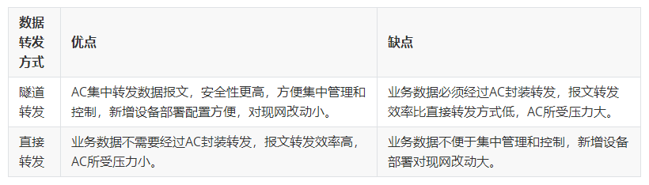

AC FIT AP架构的网络中存在两种报文，一类是AC管理控制AP的报文，称为**管理报文**（也叫控制报文），另一类是STA的用户数据报文，称为**业务报文**。

 

如上图所示，图中的虚线表示报文的转发路径。

- > 管理报文只在AC和AP之间的网络中传输，需要经过CAPWAP隧道转发。
- > 业务报文在STA和STA要访问的网络之间传输。

>业务报文存在两种转发方式，直接转发（本地转发）和隧道转发（集中转发），隧道转发方式下业务报文需要经过CAPWAP隧道转发，直接转发方式下不经过CAPWAP隧道转发。

本期分享的内容是直接转发和隧道转发两种方式下业务报文的转发处理流程，为便于理解，我们先来了解管理报文的转发处理流程。

## 管理报文的转发处理流程

结合下面的图来分析管理报文的转发处理流程。组网较为简单，旨在便于描述原理。

 

从上往下看图，右侧报文结构简图从右往左看。图上的Payload看做是AC想要发送给AP的实际有效信息，即管理报文的实际内容。

>直接转发和隧道转发是针对业务报文而言的，管理报文和直接转发、隧道转发没有半毛钱关系，管理报文只有一种转发处理流程。

### 一、管理报文封装

AC在发送Payload前，需要先把Payload封装在CAPWAP隧道中。所谓封装在CAPWAP隧道中，实际就是在Payload报文外面增加一节CAPWAP字段，这样“看起来”只要是有CAPWAP字段的报文就认为是封装在了CAPWAP隧道中。

增加CAPWAP字段后，再增加UDP/IP字段和802.3字段，这里的802.3字段表示这个报文将要通过有线的以太网进行传输。

最后，AC还要给这个报文加上管理VLAN。所谓**管理VLAN**，是指报文在CAPWAP封装后添加的外层VLAN。在AC与AP间的网络中，管理报文会一直带着管理VLAN进行转发处理。

### 二、管理报文传输

结合实际的配置来看，AC到AP间的网络都需要允许携带管理VLAN的报文通过，以保证管理报文能够在AC和AP间正常传输。

1、如果AC与AP间的网络是三层组网，管理VLAN会在报文转发过程中随之改变，图中的VLAN m’≠VLAN m。（这里是以在交换机Switch上进行三层转发为例，为便于记忆，m取management的第一个字母。）

2、如果AC与AP间的网络是二层组网，管理VLAN会保持不变，则图中的VLAN m’=VLAN m。

### 三、管理报文解除封装

当报文从上游到下游转发到直连AP的接口，即图中Switch连接AP的接口时，需要**去掉报文外层的管理VLAN**，再将剩下的报文内容发送给AP。

> 默认情况下，AP只能识别处理不带有管理VLAN的管理报文并解除CAPWAP封装，识别出管理报文的具体内容Payload。

结合实际的配置，直连AP的设备接口通常都要求配置PVID为管理VLAN，目的就是在此接口发送报文给AP的时候，去掉报文外层的管理VLAN。

当然，**如果接口上没有配置PVID**，或者说AP接收到的报文就是带有管理VLAN，也是有应对方法的,这时候需要针对AP配置management-vlan为管理VLAN m，这样AP在接收到带有管理VLAN的报文后，还是能够识别并去掉管理VLAN，解除CAPWAP封装，解析出Payload。

以上分析的是AC发送管理报文给AP的过程，AP发送管理报文给AC的过程，只要把上面的流程倒过来理解就可以了。AP发送经过CAPWAP封装后的报文到直连AP的接口时，Switch会给报文加上管理VLAN，再转发给AC。到达AC后，由AC去掉管理VLAN，解封CAPWAP封装，获取报文信息内容。

## 业务报文的直接转发处理流程

结合下图来分析直接转发方式下业务报文的转发处理流程。

 

同样上面往下，右边往左看图。图上的Payload是STA访问的网络设备发送给STA的实际有效信息，即业务报文的实际内容。图中有两个AC，如果AC处在中转站处，表示是AC直连式组网；如果AC处在酱油党处，表示是AC旁挂式组网；不是指有两个AC同时存在于网络中。无论AC处于哪里，业务报文都是按照同样的转发路径，从Internet一直转发到STA。

### 一、业务报文封装

发送给STA的Payload在进入网络的时候就会进行一次封装，这个封装不是指CAPWAP封装，而是在Payload报文外面增加一段802.3字段和添加业务VLAN（在图中未体现UDP/IP字段，可以理解为已经包含在了Payload中）。业务VLAN即是指业务报文外层的VLAN。

直接转发方式下，业务报文不会进行CAPWAP封装。

### 二、业务报文传输

结合实际的配置来看，直接转发方式下，从上层网络Internet到AP之间都是要允许携带业务VLAN的报文通过，以保证业务报文能够在Internet和STA间正常传输。

1、AC直连组网场景下，AC处在如图中的中转站处，在收到上层网络发送来的Payload信息后，会和其它的交换机一样只进行报文转发，不进行CAPWAP封装，图中的中转站AC收到的报文和交换机收到的报文格式是一致的，且AC的任务也是和交换机一样转发业务报文给下一个网络设备，

2、AC旁挂组网场景下，AC处在如图中的酱油党处，是不会收到业务报文的，在这种场景下，业务报文根本不需要经过AC，直接经过交换机和AP就转发给STA了。

同样业务VLAN在转发过程中也可能存在VLAN变化的情况：

1、如果上层网络Internet到AP之间是三层组网，业务VLAN会在报文转发过程中随之改变，图中的VLAN s’≠VLAN s。（这里是以在交换机Switch上进行三层转发为例，为便于记忆，s取service的第一个字母。）

2、如果上层网络Internet到AP之间是二层组网，业务VLAN会保持不变，则图中的VLAN s’=VLAN s。

结合实际的配置来看，直接转发方式下，从上层网络到AP之间都是要允许携带业务VLAN的报文通过。

### 三、去除业务VLAN

当业务报文从上游到下游转发到AP时，AP也要对接收到的报文进行两项处理，先是将外层的业务VLAN去掉，然后将原有的802.3字段改为802.11字段，802.11字段表示这个报文将采用无线传输的方式转发出去。处理完成后，AP将业务报文无线传输给STA。

### 四、解析业务报文

STA接收到业务报文后，去除掉外层的802.11字段，剩余的Payload字段被STA解析处理后就可以识别出具体内容了。由于STA无法识别带有VLAN的报文，所以AP在发送报文给STA前，必须要先去掉业务报文中的VLAN。

以上分析的是上层网络发送业务报文给STA的过程，STA发送报文到上层网络的过程，也是把上面的流程倒过来理解就可以了。STA要在报文外层加上802.11字段，将报文以无线传输的方式发送给AP，AP将收到的报文先转换为802.3格式，再添加业务VLAN，通过上层的各级网络设备，将报文转发传输到目的地。

## 业务报文的隧道转发处理流程

同样看下图来分析隧道转发方式下业务报文的转发处理流程。

 

图上的Payload是STA访问的网络设备发送给STA的实际有效信息，即业务报文的实际内容，以AC直连式组网为例说明。

### 一、封装

和直接转发一样，发给STA的Payload在进入网络的时候就会进行封装，不是CAPWAP封装，而是在Payload报文外面增加802.3字段和添加业务VLAN（在图中未体现UDP/IP字段，可以理解为已经包含在了Payload中）。完成后业务报文将径直发给AC。**隧道转发方式下，所有的业务报文都必须转发到AC。**

AC接收到业务报文后，会进行CAPWAP封装，将收到的整个业务报文看做一个新的Payload，在外层添加CAPWAP字段，增加UDP/IP字段和802.3字段。最后再为业务报文加上管理VLAN。可以看出AC上处理业务报文的过程和处理管理报文的过程是相同的。

在AC与AP间的网络中，业务报文会一直带着管理VLAN进行转发处理。

### 二、传输

结合实际的配置来看，隧道转发方式下，从上层网络Internet到AC之间的网络设备上要允许携带业务VLAN的报文通过，在AC和AP间的网络设备上要允许携带管理VLAN的报文通过。以保证业务报文能够在Internet和STA间正常传输。

因为AC和AP间的网络上业务报文是CAPWAP封装的对象，业务VLAN可以看做是新的Payload的一部分，不会被网络设备感知到，所以这段网络上只要求允许携带管理VLAN的报文通过即可。只要管理VLAN能够通过，业务VLAN同样也就打包在管理VLAN中通过了。

同样管理VLAN在转发过程中也可能存在VLAN变化的情况：

1、如果AC与AP间的网络是三层组网，管理VLAN会在报文转发过程中随之改变，图中的VLAN m’≠VLAN m。

2、如果AC与AP间的网络是二层组网，管理VLAN会保持不变，则图中的VLAN m’=VLAN m。

### 三、去除VLAN

当报文从上游到下游转发到直连AP的接口，即图中Switch连接AP的接口时，需要去掉报文外层的管理VLAN，然后把剩下的报文内容发送给AP。如果不去掉，则需要在AP上配置management-vlan，这块原理和管理VLAN的处理流程一致。不同点在于下面AP的处理方式。

AP除了需要解除CAPWAP封装外，还需要把业务VLAN去掉，再将VLAN后的802.3字段替换为802.11报文，因为业务报文是发送给STA的，需要把不带VLAN的业务报文通过无线方式传送到STA处，这样STA才能最终接收到能够识别的数据。

### 四、解析业务报文内容

最终STA解析业务报文内容的流程和直接转发方式下的一样，STA接收到业务报文后，去除掉外层的802.11字段，剩余的Payload字段被STA解析处理即可。同样由于STA无法识别带有VLAN的报文，所以AP在发送报文给STA前，必须要先去掉业务报文中的VLAN。

以上分析的是隧道转发方式下上层网络发送业务报文给AP的过程，AP发送报文到上层网络的过程，同样也是把上面的流程倒过来理解就可以了。

## 隧道转发方式与直接转发方式的优缺点比较

由于直接转发方式和隧道转发方式下对业务报文存在有不同的处理流程，两种方式之间互相对比，各自存在着一些优缺点。隧道转发方式中，由于所有的业务数据都需要转发到AC，所以在AC上容易集中管理和控制业务报文，并且由于业务报文都封装在了CAPWAP隧道中，提高了业务报文的安全性。但是同样由于所有业务报文都转发给AC，对AC的报文处理能力要求较高。直接转发方式的特点则刚好与隧道转发相反。优缺点对比表如下：

 

组网选用隧道转发还是直接转发，需要结合实际的需求和现网状况才能选择出更适合自己的方式。
